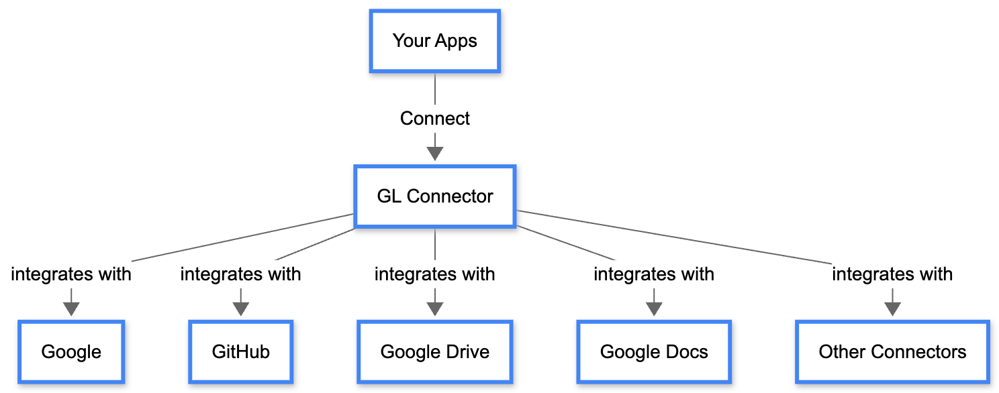


Note that we are currently in the process of migrating from "BOSA Connector" to "GL Connector"; some inconsistencies may appear during this time. For example:

1. The library name may still be `bosa-connectors-binary` or `bosa-cli`, simply to ensure functionality while we need to do the big migration for the libraries and endpoints.&#x20;
2. Environment variables, variable values, repositories, endpoints, etc. May still reflect that it is **bosa** (i.e., https://api.bosa.id) for the guides for the same reason. We will incrementally update this Gitbook as we continuously migrate to the new Connector.

**Please bear with us as we navigate these new changes.**


A Python SDK for seamlessly connecting to APIs that implement BOSA's Plugin Architecture under HTTP Interface. This connector acts as a proxy, simplifying the integration with Connector-compatible APIs.

<figure><figcaption></figcaption></figure>

# Features

* Simple and intuitive API for connecting to Connector-compatible services
* Automatic endpoint discovery and schema validation
* Built-in authentication support (API Key and User Token)
* User management and OAuth2 integration flow support
* Type-safe parameter validation
* Flexible parameter passing (dictionary or keyword arguments)
* Retry support for requests that fail (429 or 5xx)
* Response fields filtering based on action and output

# Installation

<details>

<summary>Prerequisites</summary>

Before you can proceed, ensure that:

* **Python:** v3.11 or v312
* **API key**:  will be used for a client to communicate with the Connector API

</details>

To install the GL Connector, you need to include it in your project's dependencies. You can use your favorite package manager to install:



```bash
pip install bosa-connectors-binary
```



```bash
poetry install bosa-connectors-binary
```



```bash
uv add bosa-connectors-binary
```



These commands will add the GL Connector to your project's environment, allowing you to easily interface with Connector's various 3rd party integrations.

