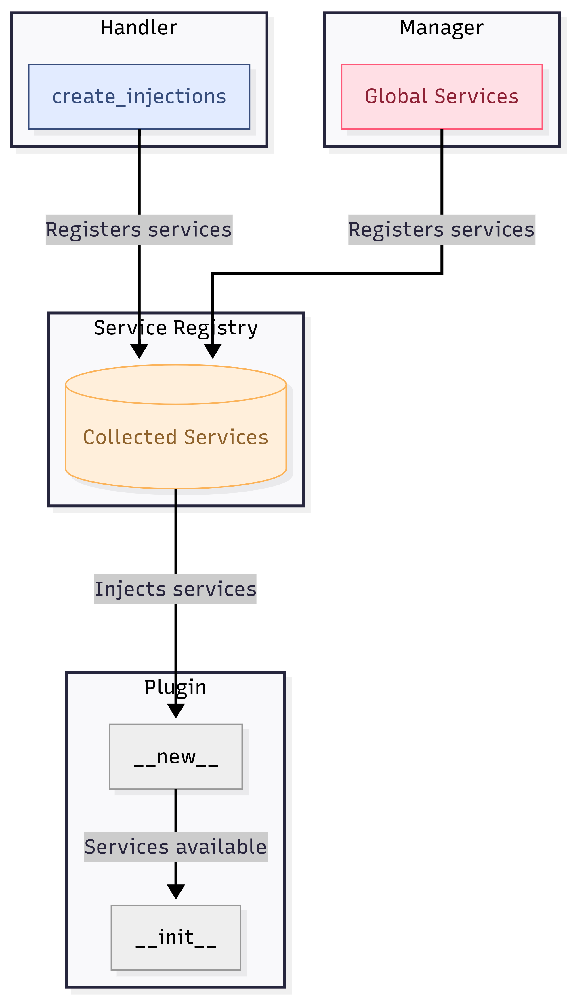

# Service Injection

## How Injection Works

Service injection is GL Plugin's mechanism for providing dependencies to your plugins automatically. Instead of manually instantiating services inside your plugins, you declare what you need and the framework delivers it.

<div data-full-width="false" data-with-frame="true"><figure><figcaption><p>Plugin Service Hierarchy: <a href="https://www.mermaidchart.com/play#pako:eNqdUl1r2zAU_SvCfdkghi5ZmlYPZfVXZthKsQt7qIdR5BtHi5CK5CQLpf99siw7H3SM7uKHe-85PufqSi8elRV42PN9vxBUiiWrcSEQ4mQvNw1GwNeFsOCSyx1dEdWgx8Aw9GZRK_K8Qt-JIDWop8JzWeH9bBW6mOcGmHO5IBzloLaMgnYEENWxzlciKm51XHaiE6YGoApIAyUTv4A2TIq_KDmfDGqmG7U3P7oO6lsn0nn29KHwQsm5UYXqaMyPb6k_8E3NhBHtkhOp-_iHAYqiNJ-AXVmeoOl9-jjATLBmwDsLuy70rZznZZ6Vl1983w0MSiPtpkK-f2tG7uhhiv5NyrOWlNqlnVHMvB3HJC2pPzoiW8I4WXCwtHbwQriDzHOMcSY1uDpMTZ2v967MM1M-AKEr1zDSpnOn-7oVO25QTrSOYImMBjKXI9fg71jVrPCn59-jvlMRbd6eInsspIC-jS8ms8_RLByhJeMcX8TjOEiSEaKSS9WDZzbt6O_3SZLpzey690mSKImng891PB5Prs587A7-wygIJtO7g1GcRMHBKLmajKMzI7PJ99vc2Bj2ZmOwubTR3_jhQb4gulFbwIgzAUShV-_1D25uW0k">Mermaid Link</a></p></figcaption></figure></div>

Key points:

* Services come from two sources: **Handler** (via `create_injections`) and **Manager** (via `global_services`)
* All services are collected in the **Service Registry**
* Injection happens at the `__new__` level, **before** `__init__` runs
* By the time your `__init__` executes, all services are already available as instance attributes
* Services are identified by **type**, not by name

***

## Type-Based Resolution

GL Plugin uses the **class type** to match services with plugin attributes. This means:

```python
# In your handler
@classmethod
def create_injections(cls, instance):
    return {
        CalculatorService: CalculatorService()  # Key is the TYPE
    }

# In your plugin
class MyPlugin(Plugin):
    calculator: CalculatorService  # Matched by TYPE, not by name "calculator"
```

The framework looks at the type hint (`CalculatorService`) and finds the matching key in the injection dictionary. The attribute name (`calculator`) can be anything you want.

```python
# These all work - the name doesn't matter, only the type
class MyPlugin(Plugin):
    calculator: CalculatorService    # ✓ Works
    calc: CalculatorService          # ✓ Works
    my_service: CalculatorService    # ✓ Works
```

***

## Handler Services

Handler services are defined in your handler's `create_injections()` method. These services are specific to plugins attached to that handler.

### Basic Definition

```python
from gl_plugin.plugin.handler import PluginHandler
from typing import Any, Dict, Type

class MyHandler(PluginHandler):
    @classmethod
    def create_injections(cls, instance: "MyHandler") -> Dict[Type, Any]:
        return {
            ServiceA: ServiceA(),
            ServiceB: ServiceB(),
            ServiceC: lambda: ServiceC(),  # Factory
        }
```

### Using Handler Properties

You can access handler properties via the `instance` parameter to configure services:

```python
class DatabaseHandler(PluginHandler):
    def __init__(self, connection_string: str) -> None:
        super().__init__()
        self.connection_string = connection_string

    @classmethod
    def create_injections(cls, instance: "DatabaseHandler") -> Dict[Type, Any]:
        return {
            DatabaseService: DatabaseService(instance.connection_string)
        }
```

***

## Global Services

Global services are shared across **all plugins**, regardless of which handler they're attached to. They're registered at the Manager level.

### Registering Global Services

Pass services to the `global_services` parameter when creating the Manager:

```python
from gl_plugin.plugin.manager import PluginManager

# Create shared services
config_service = ConfigService()
cache_service = CacheService()
logger_service = LoggerService()

# Register them globally
manager = PluginManager(
    handlers=[handler_a, handler_b],
    global_services=[
        config_service,
        cache_service,
        logger_service,
    ],
)
```

### Consuming Global Services

Declare them in your plugin just like handler services:

```python
@Plugin.for_handler(SomeHandler)
class MyPlugin(Plugin):
    name = "MyPlugin"
    version = "1.0.0"
    description = "A plugin using global services"

    # Handler service
    router: Router

    # Global services
    config: ConfigService
    cache: CacheService

    def __init__(self):
        super().__init__()
        # All services available here
        api_key = self.config.get("api_key")
        cached_data = self.cache.get("my_data")
```

## When to Use Global vs Handler Services

| Service Type | Scope                  | Use Case                               |
| ------------ | ---------------------- | -------------------------------------- |
| Handler      | Plugins of one handler | Router, handler-specific utilities     |
| Global       | All plugins            | Config, cache, logging, authentication |


Use **global services** for cross-cutting concerns that multiple plugin types need. Use **handler services** for functionality specific to a plugin category.


### Example: Combining Both

```python
# Services
class ConfigService:
    def get(self, key: str) -> str:
        # Returns config values
        pass

# Handler with its own service
class HttpHandler(PluginHandler):
    @classmethod
    def create_injections(cls, instance) -> Dict[Type, Any]:
        return {
            Router: lambda: Router()  # Handler-specific
        }

# Plugin using both
@Plugin.for_handler(HttpHandler)
class GithubPlugin(Plugin):
    name = "GithubPlugin"
    version = "1.0.0"
    description = "Github integration"

    # From handler
    router: Router

    # From global services
    config: ConfigService

    def __init__(self):
        super().__init__()

        @self.router.post("/webhook")
        async def handle_webhook():
            api_key = self.config.get("github_api_key")
            # ...

# Wiring it all together
handler = HttpHandler()
manager = PluginManager(
    handlers=[handler],
    global_services=[
        ConfigService(),
    ],
)
manager.register_plugin(GithubPlugin)
```

***

## Consuming Services in Plugins

To receive an injected service, declare it as a class attribute with a type hint:

```python
@Plugin.for_handler(MyHandler)
class MyPlugin(Plugin):
    name = "MyPlugin"
    version = "1.0.0"
    description = "A plugin with injected services"

    # Declare services you need - they'll be injected automatically
    service_a: ServiceA
    service_b: ServiceB

    def __init__(self):
        super().__init__()
        # Services are already available here!
        self.service_a.do_something()
```

### Inheritance

When extending plugins, child classes inherit all service injections from their parents:

```python
@Plugin.for_handler(CalculatorHandler)
class MathPlugin(Plugin):
    calculator: CalculatorService  # Injected

    @abstractmethod
    def calculate(self, a: float, b: float) -> float:
        pass


class AddPlugin(MathPlugin):
    # calculator is inherited - no need to declare again

    def calculate(self, a: float, b: float) -> float:
        return self.calculator.add(a, b)  # Just use it
```

***

### Example: Service Injection in Action

Let's trace through the complete flow using our Calculator example.



#### Handler Defines Services

```python
class CalculatorHandler(PluginHandler):
    @classmethod
    def create_injections(cls, instance: "CalculatorHandler") -> Dict[Type, Any]:
        return {
            CalculatorService: CalculatorService()
        }
```



#### Plugin Declares Dependencies

```python
@Plugin.for_handler(CalculatorHandler)
class MathPlugin(Plugin):
    calculator: CalculatorService  # "I need a CalculatorService"
```



#### Manager Connects Them

When you register the plugin:

```python
manager.register_plugin(AddPlugin)
```

The manager:

1. Sees `AddPlugin` is attached to `CalculatorHandler`
2. Calls `CalculatorHandler.create_injections()` to get handler services
3. Combines with global services from the Manager
4. Scans `AddPlugin` (and its parents) for type-hinted attributes
5. Matches `calculator: CalculatorService` with the `CalculatorService` key
6. Injects the service instance during `__new__`
7. Calls `__init__` — service is ready to use



***

### Multiple Services

Plugins can receive multiple services from both handler and global sources:

```python
class AdvancedHandler(PluginHandler):
    @classmethod
    def create_injections(cls, instance) -> Dict[Type, Any]:
        return {
            CalculatorService: CalculatorService(),
            ValidatorService: ValidatorService(),
        }


@Plugin.for_handler(AdvancedHandler)
class AdvancedPlugin(Plugin):
    # Handler services
    calculator: CalculatorService
    validator: ValidatorService

    # Global services
    logger: LoggerService
    config: ConfigService

    def process(self, a: float, b: float) -> float:
        self.logger.info(f"Processing {a} and {b}")

        if not self.validator.validate(a, b):
            raise ValueError("Invalid input")

        return self.calculator.add(a, b)
```

***

### What Happens If a Service Is Missing?

If a plugin declares a service that neither the handler nor global services provide, the attribute will not be set. Accessing it will raise an `AttributeError`:

```python
@Plugin.for_handler(CalculatorHandler)
class BrokenPlugin(Plugin):
    calculator: CalculatorService  # ✓ Provided by handler
    logger: LoggerService          # ✗ NOT provided anywhere

    def do_something(self):
        self.calculator.add(1, 2)  # Works
        self.logger.info("Hello")  # AttributeError!
```


Always ensure your handler or global services provide all services that your plugins expect. Missing services will cause runtime errors when accessed.


***

## Summary

| Concept          | Description                                           |
| ---------------- | ----------------------------------------------------- |
| Injection timing | Services are injected at `__new__`, before `__init__` |
| Resolution       | Type-based matching (class type, not attribute name)  |
| Declaration      | Use type hints on class attributes                    |
| Inheritance      | Child plugins inherit parent's service declarations   |
| Handler services | Specific to plugins of that handler                   |
| Global services  | Shared across all plugins                             |
