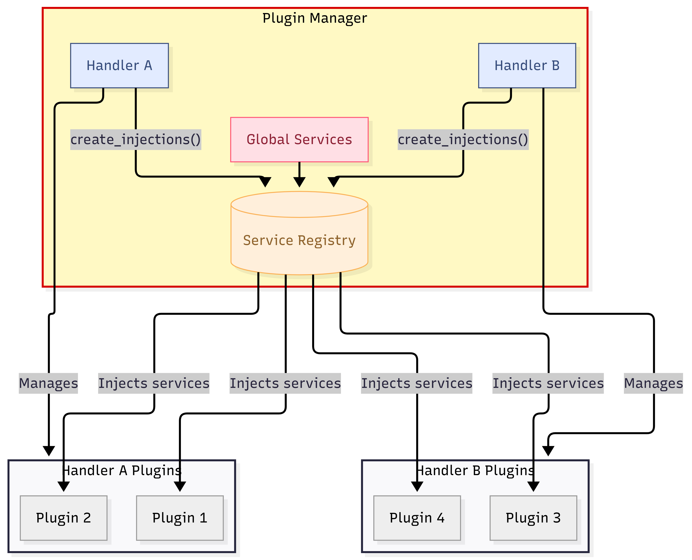
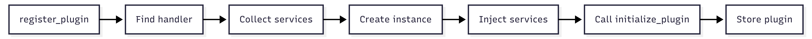
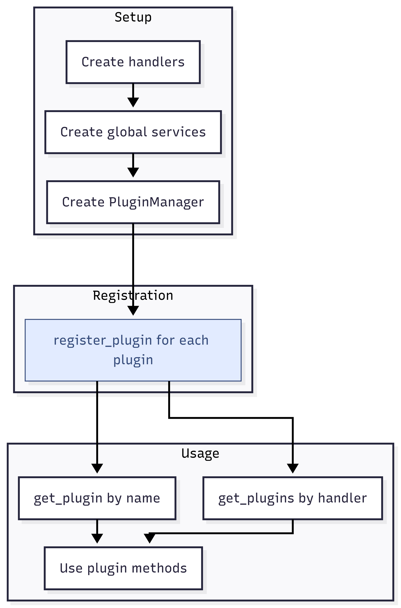

# The Plugin Manager

## What is the Plugin Manager?

The **Plugin Manager** is the orchestrator of GL Plugin. It's the central coordinator that wires everything together—handlers, services, and plugins. While it powers the entire system, you interact with it through a simple interface.

<figure><figcaption><p>The Plugin Manager's role: <a href="https://www.mermaidchart.com/play#pako:eNqdVF1vmzAU_SsWlaZWCtIwpGn8MCkUHPYwCcHeylS54BAWy64wWYem_fcZMB_OqmrdfbB07jn3Hu7F8MvKRUEtZNm2nfFc8ENVoowDwEgrzg0ClJ0y3pMHJl7yI6kb8NVXCnl-KmvyfAQxO5cV_0I4KWn9kFkDBjqRWd-6dgAUVU3zphJ8KNexT1XFnoknwkBK6x9VTuVU0kWaPFxnlqZAQstKNnWbWTcLTeSoJhHhBaM12BnlEVxQvqYoL_4eQO6WTcak0Sx25vEck4EzA9908ZfP87qLO_dyTcabGc9w6TcJbPuT2tcAI0dBkNeUNPSx4t-H3cvrG1MF_0WVJp3qc09LIPVr6iWxAz6o6bvD7Q5v6T5cAS3US176vsKrq6Hn3acIoURIqnGaKBxTkh91InJUIj21I4QGjDt2J0dxDE3omtBbwpwRKQN6AKobULdNnKj9UhXNETnPP1djpiBSfQw1aREXnI5pdOVuvGBzvwKHijF0FcLQx3gFcsFEPZIXNt2Q7_fBeL3d3I0-GAc4XE8-dyGE7u2FT7-8_zDyfXe9m41CHPizEb51YXBhpDb5fpttH9Pe-phsPvYx2MimZdT860xNgnWnW42Pirf3nvX7Dy72fVM">Mermaid Link</a></p></figcaption></figure>

The Manager is responsible for:

* Holding **handlers** that define plugin behavior
* Storing **global services** shared across all plugins
* Maintaining the **Service Registry** that resolves injections
* **Registering** and **retrieving** plugins

***

### Creating a Manager

```python
from gl_plugin.plugin.manager import PluginManager

manager = PluginManager(
    handlers=[handler_a, handler_b],
    global_services=[config_service, cache_service],
)
```

| Parameter         | Description                                        |
| ----------------- | -------------------------------------------------- |
| `handlers`        | List of handler instances that manage plugins      |
| `global_services` | List of service instances available to all plugins |

***

### Registering Plugins

Use `register_plugin()` to add plugins to the manager:

```python
manager.register_plugin(AddPlugin)
manager.register_plugin(SubtractPlugin)
manager.register_plugin(MultiplyPlugin)
```

When you register a plugin, the manager:

<figure><figcaption><p>Plugin Registration Flow: <a href="https://www.mermaidchart.com/play#pako:eNptzk0KwjAQhuGrDNnnAl0I2h8RXOnSiIR0rKPDRNJUUfHuphHqxm3eZz7yUs63qAqltTbivBypK4wAsH34IRaAfDGS45H93Z1siLDejAJgvjMqYEd9xHC48tCRGLUHrWewSKkhaeFkpWUM6f17s8i5TLn0zOgi9Bhu5LCfSJlJNZKANiKQ9NGKw0lUWdRJrOT8d6POohk3LHNaoEiW6Ym_f35hk-EywW30AWHK6v0BQghZXg">Mermaid Link</a></p></figcaption></figure>

1. Identifies which handler the plugin belongs to (via `@Plugin.for_handler()`)
2. Collects services from the handler and global services
3. Creates the plugin instance (`__new__`)
4. Injects services into the instance
5. Calls the handler's `initialize_plugin()` method
6. Stores the plugin for later retrieval

***

### Retrieving Plugins

#### By Name

Retrieve a specific plugin using its `name` attribute:

```python
add_plugin = manager.get_plugin("AddPlugin")
result = add_plugin.calculate(10, 5)
```

#### By Handler Type

Retrieve all plugins managed by a specific handler:

```python
plugins = manager.get_plugins(CalculatorHandler)

for plugin in plugins:
    print(f"{plugin.name}: {plugin.calculate(20, 4)}")
```

This is useful for:

* Processing all plugins of a category
* Polymorphic operations across related plugins
* Plugin discovery and introspection

***

### Manager Lifecycle

<figure><figcaption><p>The Lifecycle Diagram for Plugin Manager: <a href="https://www.mermaidchart.com/play#pako:eNptUltrwjAU_iuHCnuy4C4g5GG43nxxMOb2tI4S29MLxqQkqU7E_76YtGjZ-hK-y_nOl9CTl4sCPeL5vp_yXPCyqUjKARg9ik4TQLZNuRVLJg55TaWGj8A4VLepJG1rWKPu2q_Us2fqfV-m3RcYNpRINULFxIYyUCj3TY5qZHu52mrKC4ZyrIdX_Y11VcNfKacVyt6EvLit845Vo7SkuhHcDN7CUWpkRGlFlFlrc6EUEpDmNTj8_4JPZZabYXuOImPDVqiHtM0RON2NLcnIoi6e_s4j29LmY98DdqhrUahRn8vDge8_Q-BAYEHoQGhB5EBkQQx3kDgitsTSgQRWWZIts9miJ_sWESFkvT06lDOqVIQlGAbMc4ot-oem0DW5b3-mA1NQZf4PSY-EC44DTSaP86doHk6hbBgjk_ghDpJkCrlgQg7isHaVRabNbHGCvJN7JMAajlTCGQbddf2je-df_vPedQ">Mermaid Link</a></p></figcaption></figure>

#### Complete Example

```python
from gl_plugin.plugin.manager import PluginManager

# 1. Setup
handler = CalculatorHandler(precision=3)
config = ConfigService()
cache = CacheService()

manager = PluginManager(
    handlers=[handler],
    global_services=[config, cache],
)

# 2. Registration
manager.register_plugin(AddPlugin)
manager.register_plugin(SubtractPlugin)
manager.register_plugin(MultiplyPlugin)

# 3. Usage
# By name
add = manager.get_plugin("AddPlugin")
print(add.calculate(10, 5))  # 15.0

# By handler type
for plugin in manager.get_plugins(CalculatorHandler):
    print(f"{plugin.name}: {plugin.calculate(100, 10)}")
```

***

### Summary

| Method                                     | Description                                      |
| ------------------------------------------ | ------------------------------------------------ |
| `PluginManager(handlers, global_services)` | Create manager with handlers and global services |
| `register_plugin(PluginClass)`             | Register a plugin class                          |
| `get_plugin(name)`                         | Retrieve a plugin by its name                    |
| `get_plugins(HandlerType)`                 | Retrieve all plugins for a handler type          |
