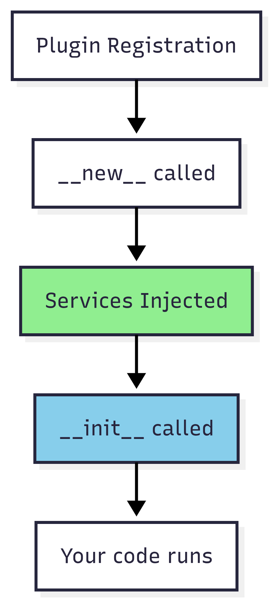

# The Plugin

## What is a Plugin?

A **Plugin** is where your actual functionality lives. It's the concrete implementation that users interact with. Plugins:

* Are attached to a specific Handler via the `@Plugin.for_handler()` decorator
* Receive services automatically through injection
* Define metadata (name, version, description)
* Can be extended through inheritance for polymorphic behavior

***

## Attaching Plugins to Handlers

Every plugin must be attached to a handler using the `@Plugin.for_handler()` decorator:

```python
from gl_plugin.plugin.plugin import Plugin

@Plugin.for_handler(CalculatorHandler)
class MathPlugin(Plugin):
    name = "MathPlugin"
    version = "1.0.0"
    description = "A math plugin"
```

This binding tells the framework:

* Which handler manages this plugin
* What services to inject (from that handler's `create_injections()`)
* How to initialize the plugin (via that handler's `initialize_plugin()`)


A plugin can only be attached to **one** handler. If you need the same functionality across different handlers, create a shared base class and extend it for each handler.


***

### Plugin Metadata

Every plugin requires three metadata attributes:

```python
@Plugin.for_handler(MyHandler)
class MyPlugin(Plugin):
    name = "MyPlugin"              # Unique identifier
    version = "1.0.0"              # Semantic version
    description = "What it does"   # Human-readable description
```

| Attribute     | Purpose                                                  |
| ------------- | -------------------------------------------------------- |
| `name`        | Unique identifier used with `manager.get_plugin("name")` |
| `version`     | Version tracking for your plugin                         |
| `description` | Documents what the plugin does                           |


The `name` must be unique within the manager. Registering two plugins with the same name will cause conflicts and typically, the latest registered one will overwrite the previous one.


***

## Abstract vs Concrete Plugins

Plugins support inheritance, allowing you to define abstract base plugins with shared behavior and concrete implementations with specific functionality.

### Abstract Base Plugin

Define a base plugin with shared services and abstract methods:

```python
from abc import abstractmethod

@Plugin.for_handler(CalculatorHandler)
class MathPlugin(Plugin):
    """Abstract base plugin for math operations."""

    name = "MathPlugin"
    version = "1.0.0"
    description = "Base plugin for math operations"

    calculator: CalculatorService  # Injected for all subclasses

    @abstractmethod
    def calculate(self, a: float, b: float) -> float:
        """Must be implemented by subclasses."""
        pass
```

### Concrete Implementations

Extend the base plugin with specific implementations:

```python
class AddPlugin(MathPlugin):
    """Performs addition."""

    name = "AddPlugin"
    version = "1.0.0"
    description = "Adds two numbers"

    def calculate(self, a: float, b: float) -> float:
        return self.calculator.add(a, b)


class SubtractPlugin(MathPlugin):
    """Performs subtraction."""

    name = "SubtractPlugin"
    version = "1.0.0"
    description = "Subtracts two numbers"

    def calculate(self, a: float, b: float) -> float:
        return self.calculator.subtract(a, b)


class MultiplyPlugin(MathPlugin):
    """Performs multiplication."""

    name = "MultiplyPlugin"
    version = "1.0.0"
    description = "Multiplies two numbers"

    def calculate(self, a: float, b: float) -> float:
        return self.calculator.multiply(a, b)
```

#### Benefits of This Pattern

```python
# Register all implementations
manager.register_plugin(AddPlugin)
manager.register_plugin(SubtractPlugin)
manager.register_plugin(MultiplyPlugin)

# Use polymorphically
plugins = manager.get_plugins(CalculatorHandler)
for plugin in plugins:
    print(f"{plugin.name}: {plugin.calculate(10, 5)}")

# Output:
# AddPlugin: 15.0
# SubtractPlugin: 5.0
# MultiplyPlugin: 50.0
```

This pattern allows you to:

* Define a consistent interface via the base plugin
* Share service injections across all implementations
* Add new operations without modifying existing code
* Process all plugins of a type uniformly

***

## Overriding Injected Services

Sometimes you need to replace an injected service with your own instance. GL Plugin's injection mechanism makes this straightforward using Python's `__new__` vs `__init__` lifecycle.

### Understanding the Lifecycle

<figure><figcaption><p>Injection Flow: <a href="https://www.mermaidchart.com/play#pako:eNptjj0LwjAQQP_KUedAN7WDYNsMbqIu0pRS4rVGjwukqVLE_26_EAfhuOW9e9wr0PaCQRQIIRRry5WpI8UAVHa29REg3RWPsCL71NfSeTilgwGwzfbU1obhgLVpvCu9sZyDEBuIs6JgfCpV9AO6JMJLPl3Fo5BkR3QPo7GBHd9Q-y9PRp72AcPG_yukoyGzs20dDP-Da7mZ4bQb3xH2qcoQRYt1KOU6_CXpTFbLRMo4eH8AOelS2Q">Mermaid Link</a></p></figcaption></figure>

1. **`__new__`** — Instance is created, services are injected
2. **`__init__`** — Your initialization code runs, services already exist

Because injection happens at `__new__`, any assignment in `__init__` **overwrites** the injected service.

### Basic Override

```python
@Plugin.for_handler(CalculatorHandler)
class CustomCalculatorPlugin(Plugin):
    name = "CustomCalculatorPlugin"
    version = "1.0.0"
    description = "Uses a custom calculator"

    calculator: CalculatorService  # Would be injected...

    def __init__(self):
        # Override with custom instance
        self.calculator = CustomCalculatorService()
        super().__init__()
```

### Override Order Matters

If your parent class uses the service in its `__init__`, override **before** calling `super().__init__()`:

```python
class ParentPlugin(Plugin):
    calculator: CalculatorService

    def __init__(self):
        super().__init__()
        # Parent uses self.calculator here
        self.result = self.calculator.add(1, 1)


class ChildPlugin(ParentPlugin):
    def __init__(self):
        # Override BEFORE super().__init__() if parent uses the service
        self.calculator = MockCalculatorService()
        super().__init__()  # Parent now uses MockCalculatorService
```

If the parent doesn't use the service in `__init__`, order doesn't matter:

```python
class ParentPlugin(Plugin):
    calculator: CalculatorService

    def __init__(self):
        super().__init__()
        # Parent doesn't use calculator here


class ChildPlugin(ParentPlugin):
    def __init__(self):
        super().__init__()
        # Override after is fine
        self.calculator = MockCalculatorService()
```

***

## When to Override Services

### Testing with Mocks

Replace real services with mocks for unit testing:

```python
class TestablePlugin(MathPlugin):
    name = "TestablePlugin"
    version = "1.0.0"
    description = "Plugin with mocked services"

    def __init__(self):
        self.calculator = MockCalculatorService()
        super().__init__()
```

### Special Cases Requiring Custom Instances

When a specific plugin needs different configuration:

```python
class HighPrecisionPlugin(MathPlugin):
    name = "HighPrecisionPlugin"
    version = "1.0.0"
    description = "Uses high-precision calculator"

    def __init__(self):
        self.calculator = CalculatorService(precision=10)
        super().__init__()
```

### Concrete Implementations Needing Different Behavior

When extending a plugin but needing a specialized service:

```python
@Plugin.for_handler(HttpHandler)
class BaseApiPlugin(Plugin):
    name = "BaseApiPlugin"
    version = "1.0.0"
    description = "Base API plugin"

    router: Router
    http_client: HttpClient

    def fetch_data(self):
        return self.http_client.get("/data")


class AuthenticatedApiPlugin(BaseApiPlugin):
    name = "AuthenticatedApiPlugin"
    version = "1.0.0"
    description = "API plugin with authentication"

    def __init__(self):
        # Use authenticated client instead
        self.http_client = AuthenticatedHttpClient(api_key="secret")
        super().__init__()

    def fetch_data(self):
        return self.http_client.get("/data")  # Automatically authenticated
```

***

## Summary

| Concept                 | Description                                                     |
| ----------------------- | --------------------------------------------------------------- |
| `@Plugin.for_handler()` | Binds a plugin to its handler                                   |
| Metadata                | `name`, `version`, `description` required                       |
| Abstract plugins        | Define shared interface and services                            |
| Concrete plugins        | Implement specific functionality                                |
| Inheritance             | Child plugins inherit services and behavior                     |
| Overriding              | Assign in `__init__` to replace injected services               |
| Override order          | Override before `super().__init__()` if parent uses the service |
