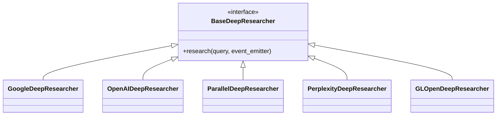

# Deep Researcher

[**`gllm-generation`**](https://github.com/GDP-ADMIN/gl-sdk/tree/main/libs/gllm-generation/gllm_generation/reference_formatter) | [<mark style="background-color:yellow;">Involves LM</mark>](#user-content-fn-1)[^1] | **Tutorial**: [deep-researcher.md](deep-researcher.md "mention") | [API Reference](https://api.python.docs.gdplabs.id/gen-ai/library/gllm_generation/api/deep_researcher.html) | [Cookbook](https://github.com/gl-sdk/gen-ai-sdk-cookbook/tree/main/gen-ai/tutorials/generation/deep_researcher)

<details>

<summary>Prerequisites</summary>

This example specifically requires completion of all setup steps listed on the [prerequisites.md](../../prerequisites.md "mention") page.

You should be familiar with these concepts:

1. [lm-invoker](../inference/lm-invoker/ "mention")
2. [lm-request-processor.md](../inference/lm-request-processor.md "mention")

</details>

## What’s a Deep Researcher?

A **Deep Researcher** is a specialized component that performs **structured, multi-step research** within a Retrieval-Augmented Generation (RAG) pipeline. Instead of issuing a single retrieval query, it is designed to **plan, execute, and refine research steps** to produce a coherent, high-quality result.

Deep Researchers can search across multiple sources, reason over intermediate findings, and iteratively adjust their approach as new information is discovered. This makes them well-suited for tasks that **require depth, comparison, or synthesis**—where a single-pass retrieval would be insufficient.

By encapsulating research logic into a dedicated component, Deep Researchers enable RAG pipelines to move beyond basic retrieval and toward **goal-driven, reasoning-aware research workflows**.


These tutorials focus on using the Deep Researcher as a component within an RAG pipeline.\
If you’re interested in a centralized, end-to-end Deep Research service, see the\
[**GL DeepResearch GitBook**](https://gdplabs.gitbook.io/gl-deepresearch) for a deeper dive.


## Available Subclasses

The Deep Researcher module provides the following built-in implementations:

1. `GoogleDeepResearcher`
2. `OpenAIDeepResearcher`
3. `ParallelDeepResearcher`
4. `PerplexityDeepResearcher`
5. `GLOpenDeepResearcher`



In this tutorial, we'll learn how to use the deep researcher module in **just a few lines of code**. You can find more details about these deep researchers in the [API reference page](https://api.python.docs.gdplabs.id/gen-ai/library/gllm_generation/api/deep_researcher.html).

## Installation



```bash
# you can use a Conda environment
pip install --extra-index-url https://oauth2accesstoken:$(gcloud auth print-access-token)@glsdk.gdplabs.id/gen-ai-internal/simple/ "gllm-generation"
```



```powershell
# you can use a Conda environment
pip install --extra-index-url https://oauth2accesstoken:$(gcloud auth print-access-token)@glsdk.gdplabs.id/gen-ai-internal/simple/ "gllm-generation"
```



```bash
# you can use a Conda environment
FOR /F "tokens=*" %T IN ('gcloud auth print-access-token') DO pip install --extra-index-url "https://oauth2accesstoken:%T@glsdk.gdplabs.id/gen-ai-internal/simple/"  "gllm-generation"
```



## Quickstart

Let’s jump into a basic example of using the deep researcher. In this example, we'll use an event emitter with a print event handler, which allows us to see the deep research progress in real time.


Each example uses the same `research()` interface while swapping out the underlying deep research provider. This allows different providers to be used interchangeably, without changing the calling logic that invokes the Component.

Each example follows the same flow:

1. define a research query;
2. invoke deep research using the same `research()` call;
3. receive streamed progress and final results via an event emitter.


Below are minimal examples that perform deep research using the GL SDK:




```python
from dotenv import load_dotenv
load_dotenv()

import asyncio
from gllm_core.event import EventEmitter
from gllm_generation.deep_researcher import GLOpenDeepResearcher

query = "Create a concise report about why bananas are yellow."
event_emitter = EventEmitter.with_print_handler()

deep_researcher = GLOpenDeepResearcher()
asyncio.run(deep_researcher.research(query=query, event_emitter=event_emitter))
```





```python
from dotenv import load_dotenv
load_dotenv()

import asyncio
from gllm_core.event import EventEmitter
from gllm_generation.deep_researcher import GoogleDeepResearcher

query = "Create a concise report about why bananas are yellow."
event_emitter = EventEmitter.with_print_handler()

deep_researcher = GoogleDeepResearcher()
asyncio.run(deep_researcher.research(query=query, event_emitter=event_emitter))
```





```python
from dotenv import load_dotenv
load_dotenv()

import asyncio
from gllm_core.event import EventEmitter
from gllm_generation.deep_researcher import ParallelDeepResearcher

query = "Create a concise report about why bananas are yellow."
event_emitter = EventEmitter.with_print_handler()

deep_researcher = ParallelDeepResearcher()
asyncio.run(deep_researcher.research(query=query, event_emitter=event_emitter))
```





```python
from dotenv import load_dotenv
load_dotenv()

import asyncio
from gllm_core.event import EventEmitter
from gllm_generation.deep_researcher import PerplexityDeepResearcher

query = "Create a concise report about why bananas are yellow."
event_emitter = EventEmitter.with_print_handler()

deep_researcher = PerplexityDeepResearcher()
asyncio.run(deep_researcher.research(query=query, event_emitter=event_emitter))
```





```python
from dotenv import load_dotenv
load_dotenv()

import asyncio
from gllm_core.event import EventEmitter
from gllm_generation.deep_researcher import OpenAIDeepResearcher

query = "Create a concise report about why bananas are yellow."
event_emitter = EventEmitter.with_print_handler()

deep_researcher = OpenAIDeepResearcher()
asyncio.run(deep_researcher.research(query=query, event_emitter=event_emitter))
```




**Expected Output**


```
╭────────────────────────╮
│     THINKING START     │
╰────────────────────────╯
**Explaining banana ripening**

The user has asked for a short and concise report on why bananas are yellow, which relates to the science of botany. Bananas start off green and turn yellow as they ripen due to the breakdown of chlorophyll. This process reveals yellow pigments such as xanthophylls and carotenoids. I’ll focus on summarizing this pigment change, discussing how these compounds affect the color of bananas as they reach ripeness, and I'll ensure it's clear and concise.
╭──────────────────────╮
│     THINKING END     │
╰──────────────────────╯

╭────────────────────────╮
│     THINKING START     │
╰────────────────────────╯
**Focusing on textual explanation**

The user wants a "short and concise report" about why bananas are yellow. A textual explanation should suffice for this, and though I considered including an image, it's likely unnecessary for a straightforward answer. I’ll focus on gathering information about the pigments that contribute to the yellow color of bananas, particularly as they ripen. My aim will be to provide a clear and engaging textual report without the need for images, sticking closely to the user’s request.
╭──────────────────────╮
│     THINKING END     │
╰──────────────────────╯

╭──────────────────╮
│     ACTIVITY     │
╰──────────────────╯
>>> type: search
>>> query: "why banana is yellow"
>>> sources: None

╭──────────────────╮
│     ACTIVITY     │
╰──────────────────╯
>>> type: search
>>> query: banana color pigments chlorophyll carotenoids
>>> sources: None

╭──────────────────╮
│     ACTIVITY     │
╰──────────────────╯
>>> type: search
>>> query: "banana" chlorophyll breakdown yellow pigment
>>> sources: None

╭────────────────────────╮
│     THINKING START     │
╰────────────────────────╯
**Exploring banana coloration**

I’ve come across research articles about chlorophyll breakdown in banana leaves or fruits. While they might have relevant information, they could be too technical if the user expects a short answer. I’ll still need references to support a concise explanation. I wonder if I should focus on the scientific reasons behind why bananas are yellow, such as carotenoids and ripening. So, let’s search specifically for phrases like "banana why yellow carotenoids."
╭──────────────────────╮
│     THINKING END     │
╰──────────────────────╯

...

╭────────────────────────╮
│     THINKING START     │
╰────────────────────────╯
**Structuring the report on bananas**

I’m planning to create a report titled “Why Bananas Are Yellow.”

I’m thinking about using bullet points to outline key concepts like the differences between unripe and ripe bananas, the breakdown of chlorophyll, and what pigments contribute to the yellow color.

While I could use subheadings like “Chlorophyll vs. Carotenoids” or “Ripening Process,” I believe a simple bullet list under the main title is also effective. This should clearly present the information while adhering to the guidelines.
╭──────────────────────╮
│     THINKING END     │
╰──────────────────────╯
# Why Bananas Are Yellow

- **Chlorophyll in young bananas – green color:** Unripe bananas appear green because their peel contains chlorophyll pigment ((https://www.scribd.com/document/949965573/Yellow-Wikipedia#:~:text=Bananas%20are%20green%20when%20they,enzymes%20continue%20their%20work%2C%20
the)).
- **Ripening breaks down chlorophyll:** As bananas ripen they produce ethylene, triggering enzymes that degrade chlorophyll ((https://pubmed.ncbi.nlm.nih.gov/21160159/#:~:text=The%20ripening%20of%20bananas%20is,to%20their%20fascinating%20blue%20luminescence)) ((https://www.scribd.com/document/949965573/Yellow-Wikipedia#:~:text=Bananas%20are%20green%20when%20they,enzymes%20continue%20their%20work%2C%20
the)). This causes the green pigment to fade.
- **Carotenoids give the yellow color:** Once the green chlorophyll is gone, yellow-orange carotenoid pigments remain in the peel. Ripe bananas accumulate xanthophylls (a type of carotenoid) so that the peel reflects yellow light ((https://wentbananas.com/why-banana-are-yellow/#:~:text=The%20specific%20type%20of%20carotenoid,yellow%20or%20orange%20fruits%20and)) ((https://foodcrumbles.com/colours-in-fruits-vegetables/#:~:text=The%20same%20applies%20to%20a,the%20underlying%20colors%20become%20visible)). These carotenoids dominate the peel’s color, making ripe bananas look yellow.

**Sources:** The color change is explained by plant pigment chemistry: ripening bananas lose green chlorophyll and reveal underlying yellow carotenoids ((https://pubmed.ncbi.nlm.nih.gov/21160159/#:~:text=The%20ripening%20of%20bananas%20is,to%20their%20fascinating%20blue%20luminescence)) ((https://foodcrumbles.com/colours-in-fruits-vegetables/#:~:text=The%20same%20applies%20to%20a,the%20underlying%20colors%20become%20visible)). For example, one source notes that “the green chlorophyll supply is stopped and the yellow color of the carotenoids replaces it” during banana ripening ((https://www.scribd.com/document/949965573/Yellow-Wikipedia#:~:text=Bananas%20are%20green%20when%20they,enzymes%20continue%20their%20work%2C%20
the)), and specifically cites xanthophyll pigments as responsible for the yellow hue ((https://wentbananas.com/why-banana-are-yellow/#:~:text=The%20specific%20type%20of%20carotenoid,yellow%20or%20orange%20fruits%20and)).
```


<a href="https://github.com/gl-sdk/gen-ai-sdk-cookbook/tree/main/gen-ai/tutorials/generation/deep_researcher" class="button primary">See more examples on GitHub</a>

That’s it! You've just successfully used the deep researcher module! Next, let's take a look into some additional capabilities of the deep researcher components!

## Custom Prompt

We can customize the deep researcher prompts by supplying a custom `PromptBuilder` object. This is useful for adding custom instructions or simply adjusting the tone of the deep research results.


```python
from dotenv import load_dotenv
load_dotenv()

import asyncio
from gllm_core.event import EventEmitter
from gllm_inference.prompt_builder import PromptBuilder
from gllm_generation.deep_researcher import OpenAIDeepResearcher

prompt_builder = PromptBuilder(
    system_template="Provide your deep research results as if you are a journalist writing a news article.",
    user_template="{query}",
)
event_emitter = EventEmitter.with_print_handler()
query = "Create a concise report about why bananas are yellow."

deep_researcher = OpenAIDeepResearcher(prompt_builder=prompt_builder)
asyncio.run(deep_researcher.research(query=query, event_emitter=event_emitter))
```


Please note that although we're only using the `OpenAIDeepResearcher` in the example above, the same approach applies to any other deep researcher subclass.

<a href="https://github.com/gl-sdk/gen-ai-sdk-cookbook/blob/main/gen-ai/tutorials/generation/deep_researcher/02_deep_research_custom_prompt.py" class="button primary">See complete code on GitHub</a>

## MCP Integration

By default, deep researcher components have the capability to access the internet perform web search operations. This enables them to retrieve and utilize latest public information in the deep research process.

However, sometimes we also need to use non-public services as a source of knowledge. We can **provide additional data sources** to deep research by supplying MCP tools at invocation time.

MCP integration allows deep research to access **private or non-public data** (such as enterprise systems or personal data sources) during execution. It does **not** change how deep research performs research or reasoning internally.

MCP integration supports two types of connections:

1. **MCP server**: An MCP server connected via a URL. Currently supported by `GoogleDeepResearcher`, `GLOpenDeepResearcher`, `ParallelDeepResearcher`, and `OpenAIDeepResearcher`.
2. **MCP connector**: An MCP connector that connects a certain service through a connector ID with authentication. Currently supported by `OpenAIDeepResearcher`.


```python
from dotenv import load_dotenv
load_dotenv()

import asyncio
from gllm_core.event import EventEmitter
from gllm_inference.schema import NativeTool
from gllm_generation.deep_researcher import OpenAIDeepResearcher

mcp_server = NativeTool.mcp_server(name="...", url="https://.../mcp")
mcp_connector = NativeTool.mcp_connector(
    name="google_drive",
    connector_id="connector_googledrive",
    auth="<google_oauth_token>",
)

event_emitter = EventEmitter.with_print_handler()
query = "Create a concise report about my Google Drive structure!"

deep_researcher = OpenAIDeepResearcher(tools=[mcp_server, mcp_connector])
asyncio.run(deep_researcher.research(query=query, event_emitter=event_emitter))
```


## Data Store Integration

Another way to connect to a non-public source of knowledge is by integrating a data store to our deep researcher component. This allows the deep researcher to access files stored in certain provider-managed file stores services. To learn more about these data stores, please refer to the [LM invoker data store management page](../inference/lm-invoker/data-store-management.md).

Currently, data store integration is available in `GoogleDeepResearcher` and `OpenAIDeepResearcher`.

Use standardized native tools to pass data stores via the `tools` parameter.


```python
from dotenv import load_dotenv
load_dotenv()

import asyncio
from gllm_core.event import EventEmitter
from gllm_generation.deep_researcher import GoogleDeepResearcher
from gllm_inference.schema import AttachmentStore, NativeTool

store = AttachmentStore(id="fileSearchStores/<fileSearchStoreId>", provider="google")
data_store_tool = NativeTool.data_store([store])

event_emitter = EventEmitter.with_print_handler()
query = "Analyze the <topic> document and present it as a concise report!"

deep_researcher = GoogleDeepResearcher(tools=[data_store_tool])
asyncio.run(deep_researcher.research(query=query, event_emitter=event_emitter))
```



`GoogleDeepResearcher(data_stores=[...])` is deprecated and will be removed in a future release. Use `tools=[NativeTool.data_store([...])]` for forward-compatible configuration.


[^1]: This component may involve Language Model (LM). See tutorial about LM Request Processor or related [here](reference-formatter.md#lm-request-processor)
