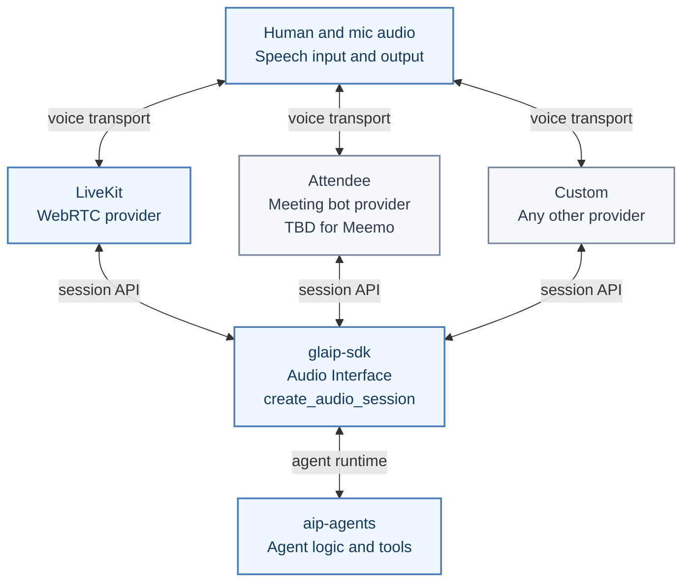
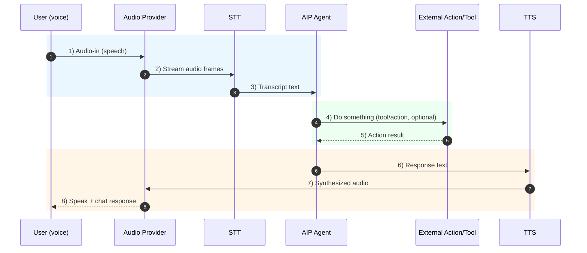

Add audio input/output to AIP agents using one interface that supports multiple
implementations.

- **One interface:** `create_audio_session(...)` in `glaip-sdk`
- **Many implementations:** provider-specific session backends under the same API
- **Current implementation:** `livekit` (available now)
- **Planned implementation:** `attendee` (TBD)


Audio interface is beta and local-only. You must run the LiveKit server and
client yourself. The CLI does not expose audio sessions yet. This page
documents a design preview; APIs and behavior may change before release.



## Interface First (Provider-Agnostic)

The entrypoint stays the same across providers: `create_audio_session(...)`.
Implementation selection is explicit: pass `implementation="..."` or set
`config["provider"]`. If both are omitted, session creation raises `ValueError`.

### Hypothetical provider example

This shows the interface shape before choosing a concrete transport:

```python
import asyncio
from glaip_sdk import Agent


async def main() -> None:
    agent = Agent(name="my-agent", instruction="You are a helpful assistant.")
    session = agent.create_audio_session(
        implementation="my-provider",
        config={
            "provider": "my-provider",
            "io": {"input_enabled": True, "output_enabled": True},
            "my_provider": {"endpoint": "...", "token": "..."},
        },
    )
    await session.run()


if __name__ == "__main__":
    asyncio.run(main())
```

### SDK Usage (Minimum)

Use this as the smallest working snippet in `glaip-sdk`:

```python
import asyncio
from glaip_sdk import Agent

async def main():
    agent = Agent(name="my-agent", instruction="You are a helpful assistant.")
    session = agent.create_audio_session(implementation="livekit")
    await session.run()

if __name__ == "__main__":
    asyncio.run(main())
```

This call is intentionally explicit. The following fails because no
implementation is provided:

```python
session = agent.create_audio_session()
# ValueError: Audio implementation must be specified
```

### Custom implementation wiring (same interface)

```python
from glaip_sdk.audio_interface import register_audio_session_implementation


class CustomProviderSession:
    ...


register_audio_session_implementation("custom-provider", CustomProviderSession)

# Swap implementation without changing the high-level call shape.
session = agent.create_audio_session(implementation="custom-provider")
```

## Architecture Overview (Interface + Providers)

This is the high-level architecture behind the interface:



## Current Implementation: LiveKit (Available Now)

LiveKit is the implementation ready today. You still use the same interface and
select `implementation="livekit"`.

To explicitly pass LiveKit config from code:

```python
session = agent.create_audio_session(
    implementation="livekit",
    config={
        "provider": "livekit",
        "io": {"input_enabled": True, "output_enabled": True},
        "livekit": {
            "url": "ws://localhost:7880",
            "api_key": "devkey",
            "api_secret": "devsecretdevsecretdevsecretdevsecret",
            "room_name": "aip-audio-demo",
        },
    }
)
```

LiveKit prerequisites, setup commands, and local test flow are currently
captured in `python/glaip-sdk/examples/sdk/livekit-local-dev.md`.

### Planned Implementation: Attendee / Meemo (TBD)

The audio interface is provider-agnostic, and we plan to add an Attendee-based
transport for Google Meet/Meemo flows.

- **Attendee status**: TBD. This is the provider path planned for Meemo.

- **Core provider implementation** will be added in `aip-agents` audio interface
  (session implementation + factory mapping).
- **SDK DX** will remain low-code in `glaip-sdk` via `create_audio_session(...)`
  with provider selection.

This section will be updated with concrete setup once the Attendee provider is available.

## Provider Model

The audio interface is provider-agnostic. Use `implementation="..."` to pick
the backend (for example `"livekit"` today). Provider-specific settings are
passed via config.

Current AIP implementation support: LiveKit AgentSession-based local audio
sessions.

## Turn Sequence (Audio -> STT -> AIP -> TTS)

The runtime turn flow is the same across providers; only the transport
implementation changes.



## Tool Call Visibility

Tool calls are handled by the underlying agent runtime (e.g. LangGraph) the same
way they are for text-only runs.

For the demo workflow in this repo:

- run with `AIP_AUDIO_DEBUG=1` to print transcripts and final replies
- use the agent's standard streaming/logging to observe tool events

## Configuration Tips

- **Audio input/output**: Set `input_enabled` or `output_enabled` to `False` to
  run input-only or output-only sessions.
- **Devices**: Supply `input_device` or `output_device` when multiple audio
  devices are present.
- **STT/TTS**: Provider-specific. LiveKit handles audio transport; transcription
  and synthesis live in the LiveKit worker/agent. Providers that expose model
  selection use `AudioModelConfig` (see the GL SDK realtime session tutorial).
- **Provider config**: `LiveKitConfig` expects the server URL, `api_key`, and
  `api_secret`; `room_name` and `identity` are optional.

## Limitations

- Local-only; no AIP-hosted audio service yet.
- LiveKit is the only provider supported in this phase for AIP, but the API is
  provider-agnostic for future providers.
- CLI support is intentionally deferred.

## Troubleshooting

| Symptom                        | Likely cause               | Fix                                                                                                                  |
| ------------------------------ | -------------------------- | -------------------------------------------------------------------------------------------------------------------- |
| `AudioSessionUnavailableError` | LiveKit deps are missing   | Install published extras: `pip install "glaip-sdk[audio]"`. Monorepo contributors can run `make -C python/aip-agents install-audio`. |
| `AudioConfigError`             | URL/api key/secret missing | Check `LiveKitConfig` and env vars `LIVEKIT_API_KEY` / `LIVEKIT_API_SECRET`.                                         |
| No audio / device error        | Device not available       | Disable audio output or set `input_device`/`output_device`.                                                          |

## Related Documentation

- Local setup runbook (repo): `python/glaip-sdk/examples/sdk/livekit-local-dev.md`
- [Agents guide](https://gdplabs.gitbook.io/sdk/gl-ai-agent-package/guides/agents) — manage agent configs and runtime overrides.
- [Tools guide](https://gdplabs.gitbook.io/sdk/gl-ai-agent-package/guides/tools) — inspect tool definitions and outputs.
- [Security & privacy](https://gdplabs.gitbook.io/sdk/gl-ai-agent-package/guides/security-and-privacy) — handle credentials and sensitive data.

## External References

- [GL SDK realtime session tutorial](https://gdplabs.gitbook.io/sdk/tutorials/inference/realtime-session)
