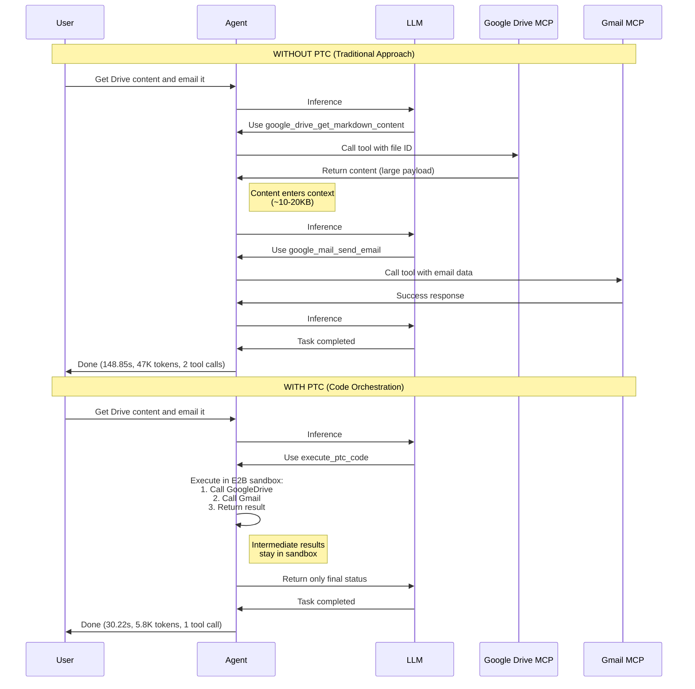

Enable AI agents to orchestrate multiple tool calls through code execution, reducing context pollution and improving efficiency for complex multi-step workflows. This guide shows how to use Programmatic Tool Calling (PTC) to let agents chain tool calls programmatically in a sandboxed environment.

> **Success**
>
> **When to use this guide:** You need agents to process large datasets with minimal context overhead, orchestrate complex multi-step tool workflows, or perform parallel operations across multiple tools without polluting the agent's context window.
>
> **Who benefits:** Developers building data-intensive agents, teams optimizing token usage and latency, and engineers implementing complex tool orchestration workflows.


PTC supports both local runs (`agent.run(local=True)`) and remote deployments (`agent.deploy()` + remote `agent.run(...)`) using the same `ptc=PTC(...)` configuration model. The SDK automatically handles sandbox lifecycle management and cleanup after each run.


## Overview

Programmatic Tool Calling (PTC) enables agents to orchestrate tools through Python code rather than through individual API round-trips. Instead of requesting tools one at a time with each result entering the agent's context, the agent writes code that calls multiple tools, processes their outputs programmatically, and controls what information enters its context window.

Traditional tool calling creates two fundamental problems as workflows become more complex:

- **Context pollution from intermediate results**: When processing large datasets (10MB log files, database queries, API responses), all intermediate data enters the agent's context window, consuming massive token budgets and potentially pushing important information out of context.
- **Inference overhead and manual synthesis**: Sequential tool orchestration requires multiple model inference passes. The agent must parse results, compare values, and synthesize conclusions through natural language processing—both slow and error-prone.

PTC solves these problems by letting agents express orchestration logic in Python code. Loops, conditionals, data transformations, and error handling become explicit in code rather than implicit in the agent's reasoning.

## Key Features

- **Code-Based Orchestration**: Agents write Python code to chain multiple tool calls
- **Context Window Protection**: Intermediate results stay in the sandbox, only final outputs reach the agent
- **Parallel Execution**: Run multiple tool calls concurrently using `asyncio.gather`
- **Tool Integration**: Works seamlessly with MCP tools
- **Automatic Cleanup**: Sandbox resources are released after each run
- **Sandboxed Execution**: Code runs in a secure E2B environment

## Installation

PTC uses one SDK configuration model (`ptc=PTC(...)`) for both local and remote execution, but prerequisites differ by mode.


**Prerequisites (Local runs):** Install local runner support and configure E2B:

```bash
# Install with local runner support
pip install glaip-sdk[local]

# Set E2B API key for sandbox execution
export E2B_API_KEY="your-e2b-api-key"
```

Get your E2B API key from [e2b.dev](https://e2b.dev).



**Prerequisites (Remote runs):** Configure platform credentials before `deploy()` and remote `run()`:

```bash
export AIP_API_URL="https://your-aip-instance.com"
export AIP_API_KEY="your-aip-api-key"
```


## Quick Start

### Basic PTC Setup

```python
from glaip_sdk.agents import Agent
from glaip_sdk.ptc import PTC

# Create agent with PTC enabled
agent = Agent(
    name="ptc_demo",
    instruction="Use execute_ptc_code for multi-tool workflows.",
    mcps=[my_mcp],  # Your MCP tools
    ptc=PTC(enabled=True)
)

# Run locally with PTC
result = agent.run("Analyze the data and summarize findings", local=True)
print(result)
```

### Example: Processing Team Expenses

Consider a common task: "Which team members exceeded their Q3 travel budget?"

With three MCP tools:

- `get_team_members(department)` - Returns team member list with IDs
- `get_expenses(user_id, quarter)` - Returns expense line items
- `get_budget_by_level(level)` - Returns budget limits

**Without PTC** (traditional approach):

- Fetch 20 team members → 20 tool calls for expenses
- Each returns 50-100 line items (2,000+ expenses total)
- All data enters agent context (200KB+)
- Agent manually sums expenses, compares against budgets
- Multiple inference passes required

**With PTC**:

The agent writes orchestration code that runs in the sandbox:

```python
# Agent-generated code (runs in sandbox)
import asyncio
import json
from tools.hr_mcp import get_team_members, get_expenses, get_budget_by_level

team = await get_team_members("engineering")

# Fetch budgets for unique levels in parallel
levels = list(set(m["level"] for m in team))
budget_results = await asyncio.gather(*[
    get_budget_by_level(level) for level in levels
])
budgets = {level: budget for level, budget in zip(levels, budget_results)}

# Fetch all expenses in parallel
expenses = await asyncio.gather(*[
    get_expenses(m["id"], "Q3") for m in team
])

# Process data and filter results
exceeded = []
for member, exp in zip(team, expenses):
    budget = budgets[member["level"]]
    total = sum(e["amount"] for e in exp)
    if total > budget["travel_limit"]:
        exceeded.append({
            "name": member["name"],
            "spent": total,
            "limit": budget["travel_limit"]
        })

print(json.dumps(exceeded))
```

**Results**:

- Agent context receives only the final result (2-3 people who exceeded budgets)
- Token consumption drops from ~200KB to ~1KB
- Multiple inference passes reduced to code execution
- Parallel execution reduces latency

## How PTC Works

### 1. Agent Writes Orchestration Code

When PTC is enabled and the agent needs to orchestrate multiple tools, it uses the `execute_ptc_code` tool (automatically available) to generate Python code:

```python
# Agent calls execute_ptc_code with orchestration logic
import asyncio
from tools.hr_mcp import get_team_members, get_expenses

team = await get_team_members("engineering")
expenses = await asyncio.gather(*[get_expenses(m["id"], "Q3") for m in team])
# ... processing logic
print(result)
```

### 2. Code Executes in E2B Sandbox

The code runs in a secure E2B sandbox environment. When the code calls tools, the sandbox pauses and requests tool execution from the API.

### 3. Tool Results Stay in Sandbox

Tool results are returned to the sandbox environment and processed by the Python code—they do not enter the agent's context window.

### 4. Final Output Returns to Agent

Only the code's final output (via `print()` or return value) is sent back to the agent's context:

```json
{
  "stdout": "[{\"name\": \"Alice\", \"spent\": 12500, \"limit\": 10000}]"
}
```

The agent sees only the summary, not the thousands of intermediate expense records.

## Configuration

### PTC Class

```python
from glaip_sdk.ptc import PTC

# Minimal configuration (recommended)
ptc = PTC(enabled=True)

# Custom configuration
ptc = PTC(
    enabled=True,
    sandbox_timeout=180.0,       # Global sandbox execution timeout in seconds
    default_tool_timeout=45.0,   # Per-MCP tool call timeout inside sandbox wrappers
    sandbox_template="aip-agents-ptc-v1",
    prompt={
        "mode": "full",           # Prompt mode: "auto", "minimal", "index", or "full"
        "auto_threshold": 10,     # Tool count threshold for auto mode
        "include_example": False  # Include example code in prompt
    }
)
```

**Configuration Options:**

- `enabled` (bool, required): Must be `True` to activate PTC. When `False`, all other fields are ignored.
- `sandbox_timeout` (float, optional): Maximum execution time for the full sandbox run (global cap). Default: 120.0.
- `default_tool_timeout` (float, optional): Per-MCP-call timeout used by sandbox MCP wrappers. Default: 60.0.
- `sandbox_template` (str, optional): Sandbox runtime template to use. Default: `"aip-agents-ptc-v1"`.
- `prompt` (dict, optional): Customize the PTC prompt configuration
  - `mode`: `"auto"` (default), `"minimal"`, `"index"`, or `"full"`
  - `auto_threshold`: Tool count threshold for auto mode (default: 10)
  - `include_example`: Whether to include example code in the prompt

**Prompt Modes:**

- `"auto"` (default): Automatically selects "minimal" if tools > auto_threshold (10), otherwise "full"
- `"minimal"`: Shows only package list with discovery helper (`tools.ptc_helper`)
- `"index"`: Shows tool names grouped by package with discovery helper
- `"full"`: Shows complete tool signatures with descriptions

### Agent Integration

PTC is configured via the `ptc` parameter on the Agent:

```python
from glaip_sdk.agents import Agent
from glaip_sdk.ptc import PTC

agent = Agent(
    name="data_processor",
    instruction="Process data efficiently using PTC.",
    mcps=[mcp1, mcp2],
    ptc=PTC(enabled=True)
)

# Local run
local_result = agent.run("Process the dataset", local=True)

# Remote run with the same PTC config
agent.deploy()
remote_result = agent.run("Process the dataset")
```

### Constraints and Limitations


**Current PTC Constraints:**

- **No local runtime override**: local runner still rejects `runtime_config.ptc` and local `agent_config.ptc` overrides.
- **Remote field restrictions**: when `ptc.enabled=True`, remote deployment rejects `ptc_packages` and `custom_tools`.
- **E2B dependency (local only)**: local sandbox execution requires valid `E2B_API_KEY`.


## When to Use PTC vs Other Techniques

### Use PTC When:

**Processing large datasets with minimal relevant output:**

- Example: Processing 10MB log file to extract 3 error patterns
- Without PTC: 10MB enters agent context
- With PTC: Only error summary (~1KB) enters context

**Running multi-step workflows with 3+ dependent tool calls:**

- Example: Fetch data → Filter → Aggregate → Compare → Report
- Benefit: Reduces round-trips and keeps intermediate data out of context

**Parallel operations across many items:**

- Example: Check health of 50 endpoints, aggregate results
- Benefit: Runs checks concurrently, only returns summary

**Data transformation before agent sees results:**

- Example: Fetch raw DB records → Normalize → Deduplicate → Format
- Benefit: Agent sees clean final output, not raw records

**Filtering or aggregating tool outputs:**

- Example: Fetch 1000 records → Filter by criteria → Return 10 matches
- Without PTC: All 1000 records enter context
- With PTC: Only 10 filtered results enter context

### Use Traditional Tool Calling When:

**Making simple single-tool invocations:**

- Example: Get current weather for a city
- Reason: PTC overhead not justified for single lookup

**Agent needs to reason about intermediate results:**

- Example: "Analyze this error message and decide next debugging step"
- Reason: Agent should see the error to make informed decisions

**Working with small, relevant datasets:**

- Example: Fetch user profile (~100 bytes)
- Reason: All data is relevant, no filtering needed

**Quick lookups with small responses:**

- Example: Dictionary lookup, simple API call
- Reason: PTC adds unnecessary execution overhead

**Exploratory workflows where agent needs full context:**

- Example: "Review these 3 documents and compare themes"
- Reason: Agent needs to see all content to reason effectively

## Real-World Performance: Tested Demo Scenario

To demonstrate PTC's real-world impact, we tested a common multi-tool workflow: fetching content from Google Drive and sending it via email. This scenario represents a typical use case where an agent needs to chain multiple tool calls together.

### Demo Scenario

**Task**: Get markdown content from a Google Drive file and send it via email.

**Tools Used**:

- `google_drive_get_markdown_content` - Retrieves file content from Google Drive
- `google_mail_send_email` - Sends email with the content

**Test Setup**:

- Same task executed with PTC enabled and disabled
- Measured: execution time, token usage, tool calls
- Model: GPT-5.2
- Environment: Local execution with MCP tools

### Execution Flow Comparison



### Detailed Metrics

| Metric            | Without PTC | With PTC | Improvement |
| ----------------- | ----------- | -------- | ----------- |
| **Total Time**    | 148.85s     | 30.22s   | **79.7% ↓** |
| **Input Tokens**  | 36,780      | 5,461    | **85.1% ↓** |
| **Output Tokens** | 10,250      | 396      | **96.1% ↓** |
| **Total Tokens**  | 47,030      | 5,857    | **87.5% ↓** |
| **Tool Calls**    | 2           | 1        | **50% ↓**   |

### Why PTC Made a Difference

**Without PTC**:

1. Agent makes first inference to understand task
1. Calls `google_drive_get_markdown_content` → Large content enters context
1. Second inference with full content in context (high token cost)
1. Calls `google_mail_send_email` with content
1. Third inference to synthesize response
1. Multiple round-trips and context pollution

**With PTC**:

1. Agent generates orchestration code via `execute_ptc_code`
1. Code executes in sandbox:
   - Fetches Drive content (stays in sandbox)
   - Sends email with content (stays in sandbox)
   - Returns only status/confirmation
1. Agent processes minimal output for final response
1. Reduced context pollution, no intermediate data

### Key Takeaways

- **5x faster execution**: PTC reduced total time from 149s to 30s
- **8x fewer tokens**: Token usage dropped from 47K to 5.8K tokens
- **Eliminated context pollution**: Large Drive content never entered agent context
- **Reduced API costs**: 87.5% reduction in tokens = proportional cost savings
- **Simpler orchestration**: Single code execution handles the entire workflow

> **Success**
>
> This demo represents a realistic multi-tool workflow. The improvements scale with workflow complexity—more tool calls and larger intermediate data lead to greater PTC benefits.

## Usage Patterns


The code examples below show what the agent might generate when using PTC. You configure the agent and give it a task—the agent writes the orchestration code automatically.


### Pattern 1: Parallel Data Collection

Fetch data from multiple sources concurrently:

```python
from glaip_sdk.agents import Agent
from glaip_sdk.ptc import PTC

agent = Agent(
    name="parallel_fetcher",
    instruction="Fetch data from multiple sources in parallel using execute_ptc_code.",
    mcps=[data_mcp],
    ptc=PTC(enabled=True)
)
```

Example agent-generated code:

```python
import asyncio
from tools.data_mcp import get_sales_data

results = await asyncio.gather(
    get_sales_data("Q1"),
    get_sales_data("Q2"),
    get_sales_data("Q3"),
    get_sales_data("Q4")
)

total_sales = sum(r["total"] for r in results)
print(f"Annual sales: ${total_sales}")
```

### Pattern 2: Filter and Aggregate

Process large datasets and return only relevant summaries:

```python
agent = Agent(
    name="log_analyzer",
    instruction="Analyze logs for errors using execute_ptc_code.",
    mcps=[log_mcp],
    ptc=PTC(enabled=True)
)
```

Example agent-generated code:

```python
import json
from tools.log_mcp import fetch_logs

logs = await fetch_logs("app.log", lines=10000)

errors = [log for log in logs if log["level"] == "ERROR"]
error_counts = {}
for error in errors:
    error_counts[error["message"]] = error_counts.get(error["message"], 0) + 1

# Return only top 5 error types
top_errors = sorted(error_counts.items(), key=lambda x: x[1], reverse=True)[:5]
print(json.dumps(dict(top_errors)))
```

### Pattern 3: Multi-Step Data Pipeline

Chain multiple operations without context pollution:

```python
agent = Agent(
    name="pipeline_processor",
    instruction="Process customer data pipeline using execute_ptc_code.",
    mcps=[db_mcp, api_mcp],
    ptc=PTC(enabled=True)
)
```

Example agent-generated code:

```python
import asyncio
import json
from tools.db_mcp import get_customers
from tools.api_mcp import get_purchase_history

# Step 1: Fetch raw customer data
customers = await get_customers(status="active")

# Step 2: Enrich with purchase history
enriched = await asyncio.gather(*[
    get_purchase_history(c["id"]) for c in customers
])

# Step 3: Calculate lifetime value
for customer, purchases in zip(customers, enriched):
    customer["ltv"] = sum(p["amount"] for p in purchases)

# Step 4: Filter high-value customers
high_value = [c for c in customers if c["ltv"] > 10000]

# Return summary only
print(f"High-value customers: {len(high_value)}")
print(json.dumps([{"name": c["name"], "ltv": c["ltv"]} for c in high_value[:10]]))
```

## Error Handling

### Missing E2B API Key

```python
# If E2B_API_KEY is not set
result = agent.run("Process data", local=True)
# Error: E2B_API_KEY environment variable is required for PTC execution
```

**Solution**: Set your E2B API key before running:

```bash
export E2B_API_KEY="your-key-here"
```

### Sandbox Timeout

```python
# If code execution exceeds sandbox_timeout
ptc = PTC(enabled=True, sandbox_timeout=60.0)
# Error: Sandbox execution timed out after 60 seconds
```

**Solution**: Increase `sandbox_timeout` for long-running operations:

```python
ptc = PTC(enabled=True, sandbox_timeout=300.0)  # 5 minutes
```

### Runtime Override Attempts

```python
# Attempting to override PTC via runtime_config
agent.run("task", local=True, runtime_config={"ptc": {...}})
# ValidationError: ptc cannot be overridden via runtime_config
```

**Solution**: Configure PTC only via `Agent.ptc` parameter.

## Best Practices

### Specifying Tool Response Formats

For tools with nested or complex response structures, include the format in your agent instruction to help the agent generate correct code:

```python
agent = Agent(
    name="my_agent",
    instruction="""You are a helpful assistant.

When calling via code, tool_name returns:
{"data": {"field": value}, "meta": {...}}

Access data using result["data"]["field"].""",
    mcps=[my_mcp],
    ptc=PTC(enabled=True)
)
```

### Performance Optimization

1. **Use parallel execution for independent operations:**

   ```python
   import asyncio
   from tools.data_mcp import fetch_data

   # Good: Parallel fetching
   results = await asyncio.gather(*[fetch_data(id) for id in ids])

   # Avoid: Sequential fetching
   results = [await fetch_data(id) for id in ids]
   ```

1. **Filter data early to minimize processing:**

   ```python
   import asyncio
   from tools.user_mcp import get_details

   # Good: Filter before expensive operations
   active_users = [u for u in users if u["status"] == "active"]
   details = await asyncio.gather(*[get_details(u["id"]) for u in active_users])

   # Avoid: Fetch all, then filter
   all_details = await asyncio.gather(*[get_details(u["id"]) for u in users])
   active_details = [d for d in all_details if d["status"] == "active"]
   ```

1. **Return only essential data:**

   ```python
   import json

   # Good: Return summary
   print(json.dumps({"total": sum(amounts), "count": len(amounts)}))

   # Avoid: Return all raw data
   print(json.dumps(all_records))
   ```

### Code Quality in PTC

1. **Handle errors gracefully:**

   ```python
   from tools.data_mcp import fetch_data

   try:
       data = await fetch_data(id)
   except Exception as e:
       print(f"Error fetching data: {e}")
       data = None
   ```

1. **Use structured output formats:**

   ```python
   import json

   # Good: JSON output
   print(json.dumps({"results": results, "count": len(results)}))

   # Avoid: Unstructured strings
   print(f"Found {len(results)} results: {results}")
   ```

1. **Set reasonable timeouts:**

   ```python
   # For quick operations
   ptc = PTC(enabled=True, sandbox_timeout=30.0)

   # For complex workflows
   ptc = PTC(enabled=True, sandbox_timeout=300.0)
   ```

### Security Considerations

1. **Validate tool outputs before processing:**

   ```python
   from tools.data_mcp import get_data

   data = await get_data()
   if not isinstance(data, list):
       print("Error: Invalid data format")
       return
   ```

1. **Avoid exposing sensitive data in outputs:**

   ```python
   import json

   # Good: Sanitize output
   print(json.dumps([{"id": u["id"], "name": u["name"]} for u in users]))

   # Avoid: Including sensitive fields
   print(json.dumps(users))  # May contain passwords, tokens, etc.
   ```

1. **Use sandbox timeout to prevent runaway code:**

   ```python
   ptc = PTC(enabled=True, sandbox_timeout=120.0)  # Always set a timeout
   ```

## Troubleshooting

### Common Issues

**"PTC module not found"**

- Install local dependencies: `pip install glaip-sdk[local]`

**"E2B_API_KEY not set"**

- Local runs require this variable. Set it with: `export E2B_API_KEY="your-key"`
- Get key from [e2b.dev](https://e2b.dev)

**"execute_ptc_code tool not available"**

- Ensure PTC is enabled: `ptc=PTC(enabled=True)`
- Verify execution mode is configured correctly:
  - Local run: `agent.run(local=True)` with local dependencies and `E2B_API_KEY`
  - Remote run: call `agent.deploy()` first, then `agent.run(...)`
- Check that tools are configured

**"Sandbox execution failed"**

- Check E2B service status
- Verify network connectivity
- Review code for syntax errors in agent-generated code

**"Code timeout exceeded"**

- Increase `sandbox_timeout` in PTC config
- Optimize code for faster execution
- Consider splitting into smaller operations

### Debugging PTC Execution

Enable detailed logging:

```python
import logging
logging.basicConfig(level=logging.DEBUG)

# Run agent with verbose output
result = agent.run("task", local=True)
```

Check sandbox output in logs:

```
DEBUG:aip_agents.runtime.ptc:Sandbox code execution started
DEBUG:aip_agents.runtime.ptc:Tool call: get_team_members
DEBUG:aip_agents.runtime.ptc:Tool call: get_expenses
DEBUG:aip_agents.runtime.ptc:Sandbox stdout: {"results": [...]}
```

## API Reference

### Core Classes

**`PTC`** - Configuration object for Programmatic Tool Calling:

```python
PTC(
    enabled: bool,                           # Required: Must be True to activate
    sandbox_timeout: float = 120.0,          # Optional: Global sandbox timeout (seconds)
    default_tool_timeout: float = 60.0,      # Optional: Per-MCP-call timeout (seconds)
    sandbox_template: str = "aip-agents-ptc-v1",  # Optional: Sandbox runtime template
    prompt: dict = None                      # Optional: Prompt configuration
)
```

**Properties:**

- `enabled`: Boolean flag to activate/deactivate PTC
- `sandbox_timeout`: Maximum execution time for full sandbox execution
- `default_tool_timeout`: Timeout applied per MCP tool call within sandbox wrappers
- `sandbox_template`: Sandbox runtime template identifier
- `prompt`: Dictionary with `mode` ("auto" | "minimal" | "index" | "full"), `auto_threshold` (int), and `include_example` (bool)

### Automatic Tool Registration

When PTC is enabled, the `execute_ptc_code` tool is automatically registered and available to the agent. This tool allows the agent to execute Python code in the E2B sandbox with access to all configured tools.

## Related Documentation

- [Tools guide](https://gdplabs.gitbook.io/sdk/gl-ai-agent-package/guides/tools) — Configure and use tools with agents
- [MCPs guide](https://gdplabs.gitbook.io/sdk/gl-ai-agent-package/guides/mcps) — Set up Model Context Protocol tools
- [Local vs Remote](https://gdplabs.gitbook.io/sdk/gl-ai-agent-package/getting-started/local-vs-remote) — Understand local and remote execution modes

## Additional Resources

- [GL SDK Documentation](https://gdplabs.gitbook.io/sdk) — Core SDK reference
- [E2B Sandbox Documentation](https://e2b.dev/docs) — E2B sandbox configuration and API
- [Anthropic Tool Use Guide](https://docs.anthropic.com/en/docs/build-with-claude/tool-use) — Advanced tool calling patterns
- Contact enterprise support for advanced PTC configuration assistance
