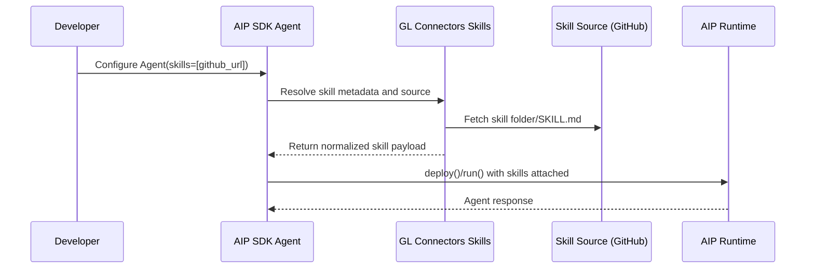

Run prompt-only skills with local and remote agents in `glaip-sdk`. Use this
guide to install/load skills, attach them to agents, and run them in the right
execution mode.


Use GitHub-backed skills for both local runs and remote deploy. Path-based
skills are local-only.

`glaip-sdk` utilizes the **GL Connectors Skills** workflow and references the
same skill model documented in GL Connectors.


## Local vs Remote Examples

For concrete local and remote skill examples, refer directly to the cookbook
PR: [gdplabs/gl-aip-sdk-cookbook#3](https://github.com/gdplabs/gl-aip-sdk-cookbook/pull/3).

Use this guide for the skill loading and attachment patterns; use the cookbook
as the runnable reference for local-vs-remote behavior.

## Skills Patterns

### GitHub-Based Skills (Recommended)

The recommended way to use skills is via GitHub URLs. This works for both local
and remote deployment.

#### Public GitHub Skills

For public repositories, pass the GitHub skill URL directly:

```python
from glaip_sdk import Agent

github_skill = "https://github.com/coreyhaines31/marketingskills/tree/main/skills/copywriting"

agent = Agent(
    name="skills-github-agent",
    instruction="You are a helpful assistant.",
    model="openai/gpt-5",
    skills=[github_skill],
)

result = agent.run("Write landing page copy for PulsePath.")
```

#### Private GitHub Skills

For private repositories, set one of these environment variables before running:

```bash
export GITHUB_PERSONAL_ACCESS_TOKEN="<your_token>"
# or
export GITHUB_TOKEN="<your_token>"
# or
export GH_TOKEN="<your_token>"
```

Then use the private URL the same way:

```python
from glaip_sdk import Agent

agent = Agent(
    name="skills-private-github-agent",
    instruction="You are a helpful assistant.",
    model="openai/gpt-5",
    skills=["https://github.com/<org>/<repo>/tree/<branch>/skills/<skill-name>"],
)
```

#### Remote Deploy with GitHub Skills

For remote runs, deploy the agent first. With GitHub-backed skills, the SDK
normalizes the skills payload and enables filesystem support automatically.

```python
from glaip_sdk import Agent

agent = Agent(
    name="skills-remote-agent",
    instruction="You are a helpful assistant.",
    model="openai/gpt-5",
    skills=["https://github.com/<org>/<repo>/tree/<branch>/skills/<skill-name>"],
)

agent.deploy()
result = agent.run("Write landing page copy for PulsePath.")
```

Accepted GitHub-based inputs:

- single URL string:

```python
skills="https://github.com/<org>/<repo>/tree/<branch>/skills/<name>"
```

- list of URL strings: `skills=["<github-skill-url-1>", "<github-skill-url-2>"]`

Input behavior:
- string or list of strings in `skills` is treated as GitHub skill source URL(s)
- `Skill` object from `Skill.from_path(...)` is treated as a local installed skill

### Path-Based Skills (Local Only)

Use local skill folders under `.agents/skills/<skill-name>/` and load them with
`Skill.from_path(...)`. **Note: Path-based skills only work for local runs and
cannot be used with remote deployment.**

```python
from glaip_sdk import Agent
from glaip_sdk.skills import Skill

skill = Skill.from_path(".agents/skills/copywriting")

agent = Agent(
    name="skills-local-agent",
    instruction="You are a helpful assistant.",
    model="openai/gpt-5",
    skills=[skill],
)

result = agent.run("Write landing page copy for PulsePath.")
```

**Use path-based skills for:**

- deterministic local development
- teams managing skill files inside the repository
- explicit skill versioning through Git history

______________________________________________________________________

## Skill Authoring (GL Connectors Skills)

For creating and structuring skills, follow the canonical GL Connectors docs:

- [GL Connectors Skills](https://gdplabs.gitbook.io/sdk/gl-connectors/sdk/connectors-skills)
- [Creating a Skill](https://gdplabs.gitbook.io/sdk/gl-connectors/sdk/connectors-skills/creating-a-skill)
- [Skills, MCP Servers, Pipelines and APIs](https://gdplabs.gitbook.io/sdk/gl-connectors/sdk/agentic-tools-and-model-context-protocol-mcp)

In this SDK guide:

- Path-based custom skills are local-only (`Skill.from_path(...)`).
- For remote deploy, publish your skill to GitHub and use the GitHub tree URL
  in `skills=[...]`.

## Troubleshooting

- **`ImportError: aip_agents is required for Skill`**
  - likely cause: local runtime extras are missing
  - fix: install `glaip-sdk[local]`
- **Filesystem override warning during deploy**
  - likely cause: filesystem is explicitly disabled in config while skills are set
  - fix: remove the override if unnecessary; SDK auto-enables filesystem for remote deploy
- **`Missing required SKILL.md`**
  - likely cause: invalid skill directory
  - fix: add `SKILL.md` at skill root
- **GitHub install failure**
  - likely cause: missing dependency or GitHub auth
  - fix: ensure `gl-connectors-tools` is installed and set `GITHUB_PERSONAL_ACCESS_TOKEN` (or `GITHUB_TOKEN` / `GH_TOKEN`) for private repos

## Current Limitations and Roadmap

- Skills are currently read/prompt-oriented (`SKILL.md`, references, examples).
- Path-based custom skills are local-only.
- Agent execution of code inside skill folders is planned (TBD).


______________________________________________________________________

## How Skills Relate to Tools, MCP Servers, and APIs

Use these components together based on responsibility:

- **Skills**: teach the agent workflow, format, and domain rules.
- **Tools**: let the agent perform discrete actions.
- **MCP servers**: expose external tools/resources through a standard interface.
- **Pipelines/APIs**: run deterministic execution outside the model.

Decision matrix:

| If you need... | Start with | Why |
| --- | --- | --- |
| The agent to **know how** to follow a workflow/format | **Skill** | Encodes instructions, rules, and domain process |
| The agent to **do** a discrete action | **Tool** or **MCP server** | Executes capabilities against external systems |
| Deterministic, fixed execution with no model reasoning | **Pipelines/APIs** | Keeps logic explicit and predictable |
| Team-specific workflow using existing tools/MCP | **Skill + Tool/MCP** | Skill teaches process; Tool/MCP provides actions |

Use tools or MCP servers for executable actions in the current release.

### Runtime Relationship (AIP + GL Connectors Skills)

Conceptual sequence for how `glaip-sdk` uses GL Connectors skill sources:



## Related Documentation

- [Agents guide](https://gdplabs.gitbook.io/sdk/gl-ai-agent-package/guides/agents)
- [MCPs guide](https://gdplabs.gitbook.io/sdk/gl-ai-agent-package/guides/mcps)
