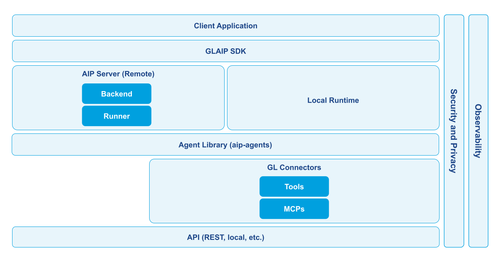

# Introduction to GL AIP

GL AIP is an agent package with an SDK-first developer experience. The primary interface is the Python `Agent` object from `glaip-sdk`. You can run agents locally for fast iteration, then deploy and run remotely when you need centralized execution.

## Start Here (Python SDK, Agent-First)

The fastest path is a minimal `Agent`:

```python
from glaip_sdk import Agent

agent = Agent(
    name="hello",
    instruction="You are a helpful assistant.",
)

# Undeployed agents run locally (requires `glaip-sdk[local]`).
print(agent.run("Hello!"))
```

When you deploy an agent, `Agent.run()` uses server-backed execution by default. You can still force local execution for a deployed agent with `local=True`.

## Recommended Reading Path

- Getting started: install, configure, and quick start.
- Guides: build (agents, tools, MCPs), run (files, HITL), operate (security, config, automation).
- CLI: interactive ops workflows (accounts, runs/transcripts, export/import).
- Resources: Python SDK reference first; REST API is reference-only for internal integrators.

### Documentation Map

Use these sections in order when exploring the SDK and CLI:

- [**Get Started**](https://gdplabs.gitbook.io/sdk/gl-ai-agent-package/getting-started) — Install, configure, complete the quick start, and run curated examples.
- [**Guides**](https://gdplabs.gitbook.io/sdk/gl-ai-agent-package/guides) — Deep dives on lifecycle management, automation, integrations, and governance.
- [**Multi-Agent System Patterns**](https://gdplabs.gitbook.io/sdk/gl-ai-agent-package/tutorials/multi-agent-system-patterns) — Runnable orchestration templates for complex workflows.
- [**CLI**](https://gdplabs.gitbook.io/sdk/gl-ai-agent-package/tutorials/cli) — Interactive ops workflows (accounts, runs/transcripts, export/import).
- [**Reference**](https://gdplabs.gitbook.io/sdk/gl-ai-agent-package/resources/reference) — Definitive API, SDK, and CLI commands for implementation details.
- [**Resources**](https://gdplabs.gitbook.io/sdk/gl-ai-agent-package/resources) — Glossary, upgrade checklists, and cookbook pointers.

### Role-Based Entry Points

Choose the track that matches how you work today.

<details>

<summary>Engineers — Ship agents in applications and automation</summary>

**Why it matters:** You need reliable APIs, typed clients, and testable workflows that fit existing services.

**Start here:**

- [Quick Start Guide](https://gdplabs.gitbook.io/sdk/gl-ai-agent-package/getting-started/quick-start-guide) for first-run success.
- [Python SDK Reference](https://gdplabs.gitbook.io/sdk/gl-ai-agent-package/resources/reference/python-sdk) for signatures and streaming behaviour.
- [Automation & Scripting](https://gdplabs.gitbook.io/sdk/gl-ai-agent-package/guides/automation-and-scripting) for CI, cron, and deployment patterns.

</details>

<details>

<summary>Product Managers — Validate agents via GLChat</summary>

**Why it matters:** You review agent behaviour for stakeholders. GLChat gives you fast access, but the CLI helps you list available agents and capture verbose output when needed.

**Start here:**

- [CLI quick start](https://gdplabs.gitbook.io/sdk/gl-ai-agent-package/getting-started/quick-start-guide/cli) — run an agent end-to-end and see detailed logs.
- [CLI landing](https://gdplabs.gitbook.io/sdk/gl-ai-agent-package/tutorials/cli) — task-focused pages (status, agents, runs/transcripts).
- [Agents guide › List & run](https://gdplabs.gitbook.io/sdk/gl-ai-agent-package/guides/agents#list-and-inspect-agents) — discover agent IDs/names before launching them in GLChat.
- [Automation & Scripting › Choose the right output](https://gdplabs.gitbook.io/sdk/gl-ai-agent-package/guides/automation-and-scripting#choose-the-right-output-format) — switch between rich and plain responses when sharing findings.

</details>

<details>

<summary>Data Developers — Curate prompts, evaluations, and linguistic QA</summary>

**Why it matters:** You iterate on prompts, run guided evaluations, and need to inspect agent transcripts without writing code.

**Start here:**

- [CLI quick start](https://gdplabs.gitbook.io/sdk/gl-ai-agent-package/getting-started/quick-start-guide/cli) — validate access and run agents.
- [Runs & transcripts](https://gdplabs.gitbook.io/sdk/gl-ai-agent-package/tutorials/cli/commands/runs-and-transcripts) — capture and review outputs.
- [Configuration management guide](https://gdplabs.gitbook.io/sdk/gl-ai-agent-package/guides/configuration-management) — master CLI export/import loops for prompt iteration.
- [CLI Commands Reference](https://gdplabs.gitbook.io/sdk/gl-ai-agent-package/resources/reference/cli-commands) — look up flags for runs, exports, and transcript capture.

</details>

### Choose Your Interface

Pick the surface that matches your environment. Default path is Python SDK first.

| Interface                 | When to use it                                                         | Start here                                                                                                                                                                                  |
| ------------------------- | ---------------------------------------------------------------------- | ------------------------------------------------------------------------------------------------------------------------------------------------------------------------------------------- |
| Python SDK (recommended)  | Application code, notebooks, CI, local iteration, type-safe workflows. | [Quick Start (SDK)](https://gdplabs.gitbook.io/sdk/gl-ai-agent-package/getting-started/quick-start-guide) · [Python SDK reference](https://gdplabs.gitbook.io/sdk/gl-ai-agent-package/resources/reference/python-sdk) |
| CLI                       | Interactive ops, demos, export/import promotion loops, transcripts.    | [CLI](https://gdplabs.gitbook.io/sdk/gl-ai-agent-package/tutorials/cli) · [CLI commands reference](https://gdplabs.gitbook.io/sdk/gl-ai-agent-package/resources/reference/cli-commands) |
| REST API (reference-only) | Internal integrations (for example GLChat) or non-Python environments. | [REST API reference](https://gdplabs.gitbook.io/sdk/gl-ai-agent-package/resources/reference/rest-api) |

### Platform Capabilities at a Glance

Symbols: `✅` fully supported · `🛠️` partial via customization/workarounds · `🚧` roadmap


REST exists as a reference-only surface for internal integrations. SDK and CLI are the supported day-to-day surfaces for most users.


| Capability                      | What it covers                                                    | REST API (ref) | Python SDK | CLI |
| ------------------------------- | ----------------------------------------------------------------- | -------------- | ---------- | --- |
| Agent lifecycle & metadata      | Create/list/update/delete agents with tools, MCPs, and sub-agents | ✅             | ✅         | ✅  |
| Streaming execution & artifacts | Runs, SSE output, file attachments, artifact links                | ✅             | ✅         | ✅  |
| Tools (native + custom)         | Attach catalog tools, upload tools, tool configs                  | ✅             | ✅         | ✅  |
| MCP connectors                  | MCP CRUD, connect/test, tool discovery                            | ✅             | ✅         | ✅  |
| HITL approvals                  | Pause, approve/reject, resume                                     | ✅             | ✅         | 🛠️  |
| Run history                     | List runs, statuses, transcripts                                  | ✅             | ✅         | ✅  |
| Scheduling                      | Cron schedules and run history                                    | ✅             | ✅         | 🚧  |
| Memory & persistence            | Memory config and chat history                                    | ✅             | ✅         | 🛠️  |
| Security & privacy              | `pii_mapping`, tool output sharing, secrets hygiene               | ✅             | ✅         | 🛠️  |

## Architecture (Reference)

<details>
<summary>How the SDK, CLI, and platform fit together</summary>

<figure><figcaption>Architecture reference — SDK, CLI, local engine, and platform relationships.</figcaption></figure>

Components:

- `glaip-sdk`: user-facing SDK and CLI.
- `aip-agents`: local execution engine used by both local runs and the platform.
- `ai-agent-platform`: remote execution and management.

Setup:

- Local mode: configure LLM provider credentials (for example `OPENAI_API_KEY`).
- Remote mode: configure platform credentials (CLI: `aip accounts add/use`; Python SDK: `AIP_API_URL` and `AIP_API_KEY`).

</details>

### Notes on Execution Modes

- Local mode: runs in your Python process (fast iteration).
- Remote mode: runs on the platform (centralized execution, shared agents).
- The CLI uses the Python SDK under the hood for most operations.
- REST API documentation is kept as reference for internal integrations.

### Start Building

Ready to go from prototype to production? Follow this path to ship quickly:

1. **Install & configure** — Set up credentials and the CLI with [Install & Configure](https://gdplabs.gitbook.io/sdk/gl-ai-agent-package/prerequisites).
1. **Run the quick start** — Use the Agent-first pattern (recommended). Treat `Client` workflows as legacy/advanced admin paths in the [Quick Start Guide](https://gdplabs.gitbook.io/sdk/gl-ai-agent-package/getting-started/quick-start-guide).
1. **Explore patterns** — Use the [Hands-on Examples](https://gdplabs.gitbook.io/sdk/gl-ai-agent-package/tutorials/hands-on-examples) to pick the right pattern (single agent, multi-agent, class pattern, runtime config, local execution, report automation).
1. **Iterate on prompts** — Use the CLI export/import loop in [Configuration management](https://gdplabs.gitbook.io/sdk/gl-ai-agent-package/guides/configuration-management) to refine instructions safely.
1. **Add real workflows** — Explore [Tools](https://gdplabs.gitbook.io/sdk/gl-ai-agent-package/guides/tools), [File processing](https://gdplabs.gitbook.io/sdk/gl-ai-agent-package/guides/file-processing), or [Multi-agent patterns](https://gdplabs.gitbook.io/sdk/gl-ai-agent-package/tutorials/multi-agent-system-patterns) as you expand capabilities.

The GL AIP package, SDK, and CLI give you a single, consistent toolkit to build, test, and operate AI agents anywhere.
