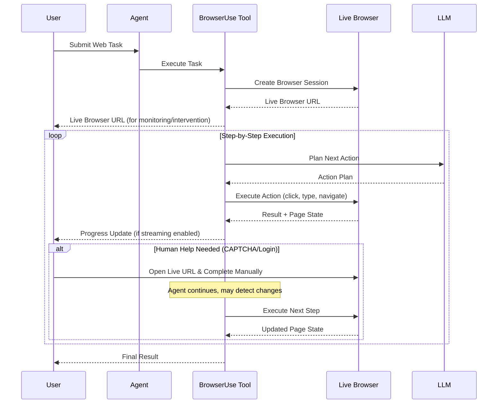

## Overview

The Browser Use Agent enables AI agents to interact with websites automatically. It can navigate pages, fill forms, extract data, and handle complex scenarios like CAPTCHAs and logins with human assistance when needed.

## Execution Flow & Architecture

### Process Flow Diagram



### Workflow Explanation

1. **Task Submission**: You provide a web automation task (e.g., "Search for jobs on LinkedIn")

1. **Browser Session Creation**: The agent creates an isolated browser session and provides you with a live browser URL

1. **Step-by-Step Execution**: The agent plans and executes actions one by one:

   1. Analyzes the current page
   1. Decides what to do next (click button, fill form, navigate)
   1. Executes the action
   1. Reports progress

1. **Human Assistance**: When the agent encounters challenges like CAPTCHAs or login prompts, you can help by opening the live browser URL and completing them manually

1. **Result Delivery**: The agent returns the final results (extracted data, completion status, etc.)

______________________________________________________________________

## Human-in-the-Loop Mechanisms

The Browser Use Agent handles challenging web scenarios through intelligent automation and optional human assistance.

### How It Handles CAPTCHAs and Logins

**Automatic Attempts:**
The agent tries to handle challenges automatically using its built-in instructions:

1. **CAPTCHAs**: Attempts to solve them when possible; uses alternative strategies if blocked
1. **Logins**: Only attempts login if credentials are provided or explicitly required
1. **Stuck Situations**: Re-evaluates the task and tries different approaches

**When You Need to Help:**
Sometimes the agent needs human assistance for complex challenges:

1. **Agent encounters a challenge** (CAPTCHA, login prompt, etc.) during execution

1. **Live browser URL is available** - You receive a URL that shows the current browser session in real-time

1. **You open the URL** and manually complete the challenge (solve CAPTCHA, enter login credentials, etc.)

1. **Agent continues** - The agent proceeds with its next step independently (it doesn't wait for you)

1. **Task continues** - When the agent executes its next step, it may detect that you've completed the challenge and continue with the updated page state (this detection is automatic but not guaranteed)

**Important Points:**

1. The agent doesn't pause or wait for you - it continues executing steps independently
1. You can help at any time by opening the live browser URL
1. The agent may detect your changes when it executes its next step (this is automatic, not guaranteed)
1. There's no explicit pause/resume - you're helping in parallel with the agent's execution

### Example Scenario: Job Board Search

**Task**: "Search for software engineer jobs on a job board and extract the first 5 listings"

**What Happens:**

1. Agent navigates to the job board website
1. Agent encounters a CAPTCHA during search
1. You receive a live browser URL
1. You open the URL and solve the CAPTCHA manually
1. Agent continues searching and extracts job listings
1. Agent returns the results

**If Login is Required:**

1. If no credentials are provided, the agent skips login (per its instructions)
1. If login is necessary, you can complete it via the live browser URL
1. The agent then continues with the task

### Recovery Strategies

When the agent gets stuck or encounters errors:

1. **Automatic Retry**: The agent tries alternative approaches automatically
1. **Session Recovery**: If the browser connection is lost, the agent recreates the session and continues
1. **State Preservation**: Your manual changes (like completing a CAPTCHA) are typically preserved in the browser session, and the agent may detect them when it executes its next step

______________________________________________________________________

## How It Works

### Browser Automation Process

**Step-by-Step Execution:**

1. The agent analyzes the current webpage
1. It plans the next action using AI reasoning
1. It executes the action (click, type, navigate, extract data)
1. It checks the result and plans the next step
1. This continues until the task is complete

**Real-Time Updates:**

1. You receive progress updates showing what the agent is doing
1. You can see the agent's "thinking" process
1. A live browser URL lets you watch or intervene if needed

**Session Recording:**

1. Optionally records a video of the entire browser session
1. Useful for debugging or reviewing what happened
1. Available after task completion

### Error Handling

**Automatic Recovery:**

1. If the browser disconnects, the agent automatically recreates the session
1. If an action fails, the agent tries alternative approaches
1. Configurable retry limits prevent infinite loops

**Common Issues:**

1. **CAPTCHA/Login Blocks**: Use the live browser URL to complete manually
1. **Element Not Found**: Agent waits, refreshes, or tries alternative selectors
1. **Session Disconnects**: Automatic retry with session recreation

______________________________________________________________________

## Sample Usage

### Basic Web Automation

**Using via SDK:**

```python
from glaip_sdk import Client

client = Client()
agent = client.agents.find_agents("browser_use_agent")[0]

# Simple task
result = agent.run("Go to example.com and extract the main heading")
print(result)
```

**Example Output:**

```
The agent navigated to example.com and extracted: "Example Domain"
```

### Task Requiring Human Assistance

```python
from glaip_sdk import Client

client = Client()
agent = client.agents.find_agents("browser_use_agent")[0]

# Complex task that may require CAPTCHA/login handling
result = agent.run("""
    Navigate to a job board, search for 'software engineer' positions,
    filter by remote work, and extract the first 5 job listings with
    company names and salaries.
""")

# If CAPTCHA appears, you'll receive a live browser URL as a status update
# Open it, complete the CAPTCHA, and the agent may detect the change on its next step
```

**What to Expect:**

1. Agent starts executing the task
1. If a CAPTCHA appears, you receive a live browser URL as a status update
1. Open the URL, solve the CAPTCHA
1. Agent continues with its next step and might detect your changes when it executes the next action
1. Final results are returned with the job listings

### Configuring Timeouts

You can configure timeout settings to match your task requirements:

```python
from glaip_sdk import Client

client = Client()
agent = client.agents.find_agents("browser_use_agent")[0]

# Configure timeouts for longer tasks via runtime_config
runtime_config = {
    "tool_configs": {
        "browser_use_tool": {
            "steel_timeout_in_ms": 900_000,  # 15 minutes (matches Steel Hobby plan max)
            "browser_use_llm_timeout_in_s": 120,  # 2 minutes for LLM responses
            "browser_use_step_timeout_in_s": 300,  # 5 minutes per step
        }
    }
}

# Use the configured agent with custom timeouts
result = agent.run("Your task here", runtime_config=runtime_config)
```

______________________________________________________________________

## Capabilities & Limitations

### Known Capabilities

The Browser Use Agent excels at a wide range of web automation tasks:

1. **Web Navigation & Form Filling**

   1. **Use Case**: Automatically fill out contact forms, registration pages, or search forms
   1. **Example Task**: "Go to https://duckduckgo.com, search for 'Python web automation', and extract the titles of the first 5 search results"

1. **Data Extraction & Collection**

   1. **Use Case**: Gather information from multiple pages or websites
   1. **Example Task**: "Navigate to https://en.wikipedia.org/wiki/Python_(programming_language) and extract the first paragraph"

1. **Multi-Step Task Automation**

   1. **Use Case**: Complete complex workflows that require multiple sequential actions
   1. **Example Task**: "Go to https://www.python.org, navigate to the documentation section, find the 'Tutorial' page, and extract the main topics covered"

1. **Scrolling & Pagination**

   1. **Use Case**: Navigate through long pages or multiple pages of results
   1. **Example Task**: "Go to https://en.wikipedia.org/wiki/Python_(programming_language) and scroll down past the introduction section"

1. **Multi-Tab Operations**

   1. **Use Case**: Open multiple tabs for research or parallel information gathering
   1. **Example Task**: "Open https://www.python.org, open the documentation section in a new tab, then extract the main heading from each page"

### Known Limitations

While powerful, the Browser Use Agent has some limitations:

1. **CAPTCHAs in Iframes**

   1. **Limitation**: CAPTCHAs embedded in iframes are difficult to solve automatically
   1. **Example Scenario**: A login page with a CAPTCHA widget loaded in an iframe may require manual intervention
   1. **Workaround**: Use the live browser URL to complete CAPTCHAs manually when needed

1. **Login Without Credentials**

   1. **Limitation**: The agent skips login attempts if no credentials are provided (by design for security)
   1. **Example Scenario**: Task requires accessing a protected area but no login credentials are available
   1. **Workaround**: Provide credentials in the task description or complete login manually via the live browser URL

1. **Timeouts & Limits**

   1. **Limitation**: Several timeout and limit constraints may affect task execution:
      1. **Task Length**: Tasks requiring more than 100 steps may face memory constraints. This is a practical limitation based on observed memory usage patterns, not a hard limit enforced by the tool. The browser-use framework roadmap includes plans to improve agent memory handling for longer tasks.
      1. **Timeout Settings**: Three configurable timeout settings limit task duration (all configurable via `BrowserUseToolConfig`):
         1. **Steel Session API Timeout**: Default 600 seconds (10 minutes) - controls how long the Steel session can remain active (`steel_timeout_in_ms`)
         1. **Browser Use Agent LLM Timeout**: Default 60 seconds - controls how long the LLM has to respond for each planning step (`browser_use_llm_timeout_in_s`)
         1. **Browser Use Agent Step Timeout**: Default 180 seconds (3 minutes) - controls how long each agent step can take (`browser_use_step_timeout_in_s`)
      1. **Network Latency**: Due to geographic distance between Browser Use deployment (South East Asia) and Steel servers (United States), network latency can cause timeout scenarios during rapid interactions
      1. **Steel Hobby Plan Limits**: Browser Use currently uses Steel's free Hobby plan with the following limits (note: these limits are subject to change if we upgrade to a paid Steel plan):
         1. **Max Session Time**: 15 minutes per browser session
         1. **Daily Requests**: 500 requests per day
         1. **Requests per Second**: 1 request per second rate limit
         1. **Concurrent Sessions**: Maximum 5 concurrent browser sessions
         1. **Data Retention**: Session data retained for 24 hours
   1. **Example Scenario**: Long-running tasks exceeding 15 minutes will be terminated, rapid interactions may timeout due to network latency, or hitting daily request limits will prevent new sessions
   1. **Workaround**: Break large tasks into smaller subtasks under 15 minutes, use the file system to track progress across multiple runs, configure timeout values if needed, or upgrade to a paid Steel plan for higher limits (see [Steel Pricing](https://docs.steel.dev/overview/pricinglimits))

1. **Cross-Origin Iframe Interactions**

   1. **Limitation**: Interacting with elements inside cross-origin iframes can be unreliable
   1. **Example Scenario**: A payment form embedded in an iframe from a different domain
   1. **Workaround**: Manual intervention via live browser URL for critical iframe interactions

1. **Sequential Execution**

   1. **Limitation**: Tasks execute sequentially, not in parallel
   1. **Example Scenario**: Applying to 50 different job postings must be done one at a time
   1. **Workaround**: For parallel tasks, run multiple agent instances or break into batches

1. **UI Element Detection**

   1. **Limitation**: Some dynamically loaded or custom UI elements may not be immediately detected
   1. **Example Scenario**: A custom dropdown menu that loads content via JavaScript after a delay
   1. **Workaround**: The agent will wait and retry, or you can use the live browser URL to verify element visibility

1. **Real-Time Interactive Elements**

   1. **Limitation**: Elements that require real-time human interaction (like drag-and-drop) may be challenging
   1. **Example Scenario**: A complex image editor with drag-and-drop functionality
   1. **Workaround**: Use manual intervention via live browser URL for complex interactions

1. **Elements with Mouse Events**

   1. **Limitation**: Elements that rely on mouse event handlers (such as `mousedown`, `mouseup`, `mouseover`, etc.) instead of standard `click` events may not respond correctly to agent interactions
   1. **Example Scenario**: A custom button or interactive element that only triggers actions on mouse events (common in some JavaScript frameworks or custom UI libraries)
   1. **Workaround**: Use manual intervention via live browser URL to interact with such elements, or contact support if this is a critical requirement

1. **Token Consumption**

   1. **Limitation**: Very large pages with extensive DOM content can consume significant tokens
   1. **Example Scenario**: A single-page application with thousands of interactive elements
   1. **Workaround**: Configure vision detail levels (auto/low/high) to optimize token usage

______________________________________________________________________

## Technical Details

### Browser Sessions

The agent uses isolated browser sessions that:

1. Run in secure, isolated environments
1. Automatically clean up after task completion
1. Support real-time monitoring via live browser URLs

### AI Models

The agent uses two AI models:

1. **Primary Model**: Plans actions and makes decisions
1. **Secondary Model**: Extracts structured data from web pages

Both models work together to understand pages and execute tasks effectively.

### Streaming Events

The agent provides real-time updates through streaming events:

1. **Status Updates**: Progress notifications, session initialization
1. **Step Results**: Action execution results with thinking process
1. **Live Browser URL**: You'll receive the live browser URL as a status update early in execution, allowing you to monitor or intervene if needed

### Security

**Isolation:**

1. Each browser session is isolated from others
1. No data persists between tasks
1. API keys are loaded from environment variables (never hardcoded)

**Safety:**

1. Actions are validated before execution (enforced by the browser-use framework)
1. Error messages are sanitized
1. Logging available for monitoring

______________________________________________________________________

## Performance & Troubleshooting

**Efficiency:**

1. Configurable vision detail levels (auto/low/high) for faster processing
1. Background video recording doesn't slow down execution
1. Automatic resource cleanup

**Common Issues:**

| Issue                | Solution                                            |
| -------------------- | --------------------------------------------------- |
| CAPTCHA/Login blocks | Use the live browser URL to complete manually       |
| Session disconnects  | Automatic retry - agent recreates session           |
| Element not found    | Agent waits and retries with alternative approaches |
| Task stuck           | Agent re-evaluates and tries different strategies   |

**Debug Resources:**

1. Live browser URLs for real-time monitoring
1. Video recordings (if enabled) for reviewing sessions
1. Action logs showing what the agent did
1. AI reasoning traces showing decision-making process
