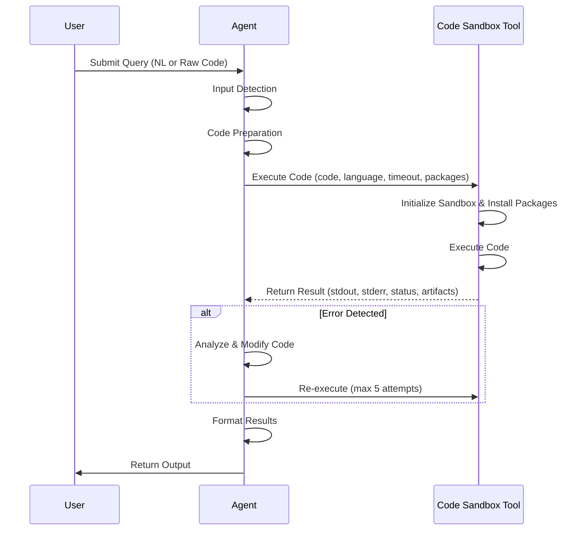

## Execution Flow & Architecture

### Process Flow Diagram



### Workflow Explanation

1. **Input Detection**: Detects if input is natural language (generates code) or raw code (executes as-is). Identifies language (Python default, or JS/TS/R/Java)

1. **Code Preparation**: Adds imports, installs packages dynamically, includes error handling and save commands for artifacts

1. **Secure Execution**: Runs in sandbox. On error: analyzes -> modifies -> re-executes (max 5 attempts). Blocks dangerous operations

1. **Result Formatting**: Returns final code only (hides iterations), formatted results, and embedded artifacts

______________________________________________________________________

## Detailed Mechanisms

### Code Execution Mechanism

**How Code is Executed:**

1. **Agent calls the E2B Sandbox Tool** with parameters:

   - `code`: The Python/JS/TS/R/Java code to execute
   - `language`: Target programming language (default: Python)
   - `timeout`: Maximum execution time in seconds (default: 30s, max: 300s)
   - `additional_packages`: Optional packages to install before execution

1. **Sandbox Initialization**: E2B Cloud Sandbox creates isolated environment with specified language runtime

1. **Package Installation**: Installs required packages dynamically within the sandbox

1. **Code Execution**: Runs code in isolated environment with resource monitoring

1. **Result Collection & Response**: Captures execution details and returns structured response:

   ```json
   {
     "status": "success/error",
     "code": "executed code",
     "stdout": "standard output",
     "stderr": "standard error",
     "error": "error message if any",
     "duration_ms": "execution time",
     "artifacts": ["generated files"]
   }
   ```

### Language Support

1. **Supported Languages**: Python (default), JavaScript, TypeScript, R, Java

1. **Extensible**: Additional languages can be installed dynamically based on user requirements or query needs

### Security Mechanisms

| Layer                | Protection                                                  |
| -------------------- | ----------------------------------------------------------- |
| Execution Boundaries | Isolated sandbox; no system commands; max 5 iterations; reject eval/exec |
| Resource Protection  | Memory monitoring; computation limits; output truncation    |
| Code Validation      | Block harmful operations; sanitize errors; prevent system info exposure |

### Iterative Error Recovery

1. **Error Detection**: Captures exceptions, syntax errors, runtime failures
1. **Error Analysis**: Parses messages, identifies root causes
1. **Code Modification**: Adjusts imports, fixes syntax, installs packages
1. **Re-execution**: Runs modified code (max 5 attempts)
1. **Clean Presentation**: Only final successful code shown to users

**Example**: Missing matplotlib -> agent installs it automatically -> re-executes -> user sees only working result.

### Artifacts

1. **Visualization Generation**: Charts, graphs, plots, heatmaps saved as PNG/JPG/SVG and embedded in markdown

1. **File Generation**: CSV exports, JSON data, reports, processed files

______________________________________________________________________

## Sample Code

### Using Code Interpreter Agent via SDK

```python
from glaip_sdk import Client

client = Client()

agent = client.agents.find_agents("code_interpreter_agent")[0]
print(agent.run("Generate 5x5 chessboard"))
```

**Output:**

**Executed Code:**

```python
import matplotlib.pyplot as plt
import numpy as np

# Create a 5x5 chessboard pattern
chessboard = np.zeros((5, 5))
chessboard[1::2, ::2] = 1
chessboard[::2, 1::2] = 1

plt.figure(figsize=(5, 5))
plt.imshow(chessboard, cmap='gray', interpolation='nearest')
plt.xticks([])
plt.yticks([])
plt.title('5x5 Chessboard')
plt.savefig('/tmp/output/chessboard_5x5.png', bbox_inches='tight', dpi=300)
plt.close()
```

**Output:**
Example execution returns a generated chessboard image artifact plus summary text.
