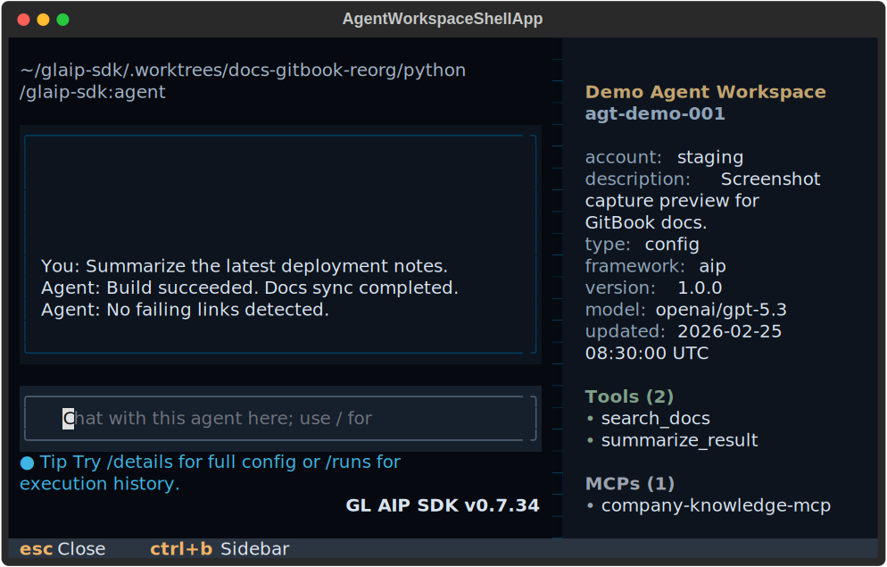
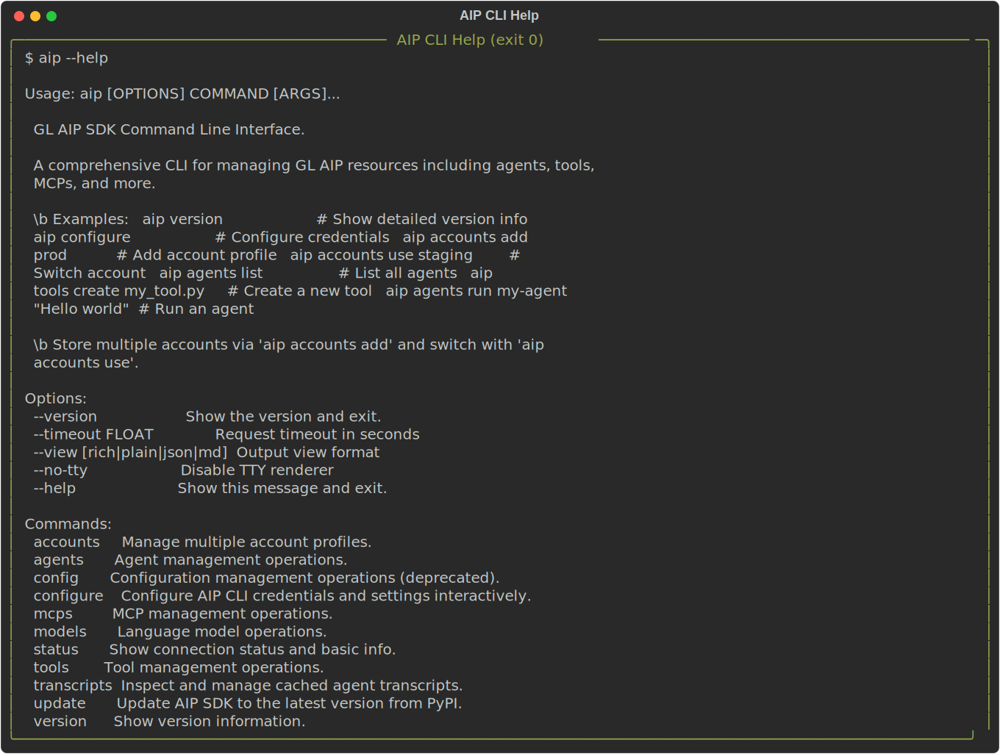

The AIP CLI ships with an interactive command palette that recognises a curated set of slash commands. Launching `aip` with no subcommand in an interactive terminal drops you straight into this palette so you can browse agents, run them, or reconfigure credentials without remembering full Click invocations.

<figure><figcaption>Captured agent workspace shell (TUI) screenshot for visual reference.</figcaption></figure>

______________________________________________________________________

## Launch & Requirements

- Run `aip` without arguments in a TTY-enabled shell to open the palette.
- The palette honours existing CLI context: flags such as `--api-url`, `--api-key`, and `--view` become defaults for the slash commands you trigger.
- `prompt_toolkit` is optional but recommended. When installed, you get inline completions, coloured placeholders, and `/`-aware key bindings. Without it, the CLI falls back to a plain input prompt and prints placeholder hints before the first command.
- The palette checks your credentials up front. If API URL or API key are missing, it launches the `/login` wizard, which stores credentials via `aip accounts add` and revalidates before continuing.
- Slash mode is skipped automatically when STDIN/STDOUT are not TTYs or when you pass `--no-tty`; in those cases the CLI prints regular help output instead.

```bash
aip
```

______________________________________________________________________

## Global Slash Commands

These commands are always available from the palette home screen and inside agent sessions.

| Command        | Aliases | What it does                                                                                                                                                                      | Context                        |
| -------------- | ------- | --------------------------------------------------------------------------------------------------------------------------------------------------------------------------------- | ------------------------------ |
| `/help`        | `/?`    | Renders a Rich table of palette commands, showing descriptions and any aliases.                                                                                                   | Global & agent                 |
| `/status`      | -       | Runs `aip status` with live Rich output, then suggests quick follow-up actions (recent agents, `/agents`).                                                                        | Global & agent                 |
| `/accounts`    | -       | Opens the accounts manager (add/switch profiles) and refreshes the session context so subsequent API calls use the new active profile.                                           | Global & agent                 |
| `/transcripts` | -       | Opens the local transcript history browser (cached runs) and lets you inspect the most recent execution details.                                                                  | Global & agent                 |
| `/agents`      | -       | Lists available agents using the API client; lets you pick interactively or jump straight to an agent via `/agents <ref>`. Enters the agent run session on selection.            | Global (also callable in agent) |
| `/update`      | -       | Upgrades the installed `glaip-sdk` package (same effect as running `aip update` from your shell).                                                                                | Global & agent                 |
| `/exit`        | `/q`    | Leaves the command palette cleanly. When called from an agent session it returns you to the palette home screen.                                                                  | Global & agent                 |

`/login` exists for internal onboarding (for example when credentials are missing) and routes to `/accounts`. It is intentionally hidden from the default `/help` inventory.

```text
/help
```

<figure><figcaption>Captured CLI help snapshot generated from `aip --help`.</figcaption></figure>

### Tips

- Type `/` to trigger inline completion; continue typing to filter commands. Backspace cancels completion when the current token is no longer a slash command.
- Rich quick-action cards appear after `/status`, `/login`, or when you exit an agent session, highlighting the next useful slash commands to try.
- The palette remembers up to five recent agents and shows the most recent one in the status banner so you can re-open it quickly (`/agents <agent-id>`).

______________________________________________________________________

## Agent Run Session Commands

Picking an agent with `/agents` drops you into a focused prompt tied to that agent. Any plain text you enter runs the agent once; slash commands provide shortcuts to inspect or exit without losing context.

```text
/agents
```

<figure><figcaption>Captured `/agents` workspace session view with metadata and composer panel.</figcaption></figure>

| Input       | Aliases       | Behaviour                                                                                                                      |
| ----------- | ------------- | ------------------------------------------------------------------------------------------------------------------------------ |
| `<message>` | -             | Executes `aip agents run` for the active agent with the entered prompt. The last input is remembered and displayed in `/help`. |
| `/details`  | -             | Shows the agent export/config (prompts to expand long instructions when needed).                                               |
| `/prompt`   | -             | Opens a Textual editor to update the agent instruction (prompt).                                                              |
| `/status`   | -             | Surfaces the same Rich status view without leaving the agent session.                                                          |
| `/runs`     | -             | Opens the remote runs browser for the active agent.                                                                            |
| `/schedules`| -             | Opens the schedules manager for the active agent (create/edit/delete recurring runs).                                         |
| `/help`     | `/?`          | Prints the context-aware help table (agent controls first, reminder that global commands stay available).                      |
| `/exit`     | `/back`, `/q` | Returns to the palette home screen while keeping agent history for quick re-entry.                                             |

### Agent Prompt UX

- The header highlights the agent name, type, ID, and readiness, followed by shortcut reminders (`/help`, `/details`, `/exit`).
- After each successful run the palette stores the prompt so the help sheet can show the latest input alongside guidance.
- With `prompt_toolkit` installed, `Alt+Enter` inserts a newline and `Ctrl+T` opens the transcript viewer for the most recent run.
- If you press `Ctrl+C`, the current input is cleared and you stay inside the agent session; `Ctrl+D` exits the palette immediately.

______________________________________________________________________

## Non-interactive Execution

While the palette is primarily interactive, the session also supports feeding a list of slash commands programmatically. The CLI skips the palette automatically when STDIN/STDOUT are not TTYs, but you can force a run by calling `SlashSession` directly in scripts or tests.

**example.py**

```python
from glaip_sdk.cli.main import main
from glaip_sdk.cli.slash import SlashSession

ctx = click.Context(main, obj={"api_url": "https://api.example", "api_key": "..."})
session = SlashSession(ctx)
session.run(initial_commands=["/status", "/exit"])
```

> Warning - The public `aip` entry point does not expose a `--slash` flag. Use the Python entry point shown above when orchestrating tests or demos that exercise the palette in a non-interactive environment.

______________________________________________________________________

## Troubleshooting & FAQ

<details>

<summary>I only see the regular CLI help</summary>

Ensure you're running `aip` inside an interactive terminal (no redirected stdin/stdout) and without `--no-tty`.

</details>

<details>

<summary>Slash completions are missing</summary>

Install `prompt_toolkit>=3.0`. The CLI works without it, but you'll lose dropdown completions and themed placeholders.

</details>

<details>

<summary>API calls fail inside the palette</summary>

`/login` re-runs the credential wizard and refreshes cached config. The header shows API URL and credential status so you can confirm the setup before re-running commands.

</details>
