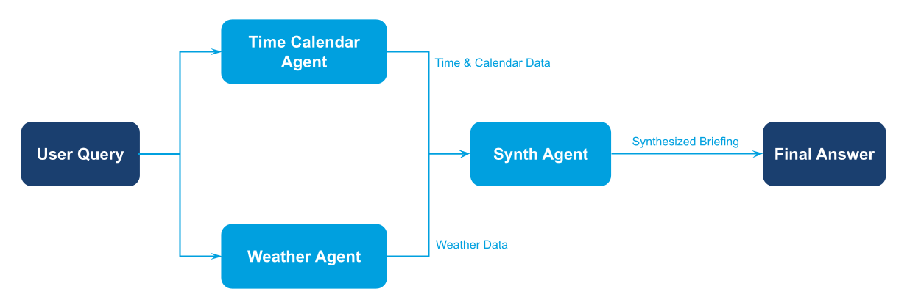

Agents contribute specialized outputs that are collected and synthesized by an
aggregator agent into a single, well-formatted result.

## Overview

Reach for this pattern when multiple agents (or tools) produce complementary
information and you want a unified summary. Executive briefings, dashboards, and
cross-team status reports are common fits.

## Demo Scenario: Daily Briefing Synthesizer

This runnable example assembles a morning briefing by combining three
specialists using **gllm-pipeline** for orchestration:

- **Time & calendar agent** – pulls the current time and today's events
- **Weather agent** – reports the local forecast
- **Synthesizer agent** – stitches everything together into a friendly briefing

Specialists run in parallel for faster execution, and their outputs are merged
and passed to the synthesizer. Each specialist uses a mock tool that returns
static values so the demo works out of the box; swap the tools for real
integrations to connect to live data.

## Diagram

<figure><figcaption>Aggregator pattern — parallel specialists feed a synthesizer for a unified result.</figcaption></figure>

## Implementation Steps

1. **Create specialist agents with tools**

   ```python
   from glaip_sdk import Agent
   from tools.mock_time_tool import MockTimeTool, MockCalendarTool, MockWeatherTool

   time_calendar_agent = Agent(
       name="time_calendar_agent",
       tools=[MockTimeTool, MockCalendarTool],
       model="openai/gpt-5-mini"
   )

   weather_agent = Agent(
       name="weather_agent",
       tools=[MockWeatherTool],
       model="openai/gpt-5-mini"
   )

   synth_agent = Agent(
       name="synth_agent",
       instruction="Synthesize a brief morning briefing...",
       model="openai/gpt-5-mini"
   )
   ```

1. **Build pipeline: parallel specialists → merge → synthesize**

   ```python
   from gllm_pipeline.steps import parallel, step, transform

   pipeline = (
       parallel(branches=[time_calendar_step, weather_step])
       | transform(
           join_partials,
           ["time_text", "weather_text"],
           "partials_text"
       )
       | step(
           component=synth_agent.to_component(),
           input_state_map={"query": "partials_text"},
           output_state="final_answer"
       )
   )
   pipeline.state_type = State
   ```

1. **Run the pipeline**

   ```python
   result = await pipeline.invoke(state)
   print(result['final_answer'])
   ```

> **Full implementation:** See `aggregator/main.py` for complete code with State definition and helper functions.
>
> **AgentComponent:** See the [Agent as Component](https://gdplabs.gitbook.io/sdk/gl-ai-agent-package/tutorials/multi-agent-system-patterns/agent-component) guide for details on the `.to_component()` pattern.

## How to Run

From the `gl-aip/examples/multi-agent-system-patterns` directory in the [GL SDK Cookbook](https://github.com/gl-sdk/gen-ai-sdk-cookbook/tree/main/gl-aip):

```bash
uv run aggregator/main.py
```

Ensure your `.env` contains:

```bash
OPENAI_API_KEY=your-openai-key-here
```

## Output

```
Daily Briefing:
Good morning — it's 10:00 AM WIB, 15 Jan 2026. Quick briefing:

Top time-sensitive items
- Development team meeting at 2:00 PM WIB (starts in ~4 hours).
  - Suggestions: finalize agenda and key updates now, send any pre-read by 1:00 PM,
    and set reminders at 30 and 10 minutes before start.
  - If you're presenting: confirm slides, test screen-sharing and audio 15–20 minutes
    before the meeting.

Weather & travel
- Partly cloudy, ~72°F (22°C). Rain expected at 3:00 PM WIB (during/just after the meeting).
  - Suggestions: bring an umbrella or light waterproof jacket; if you commute around that
    time, leave a bit earlier to avoid wet delays.
...

Quick action checklist (next few hours)
- 10:00–12:00: polish agenda, compile blockers/metrics, prepare slides.
- 12:00–13:00: send pre-read and confirm attendees.
- 1:40–1:50 PM: tech check (or arrive on site).
- 2:00 PM: meeting.
```

## Notes

- This example uses **gllm-pipeline** for orchestrating the multi-agent workflow with parallel execution.
- Replace the mock tool scripts under `aggregator/tools/` with real integrations to connect to live systems.
- Add more specialists (finance, news, incidents) by adding more branches to the `parallel()` step.
- Combine this pattern with a router or scheduler for automated briefings.
- To install gllm-pipeline: `uv add gllm-pipeline-binary==0.4.13` (compatible with aip_agents and langgraph \<0.3.x)

## Related Documentation

- [Agents guide](https://gdplabs.gitbook.io/sdk/gl-ai-agent-package/guides/agents)
  — Configure agent instructions and manage lifecycles.
- [Tools guide](https://gdplabs.gitbook.io/sdk/gl-ai-agent-package/guides/tools)
  — Upload Python tools and reference their IDs.
- [Automation & scripting](https://gdplabs.gitbook.io/sdk/gl-ai-agent-package/guides/automation-and-scripting)
  — Schedule or orchestrate the aggregator run in CI.
- [Security & privacy](https://gdplabs.gitbook.io/sdk/gl-ai-agent-package/guides/security-and-privacy)
  — Apply PII masking or output-sharing policies when aggregating data.
