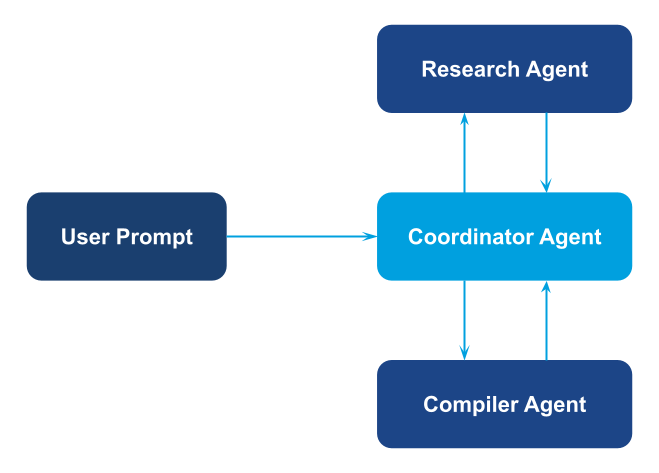

Agents are organized in a tree-like structure, with higher-level agents
(supervisors) coordinating specialist agents.

## Overview

Hierarchies shine when you need structured decision flows, explicit quality
checks, and clear ownership of each step. Supervisors break work into pieces,
delegate to the right specialists, and assemble the final answer.

## Demo Scenario: Multi-Level Research System

This runnable example builds a hierarchical research workflow using **sub-agent delegation**:

1. **Coordinator agent** – manages the research and compilation workflow
1. **Research agent** – performs web searches using the google_serper tool
1. **Compiler agent** – formats raw findings into a polished summary

The coordinator delegates tasks to research and compiler agents, reviews their outputs, and can make decisions based on their responses. This cyclic decision-making capability is why we use sub-agent delegation instead of gllm-pipeline.

## Diagram

<figure><figcaption>Hierarchical pattern — supervisor agent delegates tasks to specialist sub-agents.</figcaption></figure>

## Implementation Steps

1. **Create specialist agents**

   ```python
   from glaip_sdk import Agent
   from glaip_sdk.tools import Tool

   web_search_tool = Tool.from_native("google_serper")

   research_agent = Agent(
       name="research_agent",
       instruction="Perform web searches and provide comprehensive information...",
       tools=[web_search_tool],
       model="openai/gpt-5.2"
   )

   compiler_agent = Agent(
       name="compiler_agent",
       instruction="Transform raw research into summaries...",
       model="openai/gpt-5.2"
   )
   ```

1. **Create coordinator agent with sub-agents**

   ```python
   coordinator_agent = Agent(
       name="coordinator_agent",
       instruction="""Manage research and compilation tasks.
       Delegate to 'research_agent' to gather information,
       then delegate to 'compiler_agent' to create summaries...""",
       agents=[research_agent, compiler_agent],  # Sub-agent delegation
       model="openai/gpt-5.2"
   )
   ```

1. **Run the coordinator**

   ```python
   result = coordinator_agent.run(
       "Research this topic and provide a compiled summary: [topic]",
       verbose=False
   )
   ```

> **Full implementation:** See `hierarchical/main.py` for complete code with detailed instructions.
>
> **Why sub-agents?** This pattern uses sub-agent delegation (not gllm-pipeline) because the coordinator needs to make decisions based on sub-agent responses and potentially loop back if needed.

## How to Run

From the `gl-aip/examples/multi-agent-system-patterns` directory in the [GL SDK Cookbook](https://github.com/gl-sdk/gen-ai-sdk-cookbook/tree/main/gl-aip):

```bash
uv run hierarchical/main.py
```

Ensure your `.env` contains:

```bash
OPENAI_API_KEY=your-openai-key-here
SERPER_API_KEY=your-serper-api-key-here
```

Note: You'll need a [Serper API key](https://serper.dev/) for the google_serper tool to work.

## Output

```
## 1) GenAI deployments / product & platform updates (found)

### Epic: ongoing EHR-integrated AI positioning and feature direction
- 2025-08-20 — Epic UGM coverage: "Epic touts new AI tools"
  Source: CNBC (Aug 20, 2025)

- 2025-12-12 — Epic blog: "How AI Is Shaping the Patient and Clinician Experience"
  Source: Epic (Dec 12, 2025)

### Microsoft: "agentic AI" + Copilot framing for healthcare innovation
- 2025-11-18 — Microsoft Industry blog: "Agentic AI: Shaping the future of healthcare innovation"
  Source: Microsoft (Nov 18, 2025)

- 2025-12-02 — Microsoft TechCommunity: Ignite 2025 highlights for healthcare
  Source: Microsoft TechCommunity (Dec 2, 2025)

## 2) Regulatory guidance / policy (found; mostly FDA)

### FDA guidance documents found
- 2025-01-06 — FDA: "Considerations for the Use of Artificial Intelligence to Support
  Regulatory Decision Making for Drug and Biological Products"

- 2025-01-07 — FDA Draft Guidance: "Artificial Intelligence-Enabled Device Software Functions:
  Lifecycle Management and Marketing Submission Recommendations"

- 2025-03-25 — FDA topic page: "Artificial Intelligence in Software as a Medical Device (SaMD)"

## 3) Clinical evidence and trials

- 2025-12-23 — TCTMD journalism: "Year in Review: Evidence Around AI in Cardiology Grows"
  Source: TCTMD (Dec 23, 2025)

- 2025-10-28 — Vendor blog: PMcardio "positive RCT results…"
  Source: Powerful Medical blog (Oct 28, 2025)
...

Demo completed
```

## Notes

- This example uses **sub-agent delegation** (not gllm-pipeline) because the coordinator needs to make autonomous decisions based on sub-agent responses.
- Add reviewers or domain specialists by including them in the coordinator's `agents` list.
- The coordinator agent can implement feedback loops, quality checks, and conditional delegation based on sub-agent outputs.
- For linear workflows without decision-making or loops, prefer patterns that use gllm-pipeline (Sequential, Parallel, Router, Aggregator) which leverage the [AgentComponent](https://gdplabs.gitbook.io/sdk/gl-ai-agent-package/tutorials/multi-agent-system-patterns/agent-component) wrapper.
- For iterative optimization with feedback loops, see the [Loop pattern](https://gdplabs.gitbook.io/sdk/gl-ai-agent-package/tutorials/multi-agent-system-patterns/loop).

## Related Documentation

- [Agents guide](https://gdplabs.gitbook.io/sdk/gl-ai-agent-package/guides/agents)
  — Configure nested agents, memory, and runtime overrides.
- [Tools guide](https://gdplabs.gitbook.io/sdk/gl-ai-agent-package/guides/tools)
  — Manage catalog tools such as `web_search`.
- [Automation & scripting](https://gdplabs.gitbook.io/sdk/gl-ai-agent-package/guides/automation-and-scripting)
  — Run hierarchical workflows in CI pipelines.
- [Security & privacy](https://gdplabs.gitbook.io/sdk/gl-ai-agent-package/guides/security-and-privacy)
  — Apply tool-output sharing and PII policies across supervisor chains.
