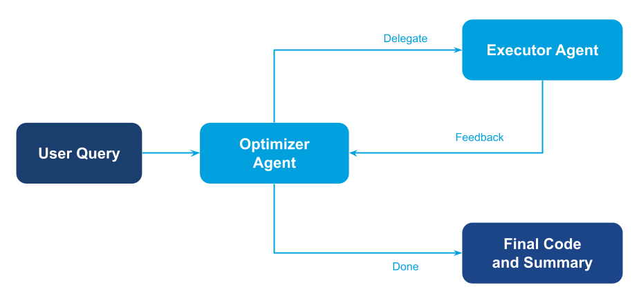

An iterative optimization pattern where an agent autonomously loops through testing and refinement cycles using sub-agent delegation.

## Overview

The loop pattern is ideal when you need iterative refinement with feedback loops. Unlike linear pipelines, this pattern allows agents to cycle back, test, and improve their output based on execution results. The optimizer agent makes autonomous decisions about when to iterate and when to stop.

## Demo Scenario: Code Optimizer with Feedback Loop

This example demonstrates an autonomous optimization loop using **sub-agent delegation**:

1. **Optimizer agent** – proposes code improvements and decides when to iterate
1. **Executor agent** – runs and benchmarks the code, providing feedback

The optimizer performs an internal loop (up to 3 iterations): it proposes code, delegates execution to the executor agent, analyzes the benchmark results, and refines the approach. This cyclic workflow is why we use sub-agent delegation instead of gllm-pipeline.

## Diagram

<figure><figcaption>Loop pattern — iterative optimization with autonomous feedback cycles.</figcaption></figure>

## Implementation Steps

1. **Create executor agent with code execution tool**

   ```python
   from glaip_sdk import Agent
   from glaip_sdk.tools import Tool

   e2b_sandbox_tool = Tool.from_native("e2b_sandbox_tool")

   executor_agent = Agent(
       name="executor_agent",
       instruction="Run code, measure runtime, and return benchmark report...",
       tools=[e2b_sandbox_tool],
       model="openai/gpt-5-mini"
   )
   ```

1. **Create optimizer agent with executor as sub-agent**

   ```python
   optimizer_agent = Agent(
       name="optimizer_agent",
       instruction="""Perform internal loop (up to 3 iterations):
       propose code, delegate to 'executor_agent', analyze results, refine...""",
       agents=[executor_agent],  # Sub-agent delegation
       model="openai/gpt-5-mini"
   )
   ```

1. **Run the optimizer**

   ```python
   result = optimizer_agent.run(prompt, verbose=False)
   ```

> **Full implementation:** See `loop/main.py` for complete code with detailed instructions.
>
> **Why sub-agents?** This pattern uses sub-agent delegation (not gllm-pipeline) because the optimizer needs to make autonomous decisions about looping back based on execution feedback. gllm-pipeline is designed for linear workflows without cyclic control flow.

## How to Run

From the `gl-aip/examples/multi-agent-system-patterns` directory in the [GL SDK Cookbook](https://github.com/gl-sdk/gen-ai-sdk-cookbook/tree/main/gl-aip):

```bash
uv run loop/main.py
```

Ensure your `.env` contains:

```bash
OPENAI_API_KEY=your-openai-key-here
E2B_API_KEY=your-e2b-api-key-here
```

Note: You'll need an [E2B API key](https://e2b.dev/) for the code sandbox functionality.

## Output

```
Summary
- Iterations performed: 2
  1) Basic trial-division: correct (78498) but slow (~11.025 s).
  2) Sieve of Eratosthenes: correct (78498) and fast (~0.004887 s).
- Final (selected) runtime: ~0.0049 s (measured in the sandbox).
- Final output: 78498
- Goal satisfied: runtime < 1 s and correct result.

Final minimal Python program (prints 78498 when run):

import math
N = 10**6
s = bytearray(b'\x01') * (N + 1)
s[0:2] = b'\x00\x00'
for p in range(2, math.isqrt(N) + 1):
    if s[p]:
        s[p*p:N+1:p] = b'\x00' * ((N - p*p)//p + 1)
print(s.count(1))

Total iterations in internal loop: 2.

Demo completed
```

## Notes

- This pattern uses **sub-agent delegation** (not gllm-pipeline) because of the cyclic nature of the workflow.
- The optimizer agent autonomously decides when to loop back and when to stop based on the executor's feedback.
- Use this pattern when you need iterative refinement with feedback loops - testing, optimization, validation cycles.
- The maximum iteration count is controlled via the optimizer's instructions, preventing infinite loops.
- For non-cyclic workflows, prefer patterns that use gllm-pipeline (Sequential, Parallel, Router, Aggregator) which leverage the [AgentComponent](https://gdplabs.gitbook.io/sdk/gl-ai-agent-package/tutorials/multi-agent-system-patterns/agent-component) wrapper.

## Related Documentation

- [Agents guide](https://gdplabs.gitbook.io/sdk/gl-ai-agent-package/guides/agents) — Configure nested agents and delegation patterns.
- [Tools guide](https://gdplabs.gitbook.io/sdk/gl-ai-agent-package/guides/tools) — Manage execution tools like e2b_sandbox_tool.
- [Hierarchical pattern](https://gdplabs.gitbook.io/sdk/gl-ai-agent-package/tutorials/multi-agent-system-patterns/hierarchical) — Another pattern using sub-agent delegation for decision-based workflows.
- [Security & privacy](https://gdplabs.gitbook.io/sdk/gl-ai-agent-package/guides/security-and-privacy) — Apply sandbox and execution policies for code running agents.
