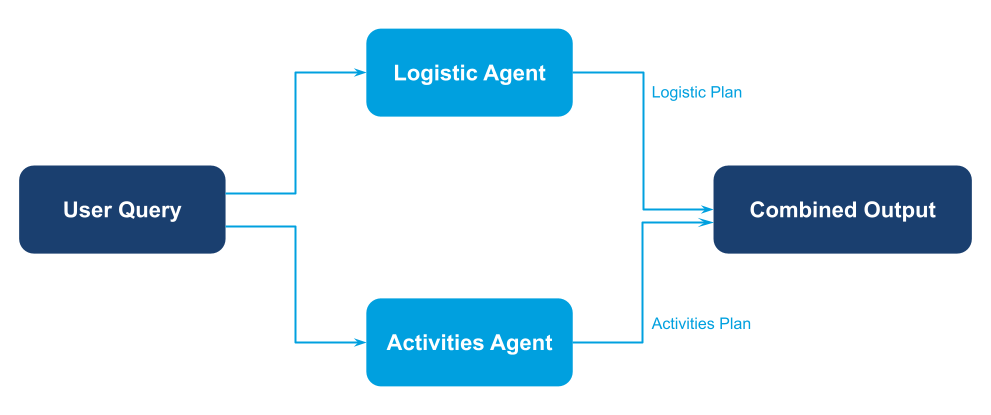

A concurrent workflow where multiple agents process the same input simultaneously, ideal for comparative analysis, multi-model testing, or getting multiple perspectives.

Multiple agents tackle independent subtasks simultaneously to reduce overall
latency, with each agent's output preserved separately.

## Overview

Use this pattern when subtasks do not depend on each other and you want faster
responses by running them side by side. The outputs are displayed separately,
preserving each agent's unique perspective without synthesis.

## Demo Scenario: Trip Planning with Specialized Agents

Two travel specialists work in parallel on the same user request using **gllm-pipeline**:

- **Logistics agent** – focuses on flights, hotels, and transportation
- **Activities agent** – curates attractions, food, and experiences

The pipeline runs both specialists simultaneously and returns their outputs
separately, allowing you to see each specialist's perspective distinctly.

## Diagram

<figure><figcaption>Parallel pattern — multiple agents process the same input concurrently.</figcaption></figure>

## Implementation Steps

1. **Create specialist agents**

   ```python
   from glaip_sdk import Agent

   logistics_agent = Agent(
       name="logistics_agent",
       instruction="Focus on flights, hotels, transport...",
       model="openai/gpt-5-mini"
   )

   activities_agent = Agent(
       name="activities_agent",
       instruction="Focus on attractions, food...",
       model="openai/gpt-5-mini"
   )
   ```

1. **Build pipeline: parallel → merge**

   ```python
   from gllm_pipeline.steps import parallel, step, transform

   pipeline = (
       parallel(branches=[logistics_step, activities_step])
       | transform(
           format_outputs,
           ["logistics_out", "activities_out"],
           "combined_output"
       )
   )
   pipeline.state_type = State
   ```

1. **Run the pipeline**

   ```python
   result = await pipeline.invoke(state)
   print(result['combined_output'])
   ```

> **Full implementation:** See `parallel/main.py` for complete code with State definition and step configuration.
>
> **AgentComponent:** See the [Agent as Component](https://gdplabs.gitbook.io/sdk/gl-ai-agent-package/tutorials/multi-agent-system-patterns/agent-component) guide for details on the `.to_component()` pattern.

## How to Run

From the `gl-aip/examples/multi-agent-system-patterns` directory in the [GL SDK Cookbook](https://github.com/gl-sdk/gen-ai-sdk-cookbook/tree/main/gl-aip):

```bash
uv run parallel/main.py
```

Ensure your `.env` contains:

```bash
OPENAI_API_KEY=your-openai-key-here
```

## Output

```
Specialist Outputs:
[Logistics]
Assuming you're departing from Jakarta (CGK). Plan: 5 days (4 nights) — 2026-02-12 (Thu) to 2026-02-16 (Mon).
Below are concise logistics: flights, hotels, airport ⇄ city, local transport, and budget estimates.

Flights (roundtrip, economy)
- Recommended: nonstop CGK ⇄ Tokyo Haneda (HND) when available — carriers: Garuda Indonesia, ANA, JAL.
  Typical duration ~7.5–8.5 hrs.
- Flight timing: take overnight outbound (depart CGK evening, arrive HND morning) and evening or
  late-afternoon return to maximize time.
...

Hotels (4 nights) — pick by area
- Budget (Asakusa/Ueno): APA Hotel / Hotel MyStays Asakusa — ~USD 50–90/night.
- Mid-range (Shinjuku/Shibuya/Ginza): Hotel Sunroute Plaza Shinjuku, Tokyu Stay Ginza — ~USD 120–220/night.
...

[Activities]
5-day Tokyo itinerary — attractions & food (concise)

Day 1 — Shinjuku (arrival, lively night)
- Morning: Check in, stroll Shinjuku Gyoen (park/tea houses).
- Afternoon: Tokyo Metropolitan Government Building observatory (free city view), explore department stores.
- Evening: Omoide Yokocho for yakitori; Golden Gai for tiny themed bars.

Day 2 — Harajuku + Omotesando + Shibuya (youth culture & view)
- Morning: Meiji Jingu shrine and Yoyogi Park.
- Late morning: Takeshita Street (crepes, street fashion) → Omotesando for chic cafés.
...

Day 3 — Asakusa, Ueno, Akihabara (traditional + pop)
- Morning: Senso‑ji temple and Nakamise shopping (street snacks: ningyo‑yaki, melon pan).
- Afternoon: Ueno Park — museums and Ameya‑Yokocho market (takoyaki, grilled seafood).
...
```

## Notes

- This example uses **gllm-pipeline** for orchestrating parallel execution of specialist agents.
- The `parallel()` step automatically runs all branches concurrently for optimal performance.
- Add more specialists by adding more branches to the `parallel()` step.
- The `transform()` step provides a clean way to format and combine outputs while preserving each agent's perspective.
- Unlike the [Aggregator pattern](https://gdplabs.gitbook.io/sdk/gl-ai-agent-package/tutorials/multi-agent-system-patterns/aggregator), this pattern does not synthesize outputs - each agent's response remains distinct.
- To install gllm-pipeline: `uv add gllm-pipeline-binary==0.4.13` (compatible with aip_agents and langgraph \<0.3.x)

## Related Documentation

- [Agents guide](https://gdplabs.gitbook.io/sdk/gl-ai-agent-package/guides/agents)
  — Configure instructions and streaming renderers.
- [Automation & scripting](https://gdplabs.gitbook.io/sdk/gl-ai-agent-package/guides/automation-and-scripting)
  — Capture transcripts or usage metrics in CI workflows.
- [Security & privacy](https://gdplabs.gitbook.io/sdk/gl-ai-agent-package/guides/security-and-privacy)
  — Apply tool-output and memory policies when sharing results downstream.
