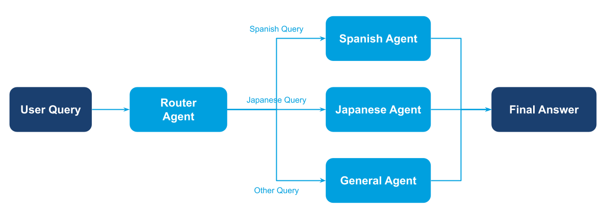

A central agent inspects each request and routes it to the most appropriate specialist agent based on content and context.

## Overview

Routers keep front-line interactions lightweight: they triage requests, choose which specialist should respond, and optionally provide fallbacks when no match is found. Common use cases include customer support triage and language translation hubs.

## Demo Scenario: Language Help Desk

Four agents collaborate using **gllm-pipeline** with conditional routing:

- **Router agent** – classifies the language query
- **Spanish expert** – handles Spanish translation and explanations
- **Japanese expert** – handles Japanese translation and explanations
- **General handler** – provides fallback for unsupported languages

The pipeline uses the `switch()` step to route queries based on the router's
classification, automatically directing each query to the appropriate specialist.

## Diagram

<figure><figcaption>Router pattern — central agent triages requests to the appropriate specialist.</figcaption></figure>

## Implementation Steps

1. **Create router and specialist agents**

   ```python
   from glaip_sdk import Agent

   router_agent = Agent(
       name="router_agent",
       instruction="Classify query: spanish | japanese | other",
       model="openai/gpt-5-mini"
   )

   spanish_agent = Agent(
       name="spanish_agent",
       instruction="Spanish language expert...",
       model="openai/gpt-5-mini"
   )

   japanese_agent = Agent(
       name="japanese_agent",
       instruction="Japanese language expert...",
       model="openai/gpt-5-mini"
   )

   general_agent = Agent(
       name="general_agent",
       instruction="Fallback handler...",
       model="openai/gpt-5-mini"
   )
   ```

1. **Build pipeline with switch for conditional routing**

   ```python
   from gllm_pipeline.steps import step, switch

   route_switch = switch(
       condition=lambda s: s["route_label"].strip().lower(),
       branches={
           "spanish": spanish_step,
           "japanese": japanese_step,
           "other": general_step
       },
       default=general_step,
   )

   pipeline = route_step | route_switch
   pipeline.state_type = State
   ```

1. **Process requests**

   ```python
   for query in queries:
       result = await pipeline.invoke(State(user_query=query, ...))
       print(result['final_answer'])
   ```

> **Full implementation:** See `router/main.py` for complete code with State definition and step configuration.
>
> **AgentComponent:** See the [Agent as Component](https://gdplabs.gitbook.io/sdk/gl-ai-agent-package/tutorials/multi-agent-system-patterns/agent-component) guide for details on the `.to_component()` pattern.

## How to Run

From the `gl-aip/examples/multi-agent-system-patterns` directory in the [GL SDK Cookbook](https://github.com/gl-sdk/gen-ai-sdk-cookbook/tree/main/gl-aip):

```bash
uv run router/main.py
```

Set the usual environment variables in `.env`:

```bash
OPENAI_API_KEY=your-openai-key-here
```

## Output

```
--- Processing Query: How do you say 'hello' in German? ---
Answer: Lo siento — solo puedo ayudar con consultas en español o japonés. No puedo proporcionar
traducciones al alemán.

Si te sirve:
- En español: "hola" (pronunciación aproximada: OH-la).
- En japonés: "こんにちは" (konnichiwa).

¿Quieres más saludos o ayuda con pronunciación en español o japonés?

Demo completed
```

## Notes

- This example uses **gllm-pipeline** with the `switch()` step for conditional routing.
- The router agent outputs a classification label that determines which branch to execute.
- Add more language specialists by adding new agents and branches to the switch.
- The `default` parameter in `switch()` provides a fallback when no branch matches.
- To install gllm-pipeline: `uv add gllm-pipeline-binary==0.4.13` (compatible with aip_agents and langgraph \<0.3.x)

## Related Documentation

- [Agents guide](https://gdplabs.gitbook.io/sdk/gl-ai-agent-package/guides/agents) — Configure nested agents, memory, and streaming renderers.
- [Automation & scripting](https://gdplabs.gitbook.io/sdk/gl-ai-agent-package/guides/automation-and-scripting) — Log routing results or wire the router into scheduled jobs.
- [Security & privacy](https://gdplabs.gitbook.io/sdk/gl-ai-agent-package/guides/security-and-privacy) — Apply memory and PII controls when routing sensitive requests.
