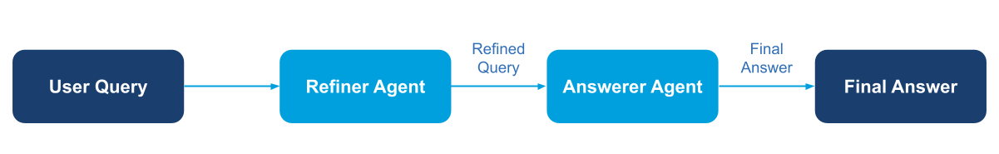

A linear workflow where each agent processes the output from the previous agent, ideal for intent refinement, multi-step validation, or staged content creation.

## Overview

Sequential compositions shine when work must pass through clearly defined stages. Each agent can tighten the scope, enrich the data, or validate the previous step before passing the baton.

## Demo Scenario: Refine Then Answer

Two lightweight agents collaborate on a user question using **gllm-pipeline**:

1. **Intent refiner** – rewrites the user's short prompt into a clear question
1. **Answerer** – provides the final response using the refined question

The pipeline automatically passes the output from the refiner as input to the
answerer, eliminating manual data passing.

## Diagram

<figure><figcaption>Sequential pattern — linear pipeline where each agent refines the output of the previous one.</figcaption></figure>

## Implementation Steps

1. **Create agents**

   ```python
   from glaip_sdk import Agent

   refiner_agent = Agent(
       name="refiner_agent",
       instruction="Rewrite ambiguous input as clear question...",
       model="openai/gpt-5-mini"
   )

   answerer_agent = Agent(
       name="answerer_agent",
       instruction="Answer coding questions with code...",
       model="openai/gpt-5-mini"
   )
   ```

1. **Chain steps with pipe operator**

   ```python
   from gllm_pipeline.steps import step

   pipeline = refine_step | answer_step
   pipeline.state_type = State
   ```

1. **Run the pipeline**

   ```python
   result = await pipeline.invoke(state)
   print(result['final_answer'])
   ```

> **Full implementation:** See `sequential/main.py` for complete code with State definition and step configuration.
>
> **AgentComponent:** See the [Agent as Component](https://gdplabs.gitbook.io/sdk/gl-ai-agent-package/tutorials/multi-agent-system-patterns/agent-component) guide for details on the `.to_component()` pattern.

## How to Run

From the `gl-aip/examples/multi-agent-system-patterns` directory in the [GL SDK Cookbook](https://github.com/gl-sdk/gen-ai-sdk-cookbook/tree/main/gl-aip):

```bash
uv run sequential/main.py
```

Set the usual environment variables in `.env`:

```bash
OPENAI_API_KEY=your-openai-key-here
```

## Output

````
Final answer: Short answer: use str.join() when you want a single concatenated string (requires elements
to be str), use map(str, ...) or a comprehension to convert non-strings first, use str(list) for a quick
Python-style representation, and use json.dumps() when you need a JSON-formatted string (for interoperability).

Examples

1) List of strings — use join()
```python
words = ["apple", "banana", "cherry"]
s1 = ",".join(words)        # "apple,banana,cherry"
s2 = ", ".join(words)       # "apple, banana, cherry"
s3 = "\n".join(words)       # each on its own line
````

2. List of non-strings (integers) — convert elements first

```python
nums = [1, 2, 3]
s4 = ",".join(map(str, nums))      # "1,2,3"
s5 = ", ".join(str(n) for n in nums)  # "1, 2, 3"
```

3. Quick Python-looking representation — use str()

```python
lst = [1, "two", 3]
s6 = str(lst)   # "[1, 'two', 3]"
```

4. JSON output — use json.dumps()

```python
import json
data = [1, "two", 3]
s7 = json.dumps(data)   # '[1, "two", 3]'
```

...

Demo completed

```

## Notes

- This example uses **gllm-pipeline** for orchestrating the sequential workflow.
- The pipe operator (`|`) provides a clean, readable syntax for chaining sequential steps.
- Add more stages by creating additional steps and chaining them with the pipe operator.
- All intermediate state (like `refined_query`) is automatically managed by the pipeline.
- To install gllm-pipeline: `uv add gllm-pipeline-binary==0.4.13` (compatible with aip_agents and langgraph <0.3.x)

## Related Documentation

- [Agents guide](https://gdplabs.gitbook.io/sdk/gl-ai-agent-package/guides/agents) — Configure instructions and streaming renderers.
- [Automation & scripting](https://gdplabs.gitbook.io/sdk/gl-ai-agent-package/guides/automation-and-scripting) — Capture transcripts inside CI pipelines.
- [Security & privacy](https://gdplabs.gitbook.io/sdk/gl-ai-agent-package/guides/security-and-privacy) — Apply memory and PII policies between stages.
```
