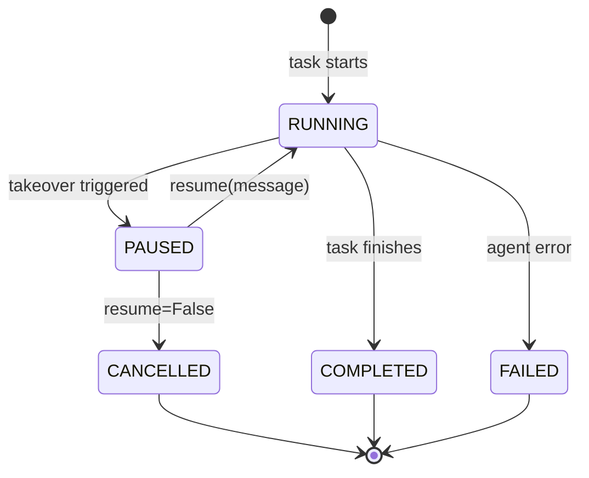

# Human-in-the-Loop Takeover

GL Computer Use can pause the agent loop and hand control to a human operator, then resume the agent with optional guidance. This is useful when the agent gets stuck, needs a decision it cannot make autonomously, or when you want to intervene at a specific moment.

## Takeover Trigger Types

| Type | Triggered by | When it fires |
|---|---|---|
| `POLICY_TRIGGERED` | SDK automatically | `max_steps` exceeded, or `repeated_noop_threshold` consecutive no-op steps |
| `AGENT_REQUESTED` | Agent's own message | Agent output matches a pattern in `agent_stuck_patterns` (e.g. "i need help") |
| `CALLER_INITIATED` | Your code explicitly | You call `s.takeover.start(task_id)` via the Layer 2 session API |

## State Diagram



## SDK-Triggered Takeover (Reactive)

Pass `on_takeover_needed` to any run method. The SDK calls your callback when a takeover condition is detected. The callback receives a `TakeoverContext` and must return a `TakeoverResponse`.

**TakeoverContext fields:**

| Field | Type | Description |
|---|---|---|
| `task_id` | `str` | Task that triggered the takeover |
| `reason` | `str` | `"AGENT_REQUESTED"`, `"POLICY_TRIGGERED"`, or `"CALLER_INITIATED"` |
| `vnc_url` | `str \| None` | noVNC URL — open in browser to take control of the desktop |
| `last_message` | `str \| None` | Agent's final message before pausing |

**TakeoverResponse fields:**

| Field | Type | Description |
|---|---|---|
| `resume` | `bool` | `True` to resume the agent, `False` to cancel the task |
| `message` | `str \| None` | Optional guidance injected into the agent's context on resume |

```python
import asyncio
from gl_computer_use import GLComputerUseClient, GLComputerUseConfig, TakeoverResponse


def handle_takeover(ctx):
    print(f"Takeover — reason: {ctx.reason}")
    print(f"Connect to: {ctx.vnc_url}")
    print(f"Last message: {ctx.last_message}")

    guidance = input("Enter guidance (or 'cancel'): ").strip()

    if guidance.lower() == "cancel":
        return TakeoverResponse(resume=False)

    return TakeoverResponse(resume=True, message=guidance or None)


async def main() -> None:
    config = GLComputerUseConfig(max_steps=5, repeated_noop_threshold=3)
    client = GLComputerUseClient(config=config)

    stream = await client.run(
        "Open a terminal and run ls -la ~",
        on_takeover_needed=handle_takeover,
    )

    async for event in stream:
        if event.event_type == "TAKEOVER_STARTED":
            print(f"Takeover started — reason: {event.reason}")
        elif event.event_type == "TAKEOVER_RESUMED":
            print(f"Agent resumed — guidance: {event.message}")
        elif event.event_type == "TASK_COMPLETED":
            print(f"Done: {event.result.output}")


asyncio.run(main())
```


If a takeover is triggered but no `on_takeover_needed` callback is supplied, the SDK raises `TakeoverRequiredError` immediately.


## Caller-Initiated Takeover (Active)

Use the Layer 2 session API when **you** decide when to pause — not the SDK. This gives you full control and supports multiple takeovers in a single session.

```python
import asyncio
from gl_computer_use import GLComputerUseClient, GLComputerUseConfig


async def main() -> None:
    client = GLComputerUseClient(config=GLComputerUseConfig(max_steps=30))

    async with client.session() as s:
        # 1. Provision the sandbox
        await s.sandbox.prepare()
        print(f"Sandbox ready — watch at: {s.sandbox.stream_url}")

        # 2. Start the task (non-blocking)
        task = await s.task.create(
            "Open a text editor and write a short poem about computers"
        )

        # 3. Trigger takeover whenever you want
        ctx = await s.takeover.start(task.task_id)
        print(f"Agent paused — VNC: {ctx.vnc_url}")
        print(f"Last message: {ctx.last_message}")

        # Human connects via VNC and does their thing...
        guidance = input("Guidance for agent: ").strip()

        # 4. Resume the agent with optional guidance
        await s.takeover.resume(task.task_id, message=guidance or None)

        # 5. Wait for the task to finish
        result = await s.task.wait(task.task_id)
        print(f"Done: {result.output}")


asyncio.run(main())
```

**Layer 2 session accessors:**

| Accessor | Purpose |
|---|---|
| `s.sandbox` | Provision, destroy, and access the sandbox stream URL |
| `s.task` | Create, cancel, and wait for tasks |
| `s.stream` | Iterate task events |
| `s.takeover` | Start and resume takeovers; check `s.takeover.state` |
| `s.desktop` | Low-level desktop interaction (screenshots, actions) |

## Configuring Takeover Triggers

```python
config = GLComputerUseConfig(
    # POLICY_TRIGGERED: pause after 10 steps
    max_steps=10,

    # POLICY_TRIGGERED: pause after 4 consecutive no-ops
    repeated_noop_threshold=4,

    # AGENT_REQUESTED: pause when agent says these phrases
    agent_stuck_patterns="i need help,i'm stuck,please assist,i cannot proceed",
)
```
