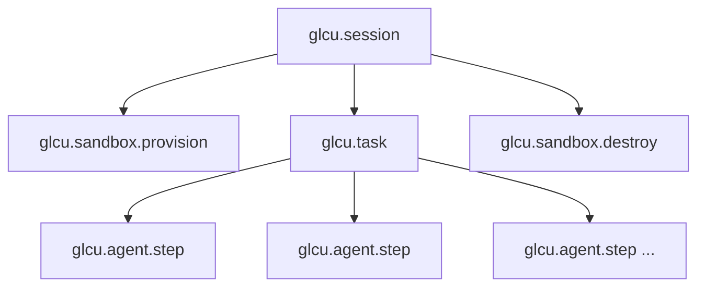

# Observability

GL Computer Use provides structured logging out of the box, and optional distributed tracing, metrics, Sentry error tracking, and PII redaction via the `observability` extra.

## Structured Logging

The SDK uses `structlog` for structured logging. Every log line is emitted as a JSON object by default, with these context fields automatically attached:

| Field | Description |
|---|---|
| `session_id` | Unique ID for the current SDK session |
| `task_id` | Unique ID for the current task |
| `component` | Internal component that emitted the log |
| `level` | Log severity |
| `timestamp` | ISO 8601 timestamp |

### Log Levels

| Level | `GLCU_LOG_LEVEL` | What's included |
|---|---|---|
| `DEBUG` | `DEBUG` | All logs including third-party (CUA, LiteLLM, E2B SDK) |
| `INFO` | `INFO` (default) | SDK lifecycle events |
| `WARNING` | `WARNING` | Warnings and above |
| `ERROR` | `ERROR` | Errors only |

### Log Formats



Set `GLCU_LOG_FORMAT=json` or leave unset. Outputs one JSON object per line, suitable for log aggregation systems (Datadog, Loki, CloudWatch):

```json
{"level": "info", "event": "task_started", "session_id": "s-abc", "task_id": "t-xyz", "component": "runner", "timestamp": "2026-05-07T10:00:00Z"}
```



Set `GLCU_LOG_FORMAT=console` for human-readable output during development:

```python
from gl_computer_use import GLComputerUseConfig

config = GLComputerUseConfig(
    log_level="DEBUG",
    log_format="console",
)
```



## OpenTelemetry Tracing

Install the observability extra and connect to any OTLP-compatible backend:

```bash
pip install "gl-computer-use[observability]"
```

Start Jaeger locally for development:

```bash
docker run --rm -p 16686:16686 -p 4317:4317 jaegertracing/all-in-one:latest
```

### Trace Hierarchy



### Code Example

```python
import asyncio
from gl_computer_use import GLComputerUseClient, GLComputerUseConfig


async def main() -> None:
    config = GLComputerUseConfig(
        otel_enabled=True,
        otel_service_name="gl-computer-use",
        otel_exporter_endpoint="http://localhost:4317",  # Jaeger gRPC port
        otel_use_grpc=True,   # set False for HTTP transport
        # otel_headers={"Authorization": "Bearer token"},  # optional
        log_format="console",
    )
    client = GLComputerUseClient(config=config)

    result = await client.run_once("Open a terminal and print the date")
    print(result.output)
    # Open http://localhost:16686 → select service "gl-computer-use"


asyncio.run(main())
```

### OTel Configuration Fields

| Variable | Default | Description |
|---|---|---|
| `GLCU_OTEL_ENABLED` | `false` | Enable OpenTelemetry |
| `GLCU_OTEL_SERVICE_NAME` | `gl-computer-use` | Service name for trace attribution |
| `GLCU_OTEL_EXPORTER_ENDPOINT` | `None` | OTLP gRPC or HTTP endpoint URL |
| `GLCU_OTEL_USE_GRPC` | `true` | Use gRPC (`true`) or HTTP (`false`) |
| `GLCU_OTEL_HEADERS` | `None` | Optional auth headers as JSON |

## Sentry

```bash
pip install "gl-computer-use[observability]"
```

```python
from gl_computer_use import GLComputerUseClient, GLComputerUseConfig

config = GLComputerUseConfig(
    sentry_enabled=True,
    sentry_dsn="https://<key>@sentry.io/<project>",
    sentry_environment="production",
    sentry_release="1.0.0",
)
client = GLComputerUseClient(config=config)
```

| Variable | Default | Description |
|---|---|---|
| `GLCU_SENTRY_ENABLED` | `false` | Enable Sentry error tracking |
| `GLCU_SENTRY_DSN` | `None` | Sentry project DSN |
| `GLCU_SENTRY_ENVIRONMENT` | `None` | Environment tag (e.g. `production`) |
| `GLCU_SENTRY_RELEASE` | `None` | Release string for version tracking |

## PII Redaction

Enable regex-based PII redaction to automatically scrub sensitive patterns from all log lines:

```python
config = GLComputerUseConfig(pii_redaction_enabled=True)
```

Or via environment variable:

```dotenv
GLCU_PII_REDACTION_ENABLED=true
```

When enabled, patterns such as email addresses, phone numbers, and API keys are replaced with `[REDACTED]` before logs are emitted.
