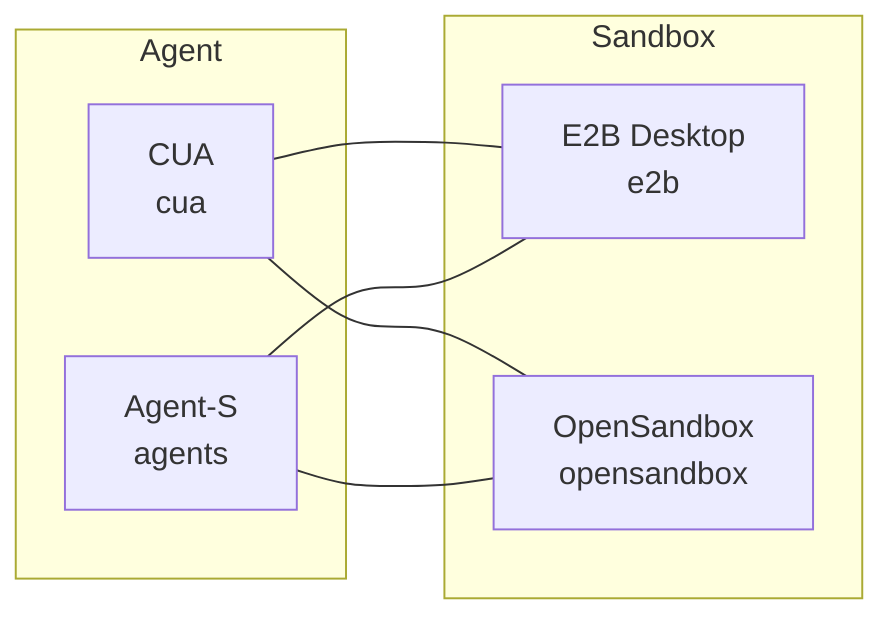
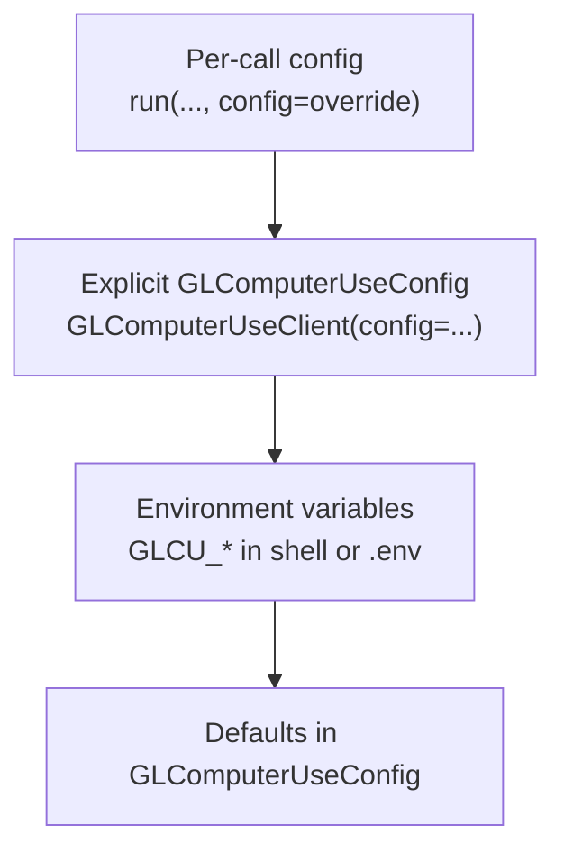

# Provider Configuration

GL Computer Use separates concerns into three swappable provider types: **agent**, **sandbox**, and **artifact store**. You can mix and match without changing application code.

## Provider Matrix

| Agent | Sandbox | Config | Extra required |
|---|---|---|---|
| CUA (default) | E2B (default) | `GLComputerUseClient()` | — |
| CUA | OpenSandbox | `GLComputerUseConfig(sandbox="opensandbox")` | `opensandbox` |
| Agent-S | E2B | `GLComputerUseConfig(agent="agents")` | `agents` |
| Agent-S | OpenSandbox | `GLComputerUseConfig(agent="agents", sandbox="opensandbox")` | `agents`, `opensandbox` |



## Code Examples



```python
from gl_computer_use import GLComputerUseClient

# Uses GLCU_* env vars for credentials
client = GLComputerUseClient()
result = client.run_sync("Open a terminal and check Python version")
```



```python
from gl_computer_use import GLComputerUseClient, GLComputerUseConfig

config = GLComputerUseConfig(
    sandbox="opensandbox",
    opensandbox_api_key="your-opensandbox-key",
    opensandbox_domain="your-opensandbox-host:8080",
)
client = GLComputerUseClient(config=config)
result = client.run_sync("Open a terminal and check Python version")
```



```python
from gl_computer_use import GLComputerUseClient, GLComputerUseConfig

config = GLComputerUseConfig(
    agent="agents",
    agents_platform="ubuntu",        # "ubuntu", "macos", or "windows"
    agents_max_steps=50,
)
client = GLComputerUseClient(config=config)
result = client.run_sync("Open a terminal and check Python version")
```

Install the extra first: `pip install "gl-computer-use[agents]"`



```python
from gl_computer_use import GLComputerUseClient, GLComputerUseConfig

config = GLComputerUseConfig(
    agent="agents",
    sandbox="opensandbox",
    opensandbox_api_key="your-opensandbox-key",
    opensandbox_domain="your-opensandbox-host:8080",
)
client = GLComputerUseClient(config=config)
result = client.run_sync("Open a terminal and check Python version")
```

Install the extras first: `pip install "gl-computer-use[agents,opensandbox]"`



## Configuration Precedence

The SDK resolves configuration in this order (highest to lowest priority):



### Environment Variables

All `GLCU_*` environment variables map to `GLComputerUseConfig` fields:

```dotenv
GLCU_AGENT=cua
GLCU_SANDBOX=e2b
GLCU_MODEL=anthropic/claude-sonnet-4-6
GLCU_E2B_API_KEY=sk-e2b-...
GLCU_ANTHROPIC_API_KEY=sk-ant-...
GLCU_TIMEOUT=600
GLCU_MAX_STEPS=100
```

### Explicit Config Object

```python
from gl_computer_use import GLComputerUseClient, GLComputerUseConfig

config = GLComputerUseConfig(
    model="anthropic/claude-sonnet-4-6",
    timeout=300.0,
    max_steps=50,
    log_format="console",
)
client = GLComputerUseClient(config=config)
```

### Per-Call Override

```python
from gl_computer_use import GLComputerUseClient, GLComputerUseConfig

client = GLComputerUseClient()  # uses env vars

# Override just for this call
result = await client.run_once(
    "Open a terminal",
    config=GLComputerUseConfig(timeout=60.0, max_steps=10),
)
```

## Model Selection

The `model` field uses `provider/name` format:

| Model | Config value |
|---|---|
| Claude Sonnet 4.6 (default) | `anthropic/claude-sonnet-4-6` |
| Claude Opus 4.7 | `anthropic/claude-opus-4-7` |
| GPT-4o | `openai/gpt-4o` |

```python
config = GLComputerUseConfig(
    model="anthropic/claude-opus-4-7",
    anthropic_api_key="sk-ant-...",
)
```
