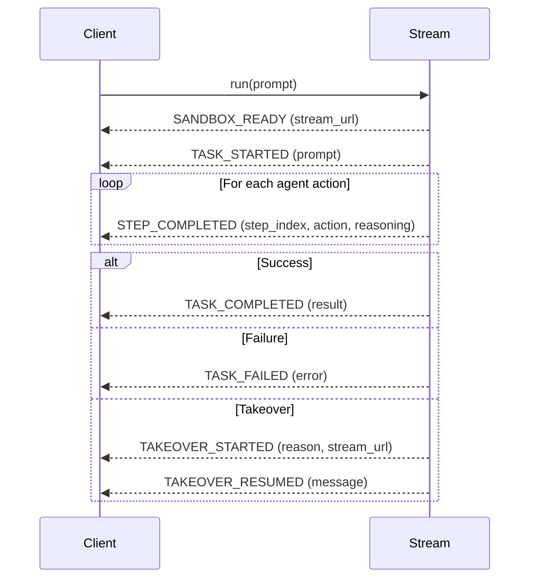
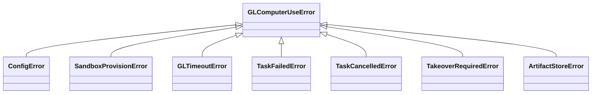

# Run Desktop Automation

This guide covers the three public run methods, event handling, result inspection, and error handling.

<details>
<summary>Prerequisites</summary>

Complete [Prerequisites](../prerequisites.md). You need `gl-computer-use` installed, `GLCU_E2B_API_KEY`, and an LLM API key.
</details>

## 1. Choose a Run Method

| Method | Returns | Use when | Raises on failure |
|---|---|---|---|
| `await client.run(prompt)` | `StreamClient` | You need live events or the desktop URL before the task finishes | No — emits `TASK_FAILED` event |
| `await client.run_once(prompt)` | `TaskResult` | You only need the final result, async context | Yes — `TaskFailedError` / `TaskCancelledError` |
| `client.run_sync(prompt)` | `TaskResult` | You only need the final result, script or Jupyter | Yes — `TaskFailedError` / `TaskCancelledError` |

All three methods accept the same parameters:

| Parameter | Type | Default | Description |
|---|---|---|---|
| `prompt` | `str` | — | Task description |
| `config` | `GLComputerUseConfig \| None` | `None` | Per-call config override |
| `timeout` | `float \| None` | `None` | Max seconds (falls back to `config.timeout`) |
| `files` | `list[File] \| None` | `None` | Files to upload before the task starts |
| `retrieve_files` | `list[str] \| None` | `None` | Sandbox paths to download after completion |
| `on_takeover_needed` | `Callable \| None` | `None` | Takeover callback |



```python
import asyncio
from gl_computer_use import GLComputerUseClient


async def main() -> None:
    client = GLComputerUseClient()
    stream = await client.run("Open a terminal and print the current date")

    async for event in stream:
        if event.event_type == "SANDBOX_READY" and event.stream_url:
            print(f"Watch live at: {event.stream_url}")
        elif event.event_type == "STEP_COMPLETED":
            action = event.action.type if event.action else "—"
            print(f"Step {event.step_index}: {action}")
        elif event.event_type == "TASK_COMPLETED":
            print(f"Output: {event.result.output}")


asyncio.run(main())
```



```python
import asyncio
from gl_computer_use import GLComputerUseClient


async def main() -> None:
    client = GLComputerUseClient()
    result = await client.run_once("Open a terminal and print the current date")
    print(result.status, result.output)
    print(f"Steps taken: {len(result.steps)}")


asyncio.run(main())
```



```python
from gl_computer_use import GLComputerUseClient

result = GLComputerUseClient().run_sync("Open a terminal and print the current date")
print(result.status, result.output)
```



## 2. Handle Stream Events

Each item yielded by `run()` is a stream event. The sequence of events follows this flow:



**Event types and payload fields:**

| Event | Triggered when | Key payload fields |
|---|---|---|
| `SANDBOX_READY` | Sandbox provisioned, noVNC reachable | `event.stream_url` |
| `TASK_STARTED` | Task begins | `event.prompt` |
| `STEP_COMPLETED` | Each agent action completes | `event.step_index`, `event.action`, `event.reasoning`, `event.message`, `event.screenshot_b64` |
| `TASK_COMPLETED` | Task finished successfully | `event.result` (`TaskResult`) |
| `TASK_FAILED` | Agent terminated with error | `event.error`, `event.result` |
| `TASK_CANCELLED` | Task cancelled | — |
| `TAKEOVER_STARTED` | Takeover triggered | `event.reason`, `event.stream_url` |
| `TAKEOVER_RESUMED` | Takeover ended, agent resumed | `event.message` |

```python
async for event in stream:
    if event.event_type == "STEP_COMPLETED" and event.action:
        print(f"Step {event.step_index}: {event.action.type}")
        if event.reasoning:
            print(f"  Thinking: {event.reasoning[:80]}")
        if event.screenshot_b64:
            print("  Screenshot captured")
```

## 3. Inspect the TaskResult

Both `run_once()` and `run_sync()` return a `TaskResult`. It is also available at `event.result` in a `TASK_COMPLETED` event.

| Field | Type | Description |
|---|---|---|
| `task_id` | `str` | Unique task identifier |
| `status` | `"COMPLETED" \| "FAILED" \| "CANCELLED"` | Terminal status |
| `output` | `str \| None` | Agent's final textual answer |
| `steps` | `list[TaskEvent]` | All `STEP_COMPLETED` events in order |
| `error` | `str \| None` | Error message when status is `FAILED` |
| `stream_url` | `str \| None` | noVNC URL active during this task |
| `screenshot_urls` | `list[str]` | Presigned URLs for per-step screenshots |
| `file_urls` | `dict[str, str]` | Sandbox path → presigned URL for retrieved files |
| `recording_url` | `str \| None` | Presigned URL for the session recording |
| `recording_status` | `"UPLOADED" \| "PARTIAL" \| "FAILED"` | Recording upload status |
| `metadata` | `dict[str, Any]` | Timing, model, and provider diagnostics |

## 4. Inspect ActionDetail

Each `STEP_COMPLETED` event carries an `ActionDetail` in `event.action`:

| Field | Type | Description |
|---|---|---|
| `type` | `str` | Action kind: `click`, `type`, `key`, `scroll`, `screenshot`, `move`, etc. |
| `coordinate` | `tuple[int, int] \| None` | `(x, y)` pixel coordinate for pointer actions |
| `text` | `str \| None` | Text for `type` actions |
| `key` | `str \| None` | Key combo for `key` actions |
| `direction` | `str \| None` | Scroll direction |
| `amount` | `int \| None` | Scroll amount |
| `raw` | `dict \| None` | Original provider-specific payload |

## 5. Handle Errors

All SDK exceptions extend `GLComputerUseError`:



```python
from gl_computer_use import (
    GLComputerUseClient,
    ConfigError,
    SandboxProvisionError,
    GLTimeoutError,
    TaskFailedError,
    TaskCancelledError,
)

try:
    result = await GLComputerUseClient().run_once("do something", timeout=120.0)
except ConfigError as e:
    print("Check your API keys:", e)
except SandboxProvisionError as e:
    print("Sandbox failed to start:", e)
except GLTimeoutError as e:
    print("Task timed out:", e)
except TaskFailedError as e:
    print("Agent failed:", e)
except TaskCancelledError as e:
    print("Task was cancelled:", e)
```


`run()` with streaming does **not** raise on failure — check `event.event_type == "TASK_FAILED"` in your loop instead.

