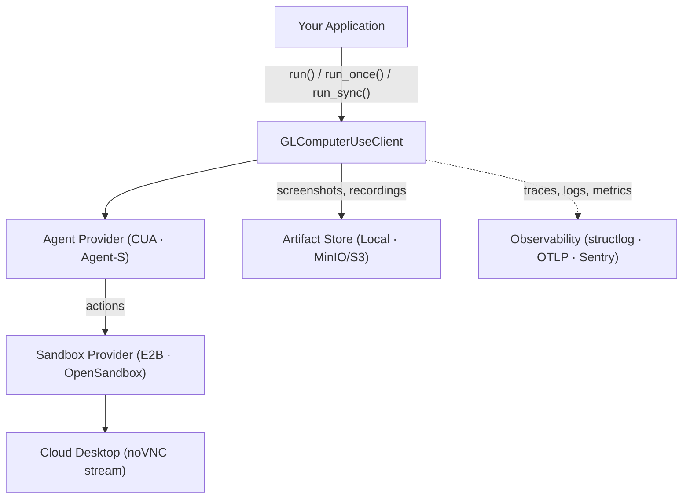

# Introduction to GL Computer Use

**GL Computer Use** is a typed Python SDK for desktop automation via natural-language prompts. It wraps cloud desktop sandboxes and computer-use agents into a clean async API with live streaming, human-in-the-loop takeover, structured observability, and swappable providers.

Use GL Computer Use when you want an LLM-powered agent to operate a full desktop environment — opening applications, navigating GUIs, filling forms, running terminal commands, or producing an auditable trace of a desktop automation run.

## Key Features

| Feature | Description |
|---|---|
| **Three run modes** | `run()` for live streaming, `run_once()` for async result, `run_sync()` for scripts and Jupyter |
| **Swappable agents** | `cua` (TryCUA, default) or `agents` (Simular-AI Agent-S) |
| **Swappable sandboxes** | `e2b` (E2B Desktop, default) or `opensandbox` (Alibaba OpenSandbox) |
| **Live desktop URL** | noVNC streaming URL available via `SANDBOX_READY` event or `StreamClient.stream_url` |
| **Human-in-the-loop takeover** | Pause agent, hand control to a human, resume with optional guidance |
| **Artifact storage** | Local disk by default; MinIO/S3-compatible via the `minio` extra |
| **Session recording** | WebM via Playwright or GIF fallback via screenshot stitching |
| **Structured logging** | JSON by default; human-readable console output available |
| **Distributed tracing** | OpenTelemetry (OTLP) and Sentry via the `observability` extra |
| **Custom provider registration** | Plug in your own sandbox, agent, or artifact store without modifying the SDK |

## Architecture

## Get Started

1. [**Prerequisites**](prerequisites.md) — Prepare Python, API keys, and optional extras.
2. [**Getting Started**](getting-started.md) — Run your first desktop automation task.
3. [**Guides**](guides/) — Learn streaming, takeover, file transfer, and production patterns.
4. [**Resources**](resources/) — Review the full SDK reference.
