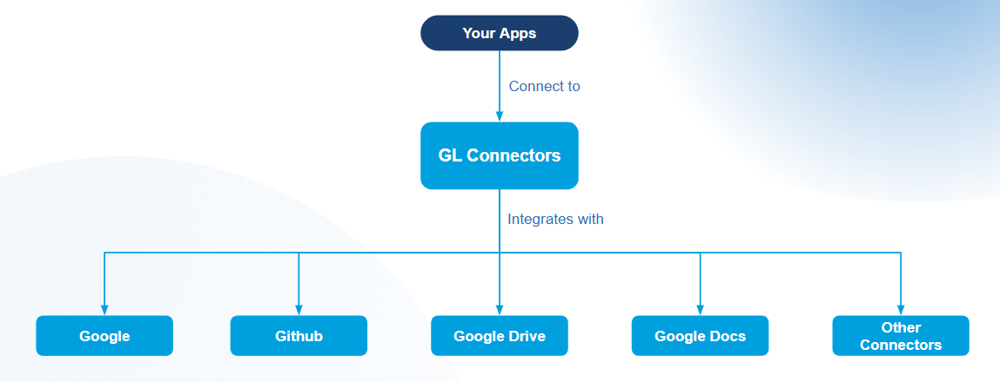

# Introduction to GL Connectors

**GL Connectors** is a unified integration platform that connects your applications to multiple third-party services through a single entry point. Check [terminology.md](../terminology.md "mention") for what we consider GL Connectors, what it relations are to Agents.

**Connect once. Access everything.**

<figure><figcaption>
GL Connectors Structure: <a href="https://docs.google.com/presentation/d/1DSqBvM3vfE7-QX5cIGm4aztnZgHVenq-bWo4_fTjNBw/edit?slide=id.g3d40ffae675_2_0#slide=id.g3d40ffae675_2_0">Diagram Link</a>
</figcaption></figure>

Instead of building and maintaining separate integrations for each service—Google, GitHub, Google Drive, Google Docs, and more—GL Connectors handles it all for you. One connection gives you seamless access to an entire ecosystem of tools.

**Why GL Connectors?**

* **No integration overhead** — Skip the complexity of managing individual APIs, authentication flows, and service updates. We handle the technical heavy lifting.
* **No account juggling** — Stop tracking multiple credentials and tokens. Simply authorize once, and we securely manage your connections on your behalf.
* **Always up to date** — When third-party services change their APIs, we adapt so you don't have to.
* **Enterprise-grade security** — Your credentials and data are managed with industry-standard security practices, so you stay in control without the burden.

**How it works:**

1. Connect your app to GL Connectors
2. Authorize the services you need with a single click
3. We manage the rest—securely and reliably

## What does GL Connectors provide?

GL Connectors offers three flexible ways to integrate with your stack—whether you're building traditional applications, AI-powered agents, or LLM-based workflows.

### GL Connectors Python

A Python for seamlessly integrating with GL Connectors—designed to get you up and running with minimal setup and maximum flexibility.

→ See [quickstart.md](../sdk/api/quickstart.md "mention") to start setting things up.

### Features

* **Simple, Intuitive API** Connect to any GL Connectors-compatible service with a clean, developer-friendly interface. No boilerplate, no complexity.
* **Automatic Endpoint Discovery & Schema Validation** The SDK automatically discovers available endpoints and validates requests against service schemas—catch errors before they happen.
* **Built-in Authentication** First-class support for both API Key and User Token authentication. Just configure once and let the SDK handle the rest.
* **User Management & OAuth2 Flows** Manage users and handle OAuth2 authorization flows out of the box—no need to build custom auth logic.
* **Type-Safe Parameter Validation** Parameters are validated at runtime to ensure type correctness, reducing bugs and improving reliability.
* **Flexible Parameter Passing** Pass parameters however you prefer—as dictionaries or keyword arguments. The SDK adapts to your coding style.
* **Automatic Retries** Transient failures happen. The SDK automatically retries on `429 Too Many Requests` and `5xx` server errors, so your integrations stay resilient.
* **Response Filtering** Retrieve only the data you need. Filter response fields based on action and output specifications to keep payloads lean and relevant.

### Skills

Skills are reusable, filesystem-based resources that provide whatever compatible agents with domain-specific expertise: workflows, context, and best practices that transform general-purpose agents into specialists. Unlike prompts (conversation-level instructions for one-off tasks), Skills load on-demand and eliminate the need to repeatedly provide the same guidance across multiple conversations.

References:

* [quickstart](../sdk/connectors-skills/quickstart/ "mention") to get quickly up to speed with installing curated skills with our SDK
* [creating-a-skill](../sdk/connectors-skills/creating-a-skill/ "mention") on how you can create Agent Skills

### Tools

Purpose-built tools for AI agent development. GL Connectors provides tool implementations compatible with **GL SDK's BaseTool** and **LangChain Tools**, enabling your agents to interact with third-party services out of the box.

References:

* [quickstart.md](../sdk/tools/quickstart.md "mention") to get quickly up to speed with our SDK
* [tool-conversion](../sdk/tools/tool-conversion/ "mention") to convert your existing tools from frameworks such as LangChain to our BaseTool

### Model Context Protocol (MCP) Servers

For LLM-native integrations, GL Connectors exposes MCP servers that work with any MCP-compatible client. This allows large language models to discover and use your connected services dynamically.

While any MCP client will work, we recommend using our in-house [mcp-client.md](../../common-modules/tutorials/tools/mcp-client.md "mention") for the best experience.

References:

* [gl-connectors-mcp-setup-guide.md](../sdk/agentic-tools-and-model-context-protocol-mcp/gl-connectors-mcp-setup-guide.md "mention") for the MCP Server quickstart
* [agentic-tools-and-model-context-protocol-mcp](../sdk/agentic-tools-and-model-context-protocol-mcp/ "mention") for a list of available MCP Servers

### RESTful API

A straightforward traditional HTTP API for direct integration with any application. Query connected services, manage credentials, and retrieve data using standard REST conventions.
