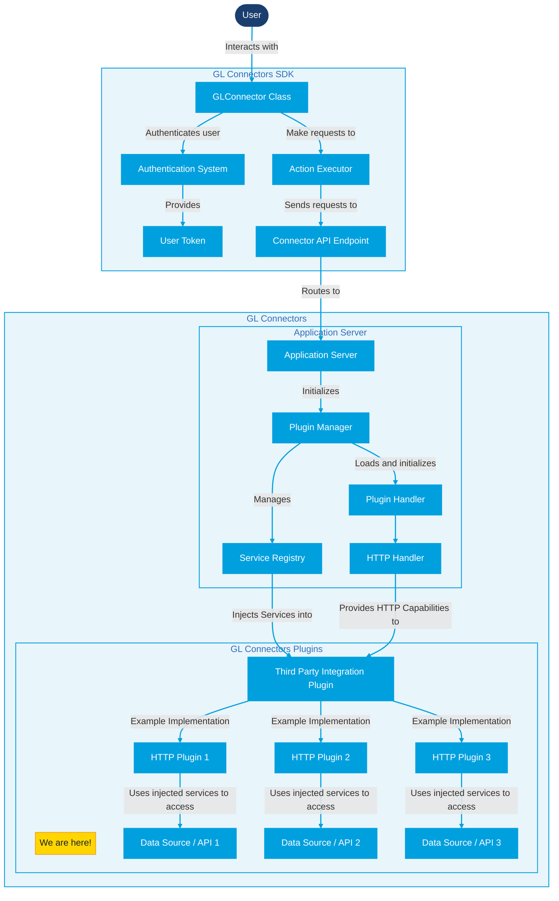
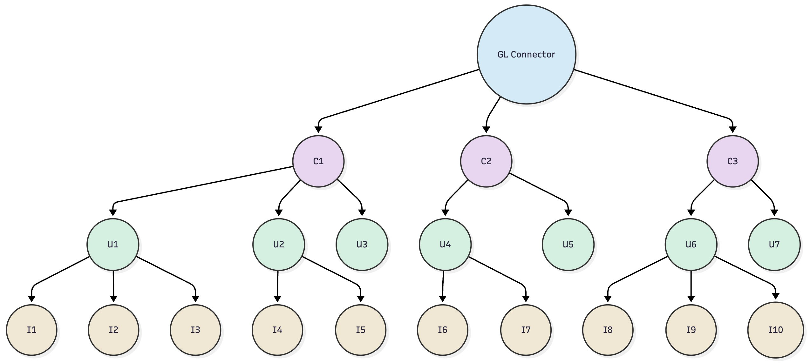

# HTTP Plugin Concepts

## HTTP Plugin Concepts

The following diagram shows how the GL Connector interacts from start to finish. We will focus on the ones that matter to the GL Connector Plugins and the Plugin Architecture itself.



What we will focus on is everything that's within the Server Plugins in the diagram, specifically, the HTTP Handler Section. To know more about the [plugin](../../../../../common-modules/tutorials/plugin/ "mention") in general, you can check the corresponding GitBook page about it.

### Concept 1: HTTP Handler

The HTTP Handler is the generic Handler for all HTTP Plugins. It provides an injection for the agnostic Router class (refer to [#concept-3-routing](http-plugin-concepts.md#concept-3-routing "mention") for routers). It can then be extended to make the routing more concrete. For example, Flask, FastAPI, etc. As of the time of writing, we support two types of HTTP Handlers:

* `FastApiHttpHandler`, which automatically maps all the routers and schema to FastAPI compatible format.
* `McpFastApiHandler`, which maps all the routers and schema to an MCP Server that will then be hosted under FastAPI.

GL Connectors utilizes _both_ handlers in the hosting, allowing both REST and MCP servers to coexist while we only need to code the Plugin _once_.

### Concept 2: HTTP Plugin

When we talk about HTTP Plugin in GL Connector Plugin context, we focus on [third-party-integration-plugin.md](plugin-handler/third-party-integration-plugin.md "mention") that supports the creation of special authentication types that can be stored and properly authenticated against for the appropriate data source. For example, for Github, we securely store the PAT, or for Google, the Bearer Token, etc. In essence, it's a standard HTTP Plugin that also handles special cases for third party authentication flows. Check the corresponding page for more details. It is already bound to a `HTTPHandler`, therefore there's no need to assign a Plugin Handler like you would any other Plugin (i.e., no need for `@Plugin.for_handler()` decorator).

### Concept 3: Routing

Connector Uses a framework-agnostic [Router](https://github.com/GDP-ADMIN/connectors-sdk/blob/main/python/gl-connectors-plugins/gl_connectors_plugins/handler/router.py#L26) class that can be extended and handled by the whatever concrete HTTP Handler. This router is responsible for handling input and output mapping to the appropriate routes, and then informing the concrete framework (e.g., Flask, FastApi, MCP) _how_ a certain route is handled.

Declaring a route is as simple as:

```python
router = Router()

@router.post("/path")
def path_handler(input: BaseModel) -> BaseModel:
    """...Doc."
```

Input and output is recommended to be a proper Pydantic `BaseModel` object in case the concrete framework is able to autogenerate OpenAPI specification (e.g., FastApi).

#### Concept 3.1: Actions

Server Plugins employ an action-oriented API design rather than a traditional, resource-based REST architecture.

Instead of using various HTTP methods (like `GET`, `PUT`) on resource-specific URLs, all operations are handled as `POST` requests to distinct, action-named endpoints. This approach ensures a uniform and predictable endpoint structure. In this model, the focus is on invoking specific **actions** (verbs) rather than **manipulating resources** (nouns).

Every operation is a `POST` request to an endpoint that explicitly describes the desired action (e.g., `create_issue`). **All necessary parameters are passed in the request body.**

**Bad Examples:**

:x: `GET /repositories/{id}`\
:x: `GET /repositories/{id}/issues`\
:x: `POST /repositories/{id}/issues`\
:x: `PUT /repositories/{id}/issues/{issueId}`

**Good Examples:**

:white\_check\_mark: `POST /get_repository`\
:white\_check\_mark: `POST /get_issue`\
\
:white\_check\_mark: `POST /create_issue`\
:white\_check\_mark: `POST /update_issue`

#### Key Advantages

* Uniformity: Every endpoint behaves the same way (`POST` with a JSON body), simplifying client-side implementation.
* Clear Intent: The endpoint name itself describes what is happening, making the API's purpose explicit.

### Concept 4: Injected Services

Based on the diagram above, a Handler will be injected specific services _on demand_. This means that you do not have to create an object of a certain type if it exists in the injection. The moment the application boots, they _will_ be populated; you do not need to initialize it anywhere; it is ready to use! Some services are _local_ to that particular handler, and others are globally defined.

Locally defined types for HTTP Handler can be found [here](https://github.com/GDP-ADMIN/connectors-sdk/blob/main/python/gl-connectors-plugins/gl_connectors_plugins/handler/interface.py#L53) (may change in the future; always refer to this link to check):

* `Router`: GL Connectors' framework-agnostic HTTP Router. To be used on _all_ routing related activities.

Globally defined types for HTTP Handler (specific to GL Connectors) can be found [here](https://github.com/GDP-ADMIN/gl-connectors/blob/main/applications/gl-connectors-api/gl_connectors_api/app.py#L247) under `global_services` (may change in the future; always refer to this link to ensure up-to-date information):

* `VerifyTokenService`: To be used to validate Connector User's authentication.
* `ClientAwareService`: To be used to validate whether or not a request comes from a valid client (i.e., checks for the presence of a valid `X-Api-Key` header).
* `ThirdPartyIntegrationService`: To be used to create, delete, read, or update existing third party integration entry for a particular Connector User.
* `CacheService`: General service to use GL Connectors Core's caching system (using Redis) to store and fetch data from the cache.

#### Concept 4.1: Overwriting Injected Services

Injected services can be overwritten by using the `__init__` function. For example:

```python
@Plugin.for_handler(HttpHandler)
class SomePlugin(Plugin):

    name: "some_plugin"

    router: Router

    def __init__(self):
        self.router = MyCustomRouter()
```

This way, `self.router` will become `MyCustomRouter` moving forward for all entries. Of course, prior to that assignment, `self.router` will be the injected router! So, be cautious when overwriting injected services. It is recommended to overwrite at the top of the `__init__` function to ensure your code is correctly adjusted.

### Concept 5: Authentication

GL Connectors is a multi-tenant application by default, with the concepts of Clients, Users, and Third Party Integrations. Hierarchically, it looks like this. When we talk about authentication, we're talking about authenticating the users that are bound to a client (i.e., U1, U2, U3, etc.). Each user manages their own integrations, whether they have Github integration, Google integration, etc.

As such, every user must send the following headers to be fully authenticated:

* `X-Api-Key`: This identifies the user about which client to authenticate against.
* `Authorization`: A **bearer** JWT token that informs GL Connector who the user is. This authentication must be attached with the appropriate Client Key (API Key); it will fail if the wrong API Key is used for that particular user.

<figure><figcaption></figcaption></figure>

<p align="center"><em>GL Connectors Client-User-Integration hierarchy. C is Client, U is user, I is integration</em><br><a href="https://www.mermaidchart.com/play#pako:eNqdkctqg1AQQH9FzMZAA96Hz0U3FsJAlr27btp486AhhkRoS-m_d5JbJ05W6bjyjHM8cv2Ol13r4zpeH18Pm-j56WUf4TVfNEkyX0RNt9_7Zd8dp9PwoFFJ0igijaSJDJIZyOGmo02Hm442HW6666ZFskQZUkaUI-VEBVIxEGABqABYACoAFoAKgAWgAmABqABYACoAFuBaKJFKogqputbTcz4dmA4ums0e8ZxuWN-wGVuNugyd4qg5ckWHoeWYsR0ThjnHYrzjwstBcdQcWdqFFliOLO1sGOYceToPw5JjxVGlY-fUf-385RRX292unrTWv62Kh1N_7N59PTHG_N3PPrZtv6n14XMs4lEGz5dttkrv97TQMzLPDd95tvw_PC30jNCzQi8TernQK2QeDP8BLfyD93ta6BmhZ4VeJvRyoVcIvVLoVUJPpfeL8c8vxeMRrw"><em>Mermaid Link</em></a></p>

### Concept 6: MCP

Utilizing [mcp-handler-advanced.md](plugin-handler/mcp-handler-advanced.md "mention"), we can immediately create MCP Server for a particular plugin. We simply need to register it to the MCP Handler the same way we would register a normal HTTP Handler. See [plugin-registration.md](plugin-registration.md "mention") for more information on how to initialize the MCP Service. Once registered, all Plugins will be created under `{BASE_URL}/{plugin.name}/mcp` under [Streamable HTTP](https://modelcontextprotocol.io/specification/2025-06-18/basic/transports#streamable-http) transport. This is why **plugin name is crucial**, because it is used to craft the MCP URL!

For more information about our available MCP servers, check our [agentic-tools-and-model-context-protocol-mcp](../../../agentic-tools-and-model-context-protocol-mcp/ "mention") page.
