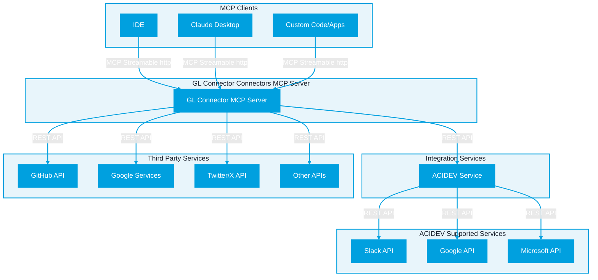

# MCP Handler (Advanced)


The MCP Handler does **not** have 1:1 feature parity with the API and likely will not be due to MCP's limitations. Functions that require waiting and callbacks, and functions involving files (such as Google Drive's upload/download file) **are not supported by MCP's specification,** attributing it to its JSON-RPC origins. Be sure to contact GL Connectors Team if you've found a feature that the MCP Handler shows, but isn't inherently supported, so we can better handle or hide those tools from MCP population.


The MCP handler exposes your plugin’s existing HTTP router handlers as MCP tools, so a single plugin works both as REST and as an MCP server.

* **REST and MCP side‑by‑side**: One handler (from your `Router`) serves traditional REST endpoints and MCP tools.
* **Transport**: Uses MCP’s Streamable HTTP transport and mounts a single MCP endpoint per plugin inside your FastAPI app.
* **Zero duplication**: Write handlers once; the MCP adapter handles tool registration, validation, auth, and response shaping.



#### How it’s wired

* `McpGenerator.generate_fastmcp([...])` creates one `FastMCP` per plugin (stateless HTTP).
* `McpFastApiHandler` mounts each MCP app at `/{plugin.name}` via `streamable_http_app()`.
* On startup, use `McpGenerator.lifespan(app)` to run MCP session managers.

```python
generator = McpGenerator()
mcps = generator.generate_fastmcp([GithubPlugin, GoogleApiPlugin])

app = FastAPI(lifespan=generator.lifespan)

mcp_plugin_handler = McpFastApiHandler(app, mcps, "/connectors/", authentication_schema)
mcp_plugin_manager = PluginManager(handlers=[mcp_plugin_handler])
mcp_plugin_manager.register_plugin(GithubApiPlugin)
mcp_plugin_manager.register_plugin(GoogleApiPlugin)
```

#### From Router → MCP Tools

For every route in a plugin’s `Router`, the handler:

1. Introspects the handler’s Python signature.
2. Builds a Pydantic model for arguments (type‑safe validation).
3. Adds an MCP `Context` param and extracts HTTP headers.
4. Skips framework‑only parameters: `Request`, `Response`, `JSONResponse`, `RedirectResponse`, `StreamingResponse`, `BackgroundTasks`, `ExposedDefaultHeaders`.
5. Registers a tool named `"{plugin.name}_{handler.__name__}"` with description from the handler’s docstring.
6. Excludes special endpoints: `integrations`, `integration-exists`, `success-authorize-callback`.

#### Response normalization

* Returns are standardized to dicts for MCP:
  * `ApiResponse` or `JSONResponse` → `{ "data": ..., "meta": ... }`
  * `RedirectResponse` → `{ "redirect": "<location>", "status": <code> }` (useful for OAuth2 handshakes)
* Errors during validation or execution are surfaced as `{ "error": "<message>" }`.

#### Authentication

* If an `AuthenticationSchema` is configured and a handler is not marked `__public__`, the MCP tool verifies authentication using headers extracted from MCP `Context` and mapped into `ExposedDefaultHeaders`.
* Policy is identical for REST and MCP, keeping a single source of truth.

#### Remote plugins

* If a plugin is a `RemoteServerPlugin`, the handler awaits `ensure_tools_loaded()` and registers tools dynamically once available.

#### Relationship to the base HTTP handler

`McpFastApiHandler` extends `HttpHandler`. The base `HttpHandler` provides:

* `get_plugin_routes()` to enumerate routes (method, path, docstring, parameters, request/response schemas).
* `redirect(url, status_code)` for framework‑aware redirects.
* A unified `_wrap_response(...)` that the MCP adapter uses to normalize handler outputs into `{ data, meta }` while preserving streaming/redirect responses.
* Standard routing integration via `handle_routing()` and schema extraction via `get_schema_extractor()`.

Result: a single plugin code path powers both REST and MCP.

#### Streamable HTTP and MCP (spec references)

* **Streamable HTTP transport**: single endpoint that supports POST/GET with optional SSE streaming, session management, and resumability — see the spec: [Model Context Protocol — Streamable HTTP](https://modelcontextprotocol.io/specification/2025-03-26/basic/transports#streamable-http).
* **Base protocol**: JSON‑RPC message format, batching, and lifecycle — see [Model Context Protocol — Base](https://modelcontextprotocol.io/specification/2025-03-26/basic).

#### Quick facts

* [**MCP endpoint**](../../../../agentic-tools-and-model-context-protocol-mcp/): `/{plugin.name}/mcp`
* **REST endpoints**: `/connectors/{plugin.name}/...`
* **Tool names**: `"{plugin.name}_{handler.__name__}"`
* **OAuth2 flows**: `RedirectResponse` is preserved as `{redirect, status}`, enabling `initialize_authorization` and `success_authorize_callback` sequences.
* **Excluded endpoints**: `integrations`, `integration-exists`, `success-authorize-callback`.

#### Minimal initiation example

```python
generator = McpGenerator()
mcps = generator.generate_fastmcp([MyPlugin])

app = FastAPI(lifespan=generator.lifespan)
mcp_handler = McpFastApiHandler(app, mcps, base_api_prefix="/api", authentication_schema=MyAuth())

plugin = MyPlugin()  # provides a Router with handlers
mcp_handler.initialize_mcp(plugin)  # mounts MCP and registers tools
```
