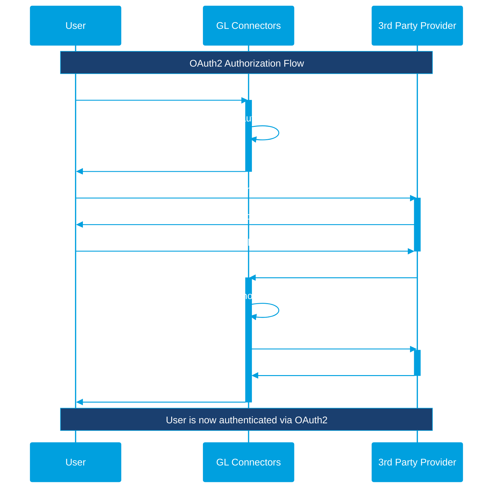

# Third Party Integration Plugin

[Third Party Integration Plugin](https://github.com/GDP-ADMIN/connectors-sdk/blob/main/python/gl-connectors-plugins/gl_connectors_plugins/common/plugin.py#L37) is a base Plugin Class that is already pre-assigned to HTTPHandler:

```python
@Plugin.for_handler(HttpHandler)
class ThirdPartyIntegrationPlugin(Plugin):
```

As such, when implementing a Plugin that extends the Third Party Integration Plugin, you _do not_ have to assign the handler yourself. Simply create your Plugin as such:

```python
class CustomThirdPartyPlugin(ThirdPartyIntegrationPlugin):
    """This is my custom third party plugin."""
    
    name = "custom_third_party_plugin"
    version = "0.0.1"
    description = "My awesome third party plugin!"
    
    router: Router
    
    # ...and so on.
```

However, when you extend the Third Party Integration Plugin, there are a few things you need to keep in mind. There are a few _important_ details that we need to implement.

## Endpoints

By extending the ThirdPartyIntegrationPlugin, you will expose new endpoints by default in order for users to _initiate_ or _create_ new configuration, as such:

* `POST /integrations`: Used to _create_ or register a new configuration for a particular user. See [#authentication](third-party-integration-plugin.md#authentication "mention") to see what kind of input may be possible and how to implement it.
* `POST /integrations/{user_identifier}`: Used to _select_ an active configuration. This is only useful for users that have registered more than one account. For example, if a user authorizes two Github accounts, this endpoint can be used to select which account is used for subsequent requests.
* `GET /integration-exists`: Used to check whether or not a user has _at least one_ active connection.
* `DELETE /integrations/{user_identifier}`: Used to delete an existing integration
* `GET /success-authorize-callback`: Used for OAuth2 only; to confirm the user's authorization and for token exchange with the 3rd party token.

This is used for GL Connectors SDK to retrieve all necessary information.

## Authentication


If the method defining the authentication is not defined or not supported (e.g., SQL Plugin does not support OAuth2 or Plugins that do not support BYOK or custom configuration), it is expected for you to `raise NotImplementedError("...")` in order to inform the client that this authentication method is not supported.


Each plugin may not have to support all methods of creating authentication, but it is _recommended_ to implement at least one (unless your Plugin is entirely unauthenticated).

### OAuth2

**Required methods to implement:**

* `initialize_authorization`: Used to create a URL for users to follow for OAuth2.
* `success_authorize_callback`: Used to exchange token with 3rd party integration when the user successfully authorizes for OAuth2.

OAuth2 is a way for the user to authorize a user using third party login directly. This way, there needs to be two steps in order to fully authenticate and get the appropriate token, following this sequence diagram:



As such, you need to implement the two methods in order to fully achieve authentication. A simple example would look like this:

```python
    def initialize_authorization(self, callback_url: str, headers: ExposedDefaultHeaders):
        """Initialize OAuth2 authorization."""
        # Extract user info from headers
        client = self.client_aware_service.get_client_by_api_key(headers.x_api_key)
        token = headers.authorization[len("Bearer "):]
        user_id = self.token_service.verify_token_and_get_user_id(headers.x_api_key, token)
        
        # Return OAuth URL for user to visit
        return f"https://provider.com/oauth/authorize?client_id=xyz&redirect_uri=callback&state={client.id}:{user_id}"
```

As you can see, during `initialize_authorization`, it's just an initialization; we do not create the integration yet. The one who creates the integration is actually the `success_authorize_callback` function. Here is an example of how one would implement the `success_authorize_callback` function:

```python
    def success_authorize_callback(self, **kwargs):
        """Handle OAuth callback success."""
        # Decode state to get client_id and user_id
        client_id, user_id = self._decode_state(kwargs.get("state"))
        
        # Exchange code for access token
        access_token = self._exchange_code_for_token(kwargs.get("code"))
        
        # Create and save integration
        integration = ThirdPartyIntegrationAuth(
            client_id=UUID(client_id),
            user_id=UUID(user_id),
            connector=self.name,
            user_identifier="provider_username",
            auth_string=access_token,
            auth_scopes=["read", "write"]
        )
        self.third_party_integration_service.create_integration(integration)
```

### Custom Configuration

**Required methods to implement:**

* `initialize_custom_configuration`: Used to immediately register and store a configuration based on user-provided keys.

Custom configuration is a way for us to set a third party integration when the user has either custom configuration (e.g., custom endpoint URL, custom API) or a custom key (BYOK). The following code shows the simplest way to implement a custom configuration based on the `configuration` entry. Because it is a free-form input, you are responsible for handling unexpected values and keys.

```python
    def initialize_custom_configuration(self, configuration: dict[str, Any], headers: ExposedDefaultHeaders):
        """Initialize with custom config (non-OAuth)."""
        # Extract user info from headers
        client = self.client_aware_service.get_client_by_api_key(headers.x_api_key)
        token = headers.authorization[len("Bearer "):]
        user_id = self.token_service.verify_token_and_get_user_id(headers.x_api_key, token)
        
        # Create integration directly
        integration = ThirdPartyIntegrationAuth(
            client_id=UUID(str(client.id)),
            user_id=UUID(str(user_id)),
            connector=self.name,
            user_identifier=config.get("user_identifier", ""),
            auth_string=config.get("auth_string", ""),
            auth_scopes=[]
        )
        return self.third_party_integration_service.create_integration(integration)
```

## Multiple Integrations

**Required methods to implement:**

* `user_has_integration`
* `select_integration`
* `remove_integration`
* `get_integration`
* `user_has_integration`

To support multiple integrations, we need to implement the four methods defining multiple integration. They typically have the same implementation as such. You normally don't need to change anything of the default implementation, as such:

```python
def remove_integration(self, user_identifier: str, headers: ExposedDefaultHeaders):
    """Remove integration."""
    # Extract user info and delete
    client = self.client_aware_service.get_client_by_api_key(headers.x_api_key)
    token = headers.authorization[len("Bearer "):]
    user_id = self.token_service.verify_token_and_get_user_id(headers.x_api_key, token)
    
    self.third_party_integration_service.delete_integration(client.id, user_id, self.name, user_identifier)

def user_has_integration(self, headers: ExposedDefaultHeaders):
    """Checks if the current active user has integration.

    Args:
        headers (ExposedDefaultHeaders): The headers to use.

    Returns:
        bool: True if the user has integration, False otherwise.
    """
    token = headers.authorization
    if not token or not token.startswith(self.BEARER_TOKEN_PREFIX):
        return False

    token = token[len(self.BEARER_TOKEN_PREFIX) :]
    api_key = headers.x_api_key
    client = self.client_aware_service.get_client_by_api_key(api_key)
    user_id = self.token_service.verify_token_and_get_user_id(api_key, token)

    return self.third_party_integration_service.has_integration(client.id, user_id, self.name)

def select_integration(self, user_identifier: str, headers: ExposedDefaultHeaders):
    """Selects the integration.

    Args:
        user_identifier: The user identifier to select.
        headers: The headers.
    """
    token = headers.authorization
    if not token or not token.startswith(self.BEARER_TOKEN_PREFIX):
        raise UnauthorizedException(TOKEN_NOT_FOUND_MESSAGE)

    token = token[len(self.BEARER_TOKEN_PREFIX) :]
    api_key = headers.x_api_key
    client = self.client_aware_service.get_client_by_api_key(api_key)
    user_id = self.token_service.verify_token_and_get_user_id(api_key, token)

    try:
        self.third_party_integration_service.set_selected_integration(
            client.id, user_id, self.name, user_identifier
        )
    except NotFoundException as e:
        raise IntegrationDoesNotExistException(self.name, user_identifier) from e

def get_integration(self, user_identifier: str, headers: ExposedDefaultHeaders):
    """Get the integration.

    Args:
        user_identifier: The user identifier.
        headers: The headers.
    """
    token = headers.authorization
    if not token or not token.startswith(self.BEARER_TOKEN_PREFIX):
        raise UnauthorizedException(TOKEN_NOT_FOUND_MESSAGE)

    token = token[len(self.BEARER_TOKEN_PREFIX) :]
    api_key = headers.x_api_key

    integration_helper = IntegrationHelper(
        self.third_party_integration_service,
        self.token_service,
        self.client_aware_service,
    )
    return integration_helper.get_integration_by_name(user_identifier, token, api_key, self.name)
```

## Combining it all

An example fully-functional Third Party Integration Handler will look something like this (_private methods not included_):

```python
"""Barebone Integration Plugin Template."""

from uuid import UUID
from typing import Any
from bosa_core.authentication.plugin.repository.models import ThirdPartyIntegrationAuth
from gl_connectors_plugins.common.plugin import ThirdPartyIntegrationPlugin
from gl_connectors_plugins.handler import ExposedDefaultHeaders


class MyIntegrationPlugin(ThirdPartyIntegrationPlugin):
    """My Integration Plugin."""
    
    name = "my_integration"
    version = "0.1.0"
    description = "My integration plugin"

    def initialize_authorization(self, callback_url: str, headers: ExposedDefaultHeaders):
        """Initialize OAuth2 authorization."""
        # Extract user info from headers
        client = self.client_aware_service.get_client_by_api_key(headers.x_api_key)
        token = headers.authorization[len("Bearer "):]
        user_id = self.token_service.verify_token_and_get_user_id(headers.x_api_key, token)
        
        # Return OAuth URL for user to visit
        return f"https://provider.com/oauth/authorize?client_id=xyz&redirect_uri=callback&state={client.id}:{user_id}"

    def initialize_custom_configuration(self, configuration: dict[str, Any], headers: ExposedDefaultHeaders):
        """Initialize with custom config (non-OAuth)."""
        # Extract user info from headers
        client = self.client_aware_service.get_client_by_api_key(headers.x_api_key)
        token = headers.authorization[len("Bearer "):]
        user_id = self.token_service.verify_token_and_get_user_id(headers.x_api_key, token)
        
        # Create integration directly
        integration = ThirdPartyIntegrationAuth(
            client_id=UUID(str(client.id)),
            user_id=UUID(str(user_id)),
            connector=self.name,
            user_identifier=config.get("user_identifier", ""),
            auth_string=config.get("auth_string", ""),
            auth_scopes=[]
        )
        return self.third_party_integration_service.create_integration(integration)

    def success_authorize_callback(self, **kwargs):
        """Handle OAuth callback success."""
        # Decode state to get client_id and user_id
        client_id, user_id = self._decode_state(kwargs.get("state"))
        
        # Exchange code for access token
        access_token = self._exchange_code_for_token(kwargs.get("code"))
        
        # Create and save integration
        integration = ThirdPartyIntegrationAuth(
            client_id=UUID(client_id),
            user_id=UUID(user_id),
            connector=self.name,
            user_identifier="provider_username",
            auth_string=access_token,
            auth_scopes=["read", "write"]
        )
        self.third_party_integration_service.create_integration(integration)

    def remove_integration(self, user_identifier: str, headers: ExposedDefaultHeaders):
        """Remove integration."""
        # Extract user info and delete
        client = self.client_aware_service.get_client_by_api_key(headers.x_api_key)
        token = headers.authorization[len("Bearer "):]
        user_id = self.token_service.verify_token_and_get_user_id(headers.x_api_key, token)
        
        self.third_party_integration_service.delete_integration(client.id, user_id, self.name, user_identifier)

    def user_has_integration(self, headers: ExposedDefaultHeaders):
        """Checks if the current active user has integration.

        Args:
            headers (ExposedDefaultHeaders): The headers to use.

        Returns:
            bool: True if the user has integration, False otherwise.
        """
        token = headers.authorization
        if not token or not token.startswith(self.BEARER_TOKEN_PREFIX):
            return False

        token = token[len(self.BEARER_TOKEN_PREFIX) :]
        api_key = headers.x_api_key
        client = self.client_aware_service.get_client_by_api_key(api_key)
        user_id = self.token_service.verify_token_and_get_user_id(api_key, token)

        return self.third_party_integration_service.has_integration(client.id, user_id, self.name)

    def select_integration(self, user_identifier: str, headers: ExposedDefaultHeaders):
        """Selects the integration.

        Args:
            user_identifier: The user identifier to select.
            headers: The headers.
        """
        token = headers.authorization
        if not token or not token.startswith(self.BEARER_TOKEN_PREFIX):
            raise UnauthorizedException(TOKEN_NOT_FOUND_MESSAGE)

        token = token[len(self.BEARER_TOKEN_PREFIX) :]
        api_key = headers.x_api_key
        client = self.client_aware_service.get_client_by_api_key(api_key)
        user_id = self.token_service.verify_token_and_get_user_id(api_key, token)

        try:
            self.third_party_integration_service.set_selected_integration(
                client.id, user_id, self.name, user_identifier
            )
        except NotFoundException as e:
            raise IntegrationDoesNotExistException(self.name, user_identifier) from e

    def get_integration(self, user_identifier: str, headers: ExposedDefaultHeaders):
        """Get the integration.

        Args:
            user_identifier: The user identifier.
            headers: The headers.
        """
        token = headers.authorization
        if not token or not token.startswith(self.BEARER_TOKEN_PREFIX):
            raise UnauthorizedException(TOKEN_NOT_FOUND_MESSAGE)

        token = token[len(self.BEARER_TOKEN_PREFIX) :]
        api_key = headers.x_api_key

        integration_helper = IntegrationHelper(
            self.third_party_integration_service,
            self.token_service,
            self.client_aware_service,
        )
        return integration_helper.get_integration_by_name(user_identifier, token, api_key, self.name)
```
