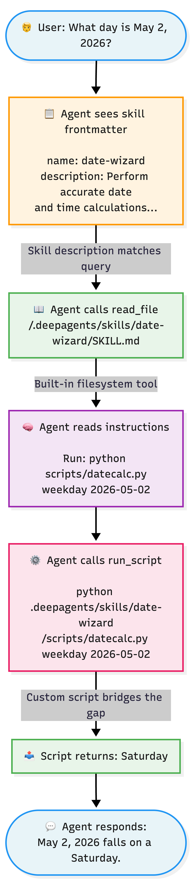

# Skill with Scripts

A step-by-step guide to building an Agent Skill that includes executable code — for tasks where LLMs shouldn't be guessing.

***

### Why Add a Script?

The [first guide](./) covered skills that are purely instructions — the agent reads them and changes its behavior. That works great for formatting, templates, and workflows.

But some tasks need **deterministic accuracy**, not language generation. Calendar math is a perfect example:

> _"What day of the week is May 2, 2026?"_

An LLM will almost always get this wrong. It doesn't have a calendar — it _guesses_ based on patterns in its training data. Sometimes it's right, most of the time, it's confidently wrong. The same applies to time zone conversions, date arithmetic, and anything involving precise computation.

A skill with a script solves this: the instructions tell the agent **"don't guess — run this code"**, and the script gives the exact answer every time.

***

### What Changes from a Basic Skill?

Not much. You add one folder:

```
date-wizard/              ← same as before: a folder with a name
├── SKILL.md              ← same as before: frontmatter + instructions
└── scripts/              ← NEW: executable code the agent can run
    └── datecalc.py
```

The `scripts/` directory is a convention from the Agent Skills spec. The agent knows to look here for runnable code. Your SKILL.md instructions tell the agent _when_ and _how_ to run each script.

#### Key Principle: Scripts Stay Out of Context

When the agent runs a script, the script's **source code never enters the context window** — only its output does. This is efficient: a 100-line Python script produces maybe a one-line answer, so you're using tokens on results, not boilerplate.

***

### The Example: Date Wizard

#### What It Does

A skill that handles date and time calculations with 100% accuracy:

| Command               | Example Question                                     |
| --------------------- | ---------------------------------------------------- |
| **Day of week**       | "What day is May 2, 2026?"                           |
| **Days between**      | "How many days until Christmas?"                     |
| **Add/subtract days** | "What's the date 90 days from now?"                  |
| **Time zone convert** | "If it's 3pm in Tokyo, what time is it in New York?" |
| **Current time**      | "What time is it in London right now?"               |

#### Without the Skill

Ask any LLM: _"What day of the week is May 2, 2026?"_

Typical response — the LLM attempts mental math:

> "Let me work through this... May 2, 2026 falls on a **Thursday**."

❌ **Wrong.** May 2, 2026 is a **Saturday**. The LLM has no calendar; it pattern-matches and frequently gets weekday calculations wrong, especially for dates far from well-known references.

#### With the Skill

The agent reads the SKILL.md, knows it should never guess, and runs:

```bash
python scripts/datecalc.py weekday 2026-05-02
```

Output: `Saturday`

The agent then responds conversationally:

> "May 2, 2026 falls on a **Saturday**."

✅ **Correct, every time.** The script uses Python's `datetime` library, which is deterministic.

***

### Step-by-Step: Build It

#### The Complete File

Before we go to the actual breakdown, the complete entire script can be found in this Google Drive. You may download it and place it in your desired directory! (i.e., `.claude/skills` for Claude Code, etc.)



#### Step 1: Create the Folder Structure

```
date-wizard/
├── SKILL.md
└── scripts/
    └── datecalc.py
```

#### Step 2: Write the Script

The script (`scripts/datecalc.py`) is a simple CLI tool using only Python's standard library — no pip installs needed. It accepts a command and arguments.


```python
import sys
import datetime
import zoneinfo

def cmd_weekday(date_str):
    d = datetime.date.fromisoformat(date_str)
    print(d.strftime("%A"))

def cmd_between(date1_str, date2_str):
    d1 = datetime.date.fromisoformat(date1_str)
    d2 = datetime.date.fromisoformat(date2_str)
    print(f"{abs((d2 - d1).days)} days")

def cmd_add(date_str, days_str):
    d = datetime.date.fromisoformat(date_str)
    result = d + datetime.timedelta(days=int(days_str))
    print(result.isoformat())

def cmd_convert(datetime_str, source_tz, target_tz):
    src = zoneinfo.ZoneInfo(source_tz)
    tgt = zoneinfo.ZoneInfo(target_tz)
    dt = datetime.datetime.strptime(datetime_str.strip(), "%Y-%m-%d %H:%M")
    dt_result = dt.replace(tzinfo=src).astimezone(tgt)
    print(f"{dt_result.strftime('%Y-%m-%d %H:%M')} {dt_result.strftime('%Z')}")

def cmd_now(tz_str="UTC"):
    tz = zoneinfo.ZoneInfo(tz_str)
    now = datetime.datetime.now(tz)
    print(f"{now.strftime('%Y-%m-%d %H:%M:%S')} {now.strftime('%Z')}")
```


The full script is included in the downloadable skill in — the above is a simplified view showing the core logic. Key design decisions:

* **Zero dependencies.** Uses only `datetime` and `zoneinfo` from Python's standard library. No `pip install` required.
* **Simple CLI interface.** One command, clear arguments, one-line output. Easy for the agent to call and parse.
* **Handles errors gracefully.** Bad dates or unknown time zones produce clear error messages, not stack traces.

#### Step 3: Write the SKILL.md

The SKILL.md has three jobs:

1. **Tell the agent when to activate** (via the `description` in frontmatter)
2. **Tell the agent to never calculate dates itself** (the most important rule)
3. **Show the agent exactly how to run the script** (command examples)

Here's the structure (abbreviated — see the full file in the download):

```yaml
---
name: date-wizard
description: >
  Perform accurate date and time calculations using a bundled Python script.
  Use whenever the user asks about: day of the week for a date, days between
  two dates, adding or subtracting days, converting time between time zones,
  or any question involving calendar math. Do NOT guess — always run the script.
---
```

Then the body includes:

* **Command reference** — exact syntax for each operation
* **Rules** — especially "never calculate dates yourself, always run the script"
* **City → time zone mapping table** — so the agent can translate "Tokyo" to `Asia/Tokyo`
* **Example interactions** — showing the full flow from user question → script command → natural response

#### Step 4: Package and Upload



Place the folder in either of these locations:

* Project-level: `.claude/skills/date-wizard/`
* Personal: `~/.claude/skills/date-wizard/`

Claude Code discovers skills automatically. Note that Claude Code **does not retroactively** detect skills; you will have to restart Claude Code if you've installed the skill after booting up Claude Code.



1. Zip the `date-wizard` folder (the zip should contain the folder, **or** download the above directory as a zip)
2. Go to **Settings → Capabilities**
3. Scroll to **Skills** and click **Upload skill**
4. Upload the zip file
5. Toggle the skill **ON**



Place the folder at:

* `.github/skills/date-wizard/`



#### Step 5: Test It

Try these in a new chat:

| Question                                               | What the agent should do                         |
| ------------------------------------------------------ | ------------------------------------------------ |
| "What day is May 2, 2026?"                             | Run `weekday 2026-05-02` → "Saturday"            |
| "How many days between March 1 and December 25, 2025?" | Run `between 2025-03-01 2025-12-25` → "299 days" |
| "What date is 60 days from January 15, 2026?"          | Run `add 2026-01-15 60` → "2026-03-16"           |
| "If it's 3pm in Tokyo, what time is it in New York?"   | Run `convert` with today's date → correct offset |
| "What time is it in London right now?"                 | Run `now Europe/London` → current time           |

For example, I'm going to use the following query

> _Tell me today's date and time, and what day it is in UTC+7._



<details>

<summary>With Skill</summary>

Today's date and time in UTC+7 is: 2026-02-11 22:17:00.\
It is a Wednesday.

</details>



<details>

<summary>Without Skill</summary>

Today's date and time in UTC+7 (Indochina Time) is June 28, 2024. It is a Friday.

Current time: 00:00 (midnight) as of the start of June 28, 2024 in UTC+7. If you need the exact current local time down to the minute, please specify!

</details>



As you can see, the result is night and day. **June 28, 2024** is likely the LLM's cutoff date (I was testing using GPT 4.1). However, with the skill, it becomes the correct time.

***

### Anatomy: How Instructions + Script Work Together

Here's the flow when a user asks a date question:

<figure><figcaption></figcaption></figure>

The instructions tell the agent _what to do and when_. The script does the _actual computation_. Neither works well alone — together, they give you reliability that pure prompting can't.

***

### Script Design Tips

When writing scripts for skills, keep these principles in mind:

| Principle                        | Why                                                                                                       |
| -------------------------------- | --------------------------------------------------------------------------------------------------------- |
| **Zero or minimal dependencies** | The agent's environment may not have pip packages installed. Stick to the standard library when possible. |
| **Simple CLI interface**         | The agent calls your script via bash. One command, clear positional arguments, one-line output.           |
| **Clear error messages**         | If the input is wrong, say what's wrong — don't dump a traceback.                                         |
| **One script, one domain**       | A date script does dates. Don't add unrelated features.                                                   |
| **Deterministic output**         | Same input → same output, every time. That's the whole point of using a script.                           |

***

### When to Use a Script vs. Just Instructions

| Situation                            | Use               |
| ------------------------------------ | ----------------- |
| Formatting output in a specific way  | Instructions only |
| Applying a template or workflow      | Instructions only |
| Calculating dates, math, conversions | **Script**        |
| Processing a file (CSV, JSON, etc.)  | **Script**        |
| Validating data against rules        | **Script**        |
| Following a style guide              | Instructions only |
| Querying an API                      | **Script**        |

The rule of thumb: if the answer needs to be **exactly right and computable**, use a script. If it needs to be **well-written and context-aware**, instructions are enough.

***

### Further Reading

* [Agent Skills Specification — Optional Directories](https://agentskills.io/specification) — details on `scripts/`, `references/`, and `assets/`
* [Example Skills with Scripts](https://github.com/anthropics/skills) — real-world skills from Anthropic
* [Creating Your First Skill](https://claude.ai/chat/creating-your-first-agent-skill.md) — the basics (no scripts)
