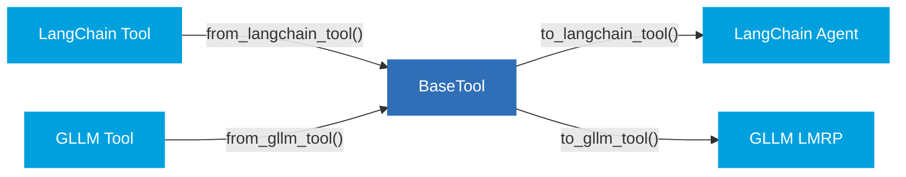

# Tool Conversion

### The Vendor Lock-In Problem

Every agentic framework defines its own tool interface. LangChain tools look different from CrewAI tools, which look different from GLLM tools. The core logic might be identical — call an API, run a query, format a result — but the wrapping is framework-specific.

This creates **vendor lock-in at the tool level**. Once you've built a library of tools for one framework, migrating to another means rewriting every tool to match the new interface. The cost scales with the number of tools you maintain, and it discourages teams from experimenting with alternative frameworks even when they'd be a better fit.

### BaseTool as the Common Layer

The GL Connectors Tools addresses this with **BaseTool** — a framework-agnostic base class that your tools inherit from. Instead of writing tools _for_ a specific framework, you write them once against BaseTool, and the adapters we provide handle conversion to and from supported frameworks.

This means:

* **Existing tools can be brought in.** If you already have tools written for a supported framework, you can convert them to BaseTool without rewriting the underlying logic.
* **New tools are portable from day one.** Tools authored against BaseTool can be converted to any supported framework through a single adapter call.
* **Migration is incremental.** You don't need to convert everything at once. BaseTool and framework-native tools can coexist in the same project.

### Supported Frameworks

| Framework | Import From                                                                          | Export To               |
| --------- | ------------------------------------------------------------------------------------ | ----------------------- |
| LangChain | 
✅ <code>from_langchain_tool()</code> ✅ <code>from_langchain_tools()</code>
 | ✅ `to_langchain_tool()` |
| GLLM      | 
✅ <code>from_gllm_tool()</code> ✅ <code>from_gllm_tools()</code>
           | ✅ `to_gllm_tool()`      |


Support for additional frameworks may be added over time. We will keep this list updated as we support more.


### Framework-Specific Guides

For step-by-step instructions on converting tools from a specific framework:

* [from-langchain-tools.md](from-langchain-tools.md "mention")
