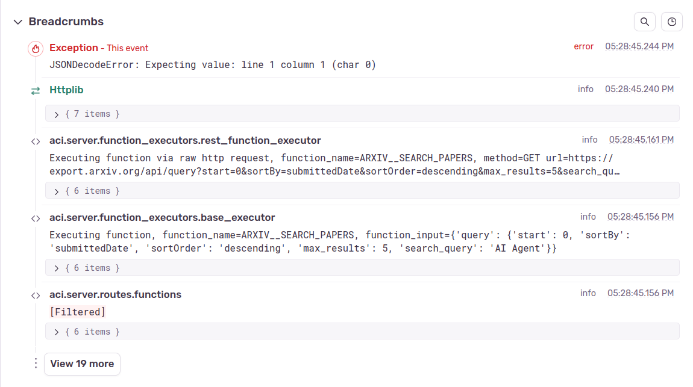

# Issues

An issue is a collection of similar error events that represent a specific problem within your application. Issues in Sentry can originate from two primary sources:

* **Uncaught Exceptions**: Errors in your code that were not handled, resulting in a failure or crash.
* **Error Logs**: Log entries that indicate errors or warnings recorded during the application’s operation.

## Issues Page

The Issues page displays list of the issues. This is the primary interface to identifying problems in your application.

<figure><figcaption></figcaption></figure>

## How to Debug

These steps will guide you on how to use Sentry Issues page for debugging error in your code:

1. Go to **sidebar > Issues > Feed**.
2. Select the project you want to look into.

<figure><figcaption></figcaption></figure>

3. Filter the error by the environment name and when it takes place.

<figure><figcaption></figcaption></figure>

4. View the list of recorded issues, including frequency, severity, and the date of the last occurrence.

<figure><figcaption></figcaption></figure>

5. Use search and filters to find specific issues based on attributes like severity, project, or timeframe.

<figure><figcaption></figcaption></figure>

6. You can also save your custom search as a **View** by clicking **Save As** on the top right corner of the page. To view the saved views, go to the **sidebar > Issues > All Views**. If the view is starred, it can also be found on the **Issues > Starred Views**.

<figure><figcaption></figcaption></figure>

<figure><figcaption></figcaption></figure>

7. You can also set the issue priority and can assign issues to team members, add comments, and mark them as resolved or archived them.

<div align="center">  </div>

8. Click on an issue to see detailed information, such as stack trace, breadcrumbs, and user context.

<figure><figcaption></figcaption></figure>

## Issue Details

The Issue Details page provides a comprehensive breakdown of an error. Let's explore the most important sections you'll use for debugging. Please note this guide will use the new experiment UI. The view can be activated by clicking the **Try New UI**.

<figure><figcaption></figcaption></figure>

### Events

It's important to understand that Sentry groups multiple errors with the same name into one Issue, even though they may have different message, error location and root cause. Those errors are called Events. Therefore, finding the correct event is a critical step in your investigation. Here is the step to find the error you are looking for.

1. Use the search bar to filter through the events and locate the exact one you need to analyze. This filter can support filtering based on the environment, timestamp, and event properties.

<figure><figcaption></figcaption></figure>

2. Click **View More Events** to see the list of all events or use the left and right arrow to analyze all the events one by one.

<figure><figcaption></figcaption></figure>

<figure><figcaption></figcaption></figure>

3. Select an event to view its details.

### Highlights

This section contains some important information about the trace ID and error message.

<figure><figcaption></figcaption></figure>

### Stacktrace

This section provides a reversed, chronological list of function calls that led up to the error, pinpointing the exact file, line of code where the failure occurred, and even the arguments passed to that function. Analyzing the stack trace is fundamental to understanding the execution path and finding the root cause of an issue.

<figure><figcaption></figcaption></figure>


**Note:** python `logging.error` doesn't automatically contain the error stacktrace. Set parameter `exc_info=True` on the logging error or use logging exception to add stacktrace on the log.

```python
import logging

logger.error("This error contains no Stacktrace", exc_info=True)
logger.exception("This error contains a Stacktrace")
```


### Breadcrumbs

Breadcrumbs offer a sequential history and timeline of events that occur leading up to an error. They act like a trail of logs or records, detailing the execution steps and event that led to the problem.

<figure><figcaption></figcaption></figure>

### Trace Preview

This section shows the preview of the trace where the error occurred. To find full information about the trace, click the trace or **View Full Trace** button, then you will be redirected to the trace page.

<figure><figcaption></figcaption></figure>

### Additional Information

The following sections contain supplementary information that, while not critical for debugging, may prove useful:

1. Tags

<figure><figcaption></figcaption></figure>

2. Contexts

<figure><figcaption></figcaption></figure>

3. Additional Data

<figure><figcaption></figcaption></figure>

4. Packages

<figure><figcaption></figcaption></figure>

5. SDK

<figure><figcaption></figcaption></figure>

## Alert

Setting up alerts is a useful way to notify project members about application errors, allowing developers to begin fixing them immediately. The alert can be set up when creating the project or after the project is created. This is the guide to create alert on existing projects:

<figure><figcaption></figcaption></figure>

1. Go to **sidebar > Issues > Alert**
2. Click the **Create Alert** button on the top right corner.
3. Fill the alert configuration.
