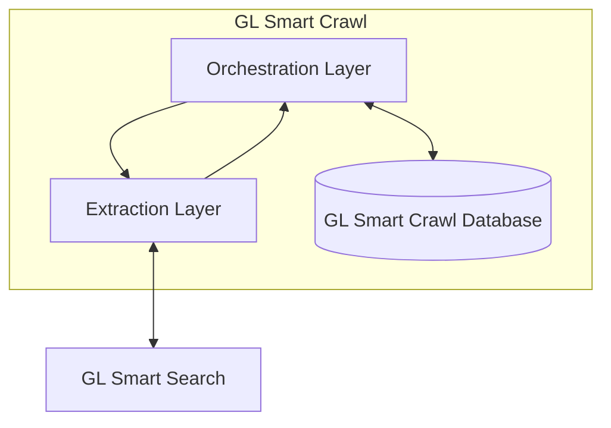

# Block Diagram: GL Smart Crawl System Architecture

```mermaid
flowchart TB

subgraph GSC[GL Smart Crawl]
    direction TB
    ORCH[Orchestration Layer]
    EXTRACT[Extraction Layer]
    CRAWLDB[(GL Smart Crawl Database)]

    ORCH --> EXTRACT
    EXTRACT --> ORCH
    ORCH <--> CRAWLDB
end

SEARCH[GL Smart Search]

EXTRACT <--> SEARCH
```
