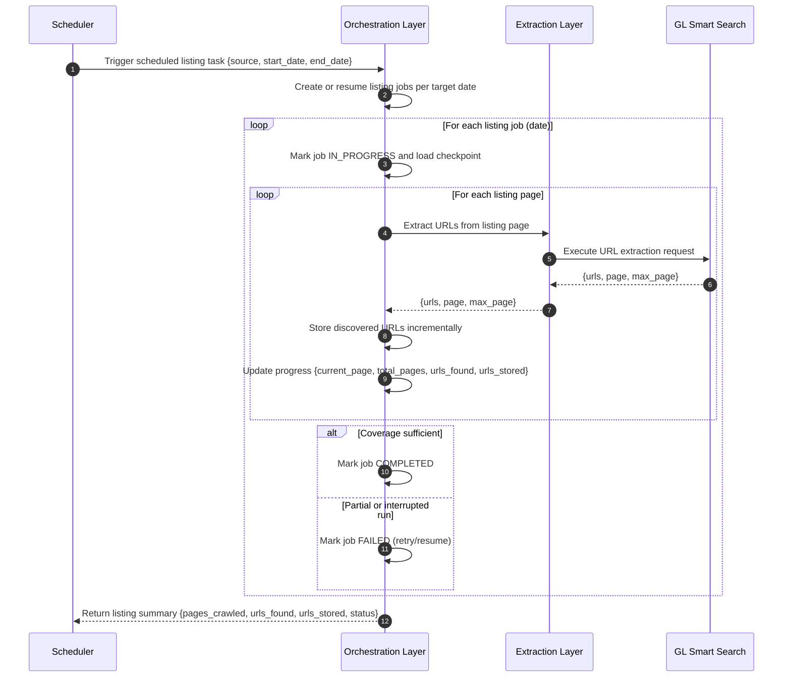

# Sequence Diagram: Listing Process

### Orchestration Layer: Listing Orchestration Flow (URL Discovery Lifecycle)

This subsection describes orchestration behavior (job lifecycle, checkpointing, and status transitions), not extraction implementation details.

When a scheduled listing task is triggered for a source and date range, the Orchestration Layer in GL Smart Crawl starts URL discovery by creating or resuming listing jobs per target date. For each job, it processes listing pages sequentially and calls the Extraction Layer via `/extract-urls` to retrieve discovered URLs and pagination metadata (`page`, `max_page`). After each page, the Orchestration Layer stores discovered URLs incrementally and updates checkpoint/progress fields (for example `current_page`, `total_pages`, `urls_found`, and `urls_stored`) so interrupted runs can resume from the last processed state. At the end of each listing job, status is finalized as `COMPLETED` when coverage is sufficient, or `FAILED` when the run is partial and requires retry/resume.

