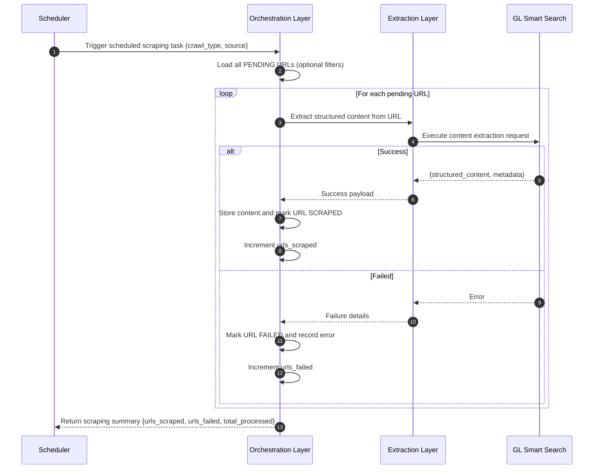

# Sequence Diagram: Scraping Process

### Orchestration Layer: Scraping Orchestration Flow (Pending URL Processing)

This subsection describes orchestration behavior (URL selection, status transitions, and batch resilience), not extraction implementation internals.

When a scheduled scraping task is triggered, the Orchestration Layer in GL Smart Crawl loads URLs that are still in `PENDING` status (optionally filtered by source or crawl type). For each pending URL, it calls the Extraction Layer via `/scrape` for content extraction. On success, GL Smart Crawl stores the structured result and marks the URL as `SCRAPED`; on failure, it records the error and marks the URL as `FAILED`. Each URL is handled independently, so individual failures do not stop the batch, and the run finishes with a summary of processed, scraped, and failed URLs. Combined with listing orchestration, this supports incremental crawl operations with resumable and operationally visible execution.

