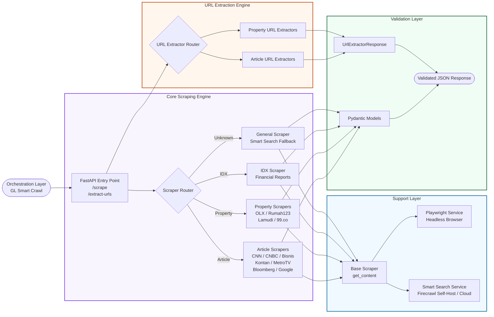

# Block Diagram: Extraction Layer Architecture

```mermaid
graph LR
    %% External Interface
    Client([Orchestration Layer\nGL Smart Crawl]) --> API[FastAPI Entry Point\n/scrape\n/extract-urls]

    %% Main Routing Block
    subgraph Core [Core Scraping Engine]
        API --> Router{Scraper Router}
        Router -->|Article| NS[Article Scrapers\nCNN / CNBC / Bisnis\nKontan / MetroTV\nBloomberg / Google]
        Router -->|Property| PS[Property Scrapers\nOLX / Rumah123\nLamudi / 99.co]
        Router -->|IDX| IS[IDX Scraper\nFinancial Reports]
        Router -->|Unknown| GS[General Scraper\nSmart Search Fallback]
    end

    %% URL Extraction
    subgraph Extraction [URL Extraction Engine]
        API --> ERouter{URL Extractor Router}
        ERouter --> AE[Article URL Extractors]
        ERouter --> PE[Property URL Extractors]
    end

    %% Infrastructure & Support Services
    subgraph Infrastructure [Support Layer]
        NS & PS & IS & GS --> BS[Base Scraper\nget_content\n]
        BS --> PW[Playwright Service\nHeadless Browser]
        BS --> SS[Smart Search Service\nFirecrawl Self-Host / Cloud]
    end

    %% Output Block
    subgraph Validation [Validation Layer]
        NS & PS & IS & GS --> Model[Pydantic Models]
        AE & PE --> URLModel[UrlExtractorResponse]
        Model --> Result([Validated JSON Response])
        URLModel --> Result
    end

    style Core fill:#f9f5ff,stroke:#7c3aed,stroke-width:2px
    style Extraction fill:#fff7ed,stroke:#c2410c,stroke-width:2px
    style Infrastructure fill:#f0f9ff,stroke:#0369a1,stroke-width:2px
    style Validation fill:#f0fdf4,stroke:#166534,stroke-width:2px
```
