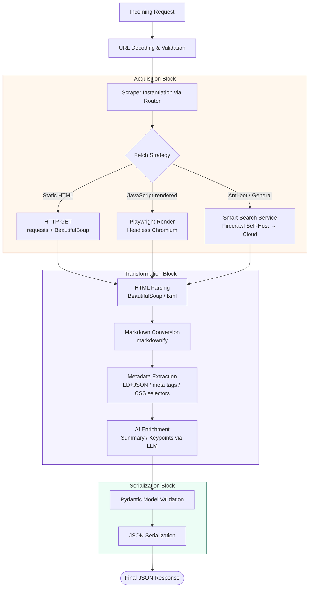

# Data Flow Diagram: Extraction Layer Request Lifecycle

```mermaid
graph TD
    %% Request Initialization
    Req[Incoming Request] --> R1[URL Decoding & Validation]
    R1 --> R2[Scraper Instantiation via Router]

    %% Data Acquisition Block
    subgraph Acquisition [Acquisition Block]
        R2 --> S1{Fetch Strategy}
        S1 -->|Static HTML| T1[HTTP GET\nrequests + BeautifulSoup]
        S1 -->|JavaScript-rendered| T2[Playwright Render\nHeadless Chromium]
        S1 -->|Anti-bot / General| T3[Smart Search Service\nFirecrawl Self-Host → Cloud]
    end

    %% Data Processing Block
    subgraph Transformation [Transformation Block]
        T1 & T2 & T3 --> P1[HTML Parsing\nBeautifulSoup / lxml]
        P1 --> P2[Markdown Conversion\nmarkdownify]
        P2 --> P3[Metadata Extraction\nLD+JSON / meta tags / CSS selectors]
        P3 --> P4[AI Enrichment\nSummary / Keypoints via LLM]
    end

    %% Finalization Block
    subgraph Finalization [Serialization Block]
        P4 --> F1[Pydantic Model Validation]
        F1 --> F2[JSON Serialization]
    end

    F2 --> Resp([Final JSON Response])

    style Acquisition fill:#fff7ed,stroke:#c2410c
    style Transformation fill:#f5f3ff,stroke:#5b21b6
    style Finalization fill:#ecfdf5,stroke:#065f46
```
