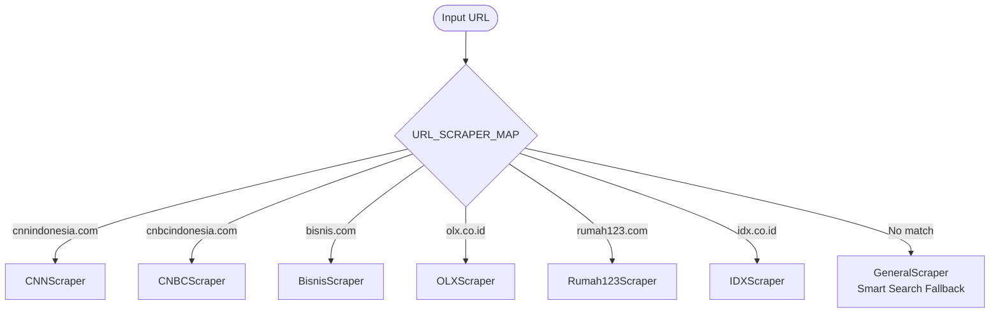

# Scrapers

Reference documentation for Extraction Layer domain-specific scrapers and URL extractors.

## Overview

The Extraction Layer uses a `ScraperRouter` to dispatch requests to the appropriate scraper based on URL domain matching. If no domain match is found, `GeneralScraper` handles the request using GL Smart Search.

**Routing logic:**

## Documentation

* [**Article Scrapers**](article-scrapers.md) — News and blog scrapers for CNN Indonesia, CNBC Indonesia, Bisnis, Kontan, MetroTV, Bloomberg Technoz, and Google News
* [**Property Scrapers**](property-scrapers.md) — Real estate scrapers for OLX, Rumah123, Lamudi, and 99.co with multi-strategy extraction
