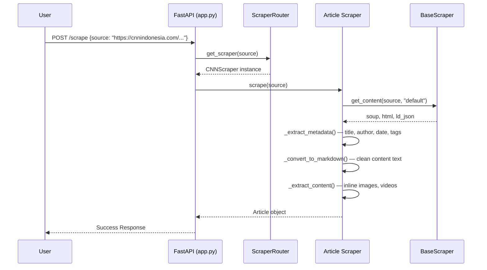

# Article Scrapers

Smart Scrape provides domain-specific article scrapers for major Indonesian news portals. Each scraper extends `BaseScraper` and overrides extraction logic for its site's HTML structure.

## Supported Article Websites

| Website | Domain Pattern | Scraper Class | Key Features |
|---------|---------------|---------------|--------------|
| **CNN Indonesia** | `cnnindonesia.com` | `CNNScraper` | Meta tags, video embeds, infographic URLs |
| **CNBC Indonesia** | `cnbcindonesia.com` | `CNBCScraper` | LD+JSON, stock ticker data, live blogs |
| **Bisnis Indonesia** | `bisnis.com` | `BisnisScraper` | Multi-page articles, video extraction, category tags |
| **Kontan** | `kontan.co.id` | `KontanScraper` | Premium content detection, financial tables |
| **Kontan Data** | `pusatdata.kontan.co.id` | `KontanDataScraper` | Data-focused content |
| **MetroTV News** | `metrotvnews.com` | `MetroTVScraper` | Video-first content, live streaming metadata |
| **Bloomberg Technoz** | `bloombergtechnoz.com` | `BloombergTechnozScraper` | Tech-focused articles, code snippets |
| **Google News** | `news.google.com` | `GoogleNewsScraper` | Aggregated news, source attribution |
| **Forex Factory** | `forexfactory.com` | `ForexFactoryScraper` | Financial calendar, economic data |

## Article Scrape Flow

## Article URL Extractors

Each article source also has a corresponding URL extractor for the listing phase. URL extractors implement `extract_urls(soup)` and `get_page_number(source)`:

| Website | CSS Selector | Pagination Style |
|---------|-------------|-----------------|
| CNN Indonesia | `a.flex.group...` | `?page=N` |
| Bisnis Indonesia | `article.post-item...` | `/page/N` or `?page=N` |
| CNBC Indonesia | `div.list_article...` | `?page=N` |
| Kontan | `div.ket a, h1.title a` | `?page=N` |
| MetroTV | `div.news-list...` | `/page/N` |
| Bloomberg Technoz | `article.post h2 a` | `/page/N` |
| Google News | `article a[href^=...]` | N/A (infinite scroll) |
| Forex Factory | `div.news__item...` | N/A |
| Kontan Data | `div.article-list...` | `?page=N` |

## Output Schema

Article scrapers return structured data conforming to the `ArticleScrapeResponse` Pydantic model:

| Field | Type | Description |
|-------|------|-------------|
| `title` | string | Article headline |
| `subtitle` | string | Article subheadline |
| `author` | string | Author name |
| `publisher` | string | Publication name |
| `article_url` | string | Canonical article URL |
| `category` | string | Article category |
| `date_published` | datetime | Publication timestamp |
| `date_modified` | datetime | Last modification timestamp |
| `tags` | list[string] | Article tags |
| `keywords` | list[string] | Meta keywords |
| `cover_image_url` | string | Featured image URL |
| `content_text` | string | Full article text in Markdown |
| `content_html` | string | Raw HTML content |
| `summary` | string | AI-generated summary (optional) |
| `inline_image_urls` | list[string] | Images embedded in article |
| `video_urls` | list[string] | Video URLs found in article |
| `schema_org_json` | dict | Raw LD+JSON structured data |

## Scraping Strategies

| Priority | Strategy | Use Case |
|----------|----------|----------|
| 1st | **LD+JSON** structured data (`@type: NewsArticle`) | Sites with rich structured data (CNBC, Bisnis) |
| 2nd | **Meta tags** (`og:`, `twitter:`, `article:`) | Universal fallback for basic metadata |
| 3rd | **CSS selectors** | Site-specific HTML patterns |
| 4th | **Smart Search (Firecrawl)** | Anti-bot protected sites or JavaScript-heavy content |
