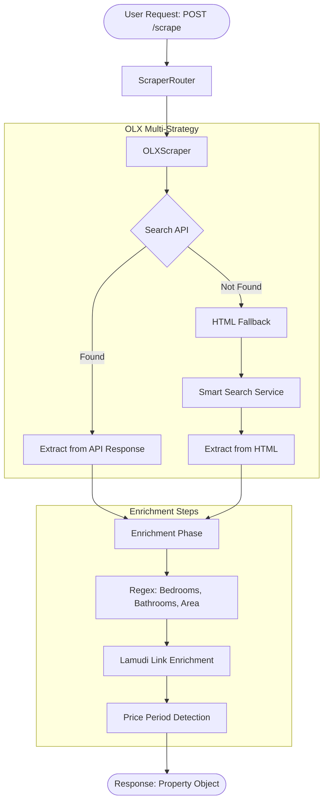

# Property Scrapers

Smart Scrape provides domain-specific property scrapers for major Indonesian real estate listing sites. Each scraper uses a multi-strategy approach with primary and fallback extraction methods.

## Supported Property Websites

| Website | Domain | Scraper Class | Primary Strategy | Fallback | Enrichment |
|---------|--------|---------------|-----------------|---------|-----------|
| **OLX** | `olx.co.id` | `OLXScraper` | Search API (progressive keyword) | HTML (Smart Search) | Lamudi link enrichment |
| **Rumah123** | `rumah123.com` | `Rumah123Scraper` | LD+JSON | JavaScript script vars | Dual page type detection |
| **Lamudi** | `lamudi.co.id` | `LamudiScraper` | LD+JSON `@graph` | HTML (`data-test` attributes) | Sentinel normalization |
| **99.co** | `99.co` | `NineNineScraper` | GraphQL API | None (API-first) | Direct clean API data |
| **99.co Projects** | `99.co/id/projects` | `NineNineProjectScraper` | GraphQL API | None | Project-level data |

## Property Scrape Flow

## Strategy Comparison

| Website | Primary Source | Fallback | Enrichment |
|---------|---------------|---------|-----------|
| **OLX** | Search API (progressive keyword search) | HTML via Smart Search | Description regex, Lamudi link |
| **Rumah123** | LD+JSON (`@type: Residence`) | JavaScript `window.__NUXT__` vars | Script metadata, dual page types |
| **Lamudi** | LD+JSON `@graph` array | `data-test` HTML attributes | Sentinel value normalization |
| **99.co** | GraphQL API (direct) | None — API-first | Clean structured API data |

## Property URL Extractors

Each property source has a URL extractor for the listing phase:

| Website | CSS Selector | Pagination Style |
|---------|-------------|-----------------|
| OLX | `a[data-aut-id=...]` | `?page=N` |
| Rumah123 | `a.card-featured...` | `?page=N` |
| Lamudi | Custom selectors | `?page=N` |
| Lamudi Proyek | Custom selectors | `?page=N` |
| 99.co | `a.listing-card...` | `?page=N` |

## Output Schema

Property scrapers return structured data conforming to the `PropertyScrapeResponse` Pydantic model:

| Field | Type | Description |
|-------|------|-------------|
| `property_id` | string | Source-specific property identifier |
| `title` | string | Property listing title |
| `url` | string | Canonical property URL |
| `description` | string | Full property description |
| `property_type` | string | Type of property (apartment, house, land, etc.) |
| `listing_type` | string | Sale or rent |
| `price` | integer | Listing price in IDR |
| `posting_date` | datetime | When the listing was posted |
| `update_date` | datetime | Last update timestamp |
| `longitude` | float | GPS longitude |
| `latitude` | float | GPS latitude |
| `address` | string | Full address text |
| `area_name` | string | Neighborhood name |
| `subdistrict` | string | Kelurahan |
| `district` | string | Kecamatan |
| `city` | string | City |
| `province` | string | Province |
| `agent_contact` | string | Agent phone or contact |
| `agent_name` | string | Agent name |
| `bedrooms` | integer | Number of bedrooms |
| `bathrooms` | integer | Number of bathrooms |
| `land_area` | float | Land area in m² |
| `building_area` | float | Building area in m² |
| `electricity` | integer | Electrical capacity in watts |
| `floor` | integer | Number of floors |

## IDX (Annual Report) Scraper

Smart Scrape also supports IDX financial report scraping for publicly listed companies. The IDX scraper:

1. Calls the IDX `GetFinancialReport` API via Smart Search Service
2. Uses an AI agent (`IDXAIPDFSelector`) to identify the primary annual report PDF
3. Downloads the XLSX file from IDX
4. Extracts financial fields (assets, liabilities, equity, revenue, profit) via `IDXExcelExtractor`
5. Falls back to Markdown table parsing if XLSX download fails

**Required query parameters for IDX scraping:**

| Parameter | Description | Example |
|-----------|-------------|---------|
| `year` | Report year | `2025` |
| `periode` | Report period | `Tahunan`, `TW I` |
| `kode_emiten` | Company code (optional) | `BBCA` |
