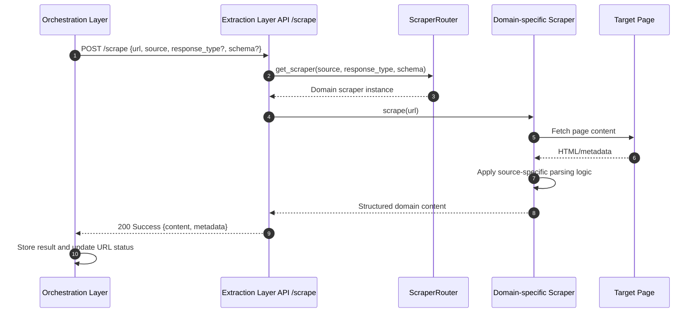

# Sequence Diagram: Domain Scrape

### Extraction Layer (`/scrape`): Domain-Specific Content Extraction Path

This subsection describes the domain-specific execution path inside the Extraction Layer for URLs that match supported source domains.

For supported domains, the Orchestration Layer in GL Smart Crawl calls the Extraction Layer endpoint (`/scrape`) with target URL and source context. The API resolves the scraper through `ScraperRouter` and selects a domain-specific scraper when a dedicated implementation exists. The selected scraper fetches the target page and applies source-specific parsing logic to produce structured fields tuned to that site layout. The API then returns standardized output so the Orchestration Layer can persist results and update URL status consistently. This path prioritizes extraction quality and field completeness for known sources while keeping orchestration behavior unchanged.

