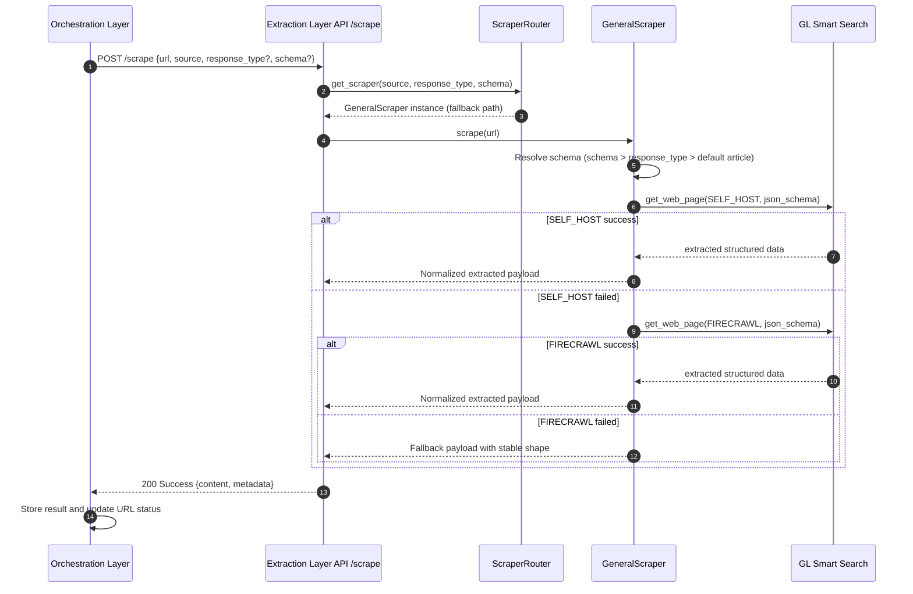

# Sequence Diagram: General Scrape

### Extraction Layer (`/scrape`): General Content Extraction Path (Fallback)

This subsection describes the general fallback execution path inside the Extraction Layer for URLs that do not match any domain-specific scraper.

For URLs without a dedicated domain scraper, the Orchestration Layer in GL Smart Crawl calls the Extraction Layer endpoint (`/scrape`), and `ScraperRouter` routes the request to `GeneralScraper`. `GeneralScraper` resolves extraction schema in priority order (`custom schema` -> `response_type` -> `default article schema`) before requesting structured extraction from GL Smart Search. It first attempts extraction using `SELF_HOST`; if that fails, it retries with `FIRECRAWL`; if both fail, it returns a fallback payload with a stable response shape. This preserves predictable downstream processing while improving resilience to provider-specific failures.

