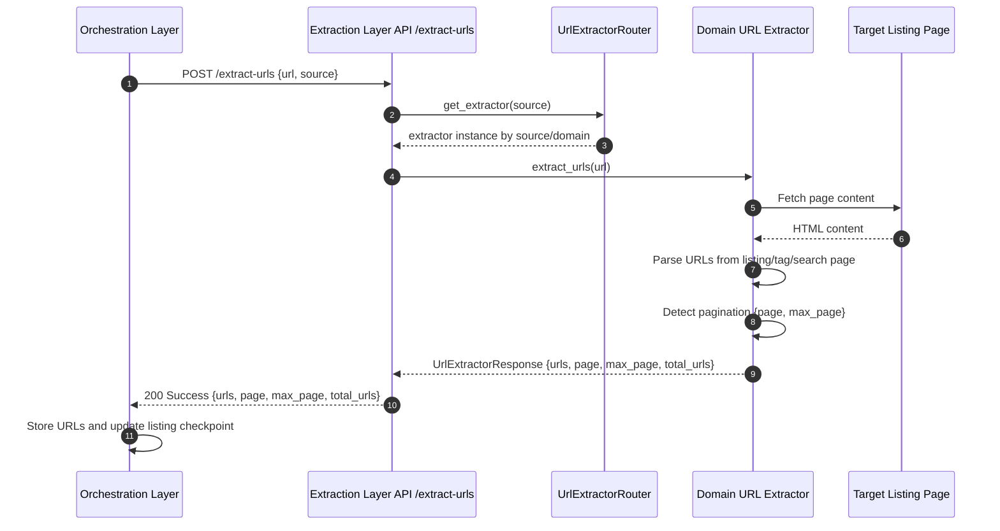

# Sequence Diagram: URL Extraction

### Extraction Layer (`/extract-urls`): URL Extraction Flow (Listing Page Parsing)

This subsection describes extraction execution behavior for a single listing/tag/search page request, not orchestration job lifecycle.

When URL extraction is triggered during listing orchestration, the Orchestration Layer in GL Smart Crawl calls the Extraction Layer endpoint (`/extract-urls`) with a listing/tag/search page URL (and source context). The API resolves the appropriate extractor through `UrlExtractorRouter`, fetches the page, and applies source-specific parsing to collect candidate URLs and pagination metadata (`page`, `max_page`). The endpoint returns URLs and page metadata in a consistent response shape so the Orchestration Layer can continue pagination, store discovered URLs incrementally, and update listing checkpoints for reliable resume behavior.

