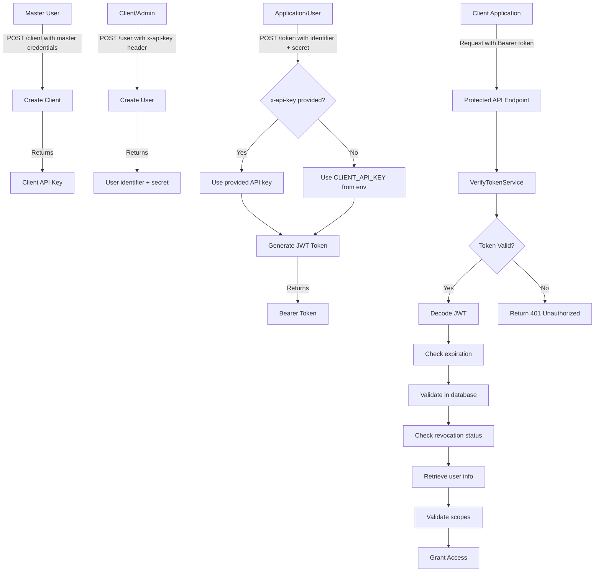
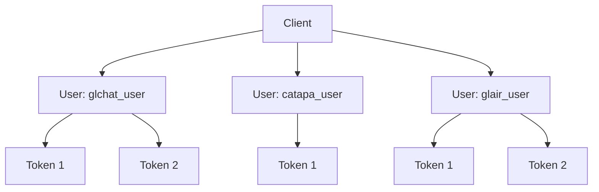
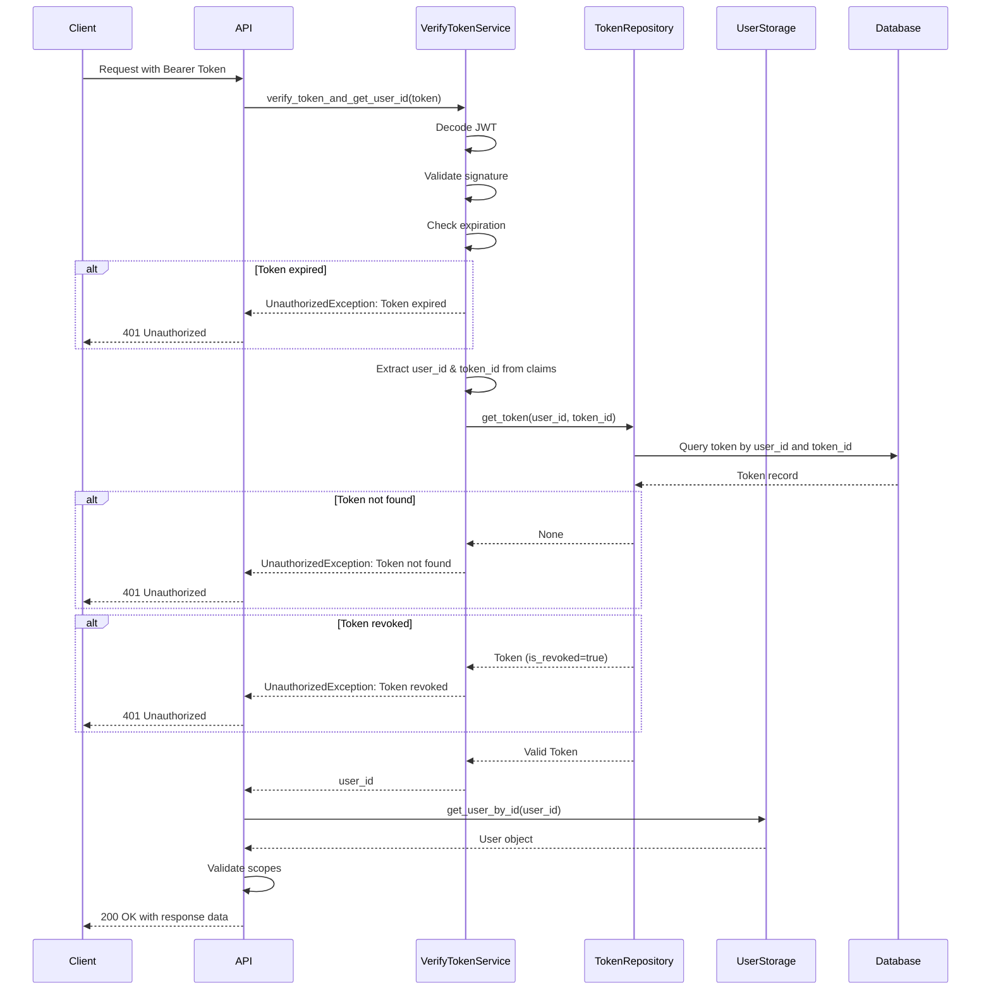

# Authentication Flow

GL Smart Search implements a secure and modular authentication system to manage access across clients, users, and environments. The system now features enhanced token verification with database validation and support for client API key-based user creation.

The authentication documentation is divided into two main sections:

* [**Authentication** ](authentication/)– Covers the standard authentication process including client registration, user creation, token issuance, and access control logic.
* [**Admin Control Panel (AdminCP)**](admin-control-panel-admincp/) – Focuses on the administrative interface used to manage clients, users, and tokens via the Admin Control Panel.

Refer to the respective sections in the sidebar for detailed setup steps and best practices.

### &#x20;Authentication Flow Diagram

This diagram shows the complete authentication flow from client creation to API access:

***

### Entity Relationships

Visualize how clients, users, and tokens are structured:

* A **Client** can have multiple **Users**
* A **User** can have multiple active **Tokens**
* Only the **Master User** can create **Clients**
* **Users** can be created by anyone with a valid **Client API Key**
* **Tokens** support backward compatibility - the `x-api-key` header is optional

***

### Token Verification Architecture

The new token verification system provides enhanced security through multi-layer validation:

**Key Security Features:**

1. **JWT Validation**: Cryptographic signature verification ensures token integrity
2. **Expiration Enforcement**: Automatic rejection of expired tokens
3. **Database Verification**: Cross-references token against stored records
4. **Revocation Support**: Immediate invalidation of compromised tokens
5. **Scope-Based Authorization**: Fine-grained permission control per user
